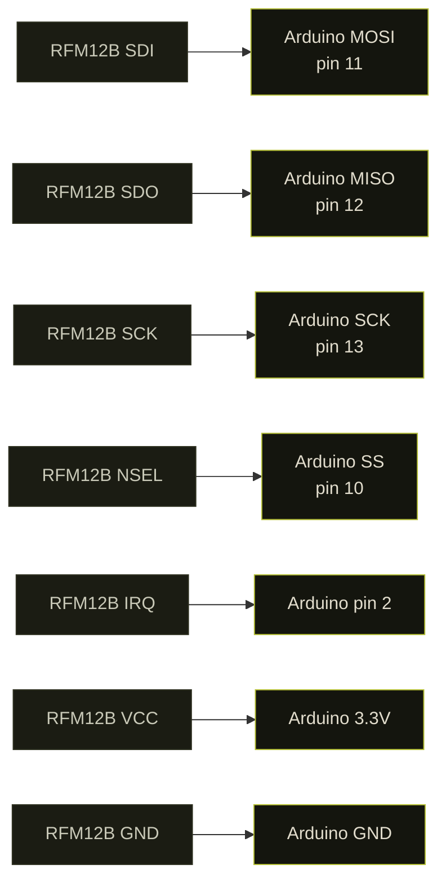
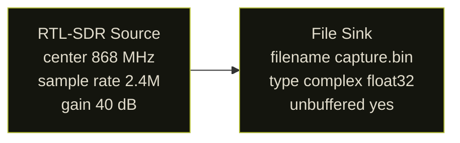
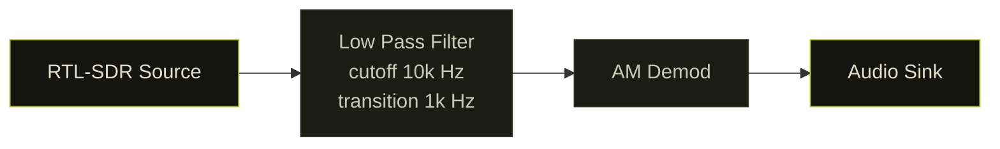

## why radio

There is an entire attack surface most security researchers ignore because it does not involve a browser or an API: the electromagnetic spectrum.

Garage doors. Smart meters. Key fobs. Temperature sensors. Baby monitors. All of these broadcast data on frequencies you can receive with $30 of hardware. Most do not encrypt. Some authenticate with a rolling code that has not been broken. Many do not.

This is the story of building a transmitter, capturing it, and trying to decode it before my RTL-SDR met an unfortunate end.

---

## the basics: modulation

Before touching hardware, the theory. Any wireless signal encodes data by varying one of three properties of a carrier wave:

**Amplitude Modulation (AM):** vary the signal strength. High amplitude = 1, low = 0. Simple, noisy, used in early radio.

**Frequency Modulation (FM):** vary the frequency. 868.01 MHz = 1, 868.00 MHz = 0. More noise-resistant than AM.

**Phase Modulation (PM):** vary the phase shift relative to a reference signal. More complex, used in modern digital comms.

For this experiment: ON/OFF Keying (OOK), a degenerate form of AM. Transmitter on = 1, transmitter off = 0. The simplest possible encoding and the most common in cheap IoT devices.

OOK is mathematically `s(t) = A·m(t)·cos(2πf_c·t)` where `m(t)` is the binary data stream (0 or 1) and `f_c` is the carrier frequency. When `m(t) = 0` the carrier is fully suppressed, so the on/off ratio is theoretically infinite (unlike standard AM which keeps a residual carrier). In practice, oscillator leakage means a small carrier remains during the off state.

At a symbol rate of `R` baud, each bit occupies `T = 1/R` seconds. At 4800 bps that is 208 µs per symbol -- wide enough to be clearly visible as individual on/off blocks in Inspectrum without zooming.

The ISM bands used for unlicensed short-range devices are regulated by region:

| Band | Region | Max TX power |
|------|--------|-------------|
| 433.05–434.79 MHz | Europe (ITU-R Region 1) | 10 mW ERP |
| 868.0–868.6 MHz | Europe (ETSI EN 300 220) | 25 mW e.r.p. |
| 902–928 MHz | Americas (FCC Part 15) | 1 W |

The RFM12B ships in region-specific variants; the 868 MHz version (suffix `-S2`) is the European part.


---

## hardware setup

### the transmitter


**RFM12B** from Hope RF, a sub-GHz transceiver module. Cheap (~$4), well-documented, supported by Arduino via the `JeeLib` library. Operates at 433 MHz, 868 MHz, or 915 MHz depending on region and model.

Connect to an Arduino UNO via SPI:



**Note:** RFM12B is a 3.3V device. The Arduino runs at 5V. A level shifter on the SPI lines is technically required. Many people skip it and it works until it does not. Use a voltage divider or a proper level converter if you care about your hardware.

**RFM12B SPI register map (relevant commands)**

Every interaction with the RFM12B is a 16-bit SPI word. The high bits identify the command; the low bits are the payload. JeeLib sends these during `rf12_initialize()`:

| Command | 16-bit code | Key bits |
|---------|-------------|----------|
| Configuration Setting | `0x8057` | `ef`=1 enable RX FIFO, `b1b0`=01 select 868 MHz band, `x3-x0`=0111 12 pF crystal load |
| Power Management | `0x82D9` | `er`=1 RX chain on, `ebb`=1 baseband on, `et`=0 TX off, `es`=1 synthesizer on, `ex`=1 crystal on, `dc`=1 disable clock output |
| Frequency Setting | `0xA000`–`0xAFFF` | 12-bit field F: `f_carrier = 10 × (43 + F/4000)` MHz for 868 MHz band; `0xA618` ≈ 868.35 MHz |
| Data Rate | `0xC647` | Sets bit clock to 4800 bps: divider `r = 103` gives `4800 = 10000000 / 29 / (1 + r)` bps |
| Receiver Control | `0x9240` | `p16`=0 VDI output on pin 16, `i2-i0`=010 BW = 134 kHz, `g1g0`=00 LNA gain 0 dB, `r2-r0`=000 RSSI threshold −103 dBm |

The Data Rate command `0xC647` is the one that sets 4800 bps -- this is what you are matching when you set the symbol rate in Inspectrum. If you change `rf12_initialize()` to use a different group or baud, the Inspectrum symbol grid will be wrong.

The antenna is a quarter-wave wire. The formula comes from the relationship between wavelength and frequency:

```
λ = c / f
λ/4 = c / (4 × f)
```

At 868 MHz:

```
λ/4 = 299,792,458 / (4 × 868,000,000)
    = 299,792,458 / 3,472,000,000
    ≈ 0.08635 m
    ≈ 86.4 mm
```

At 433 MHz the same formula gives 173 mm. The `3.3V` supply voltage limits the antenna current, so even an unmatched wire antenna gets adequate range indoors at these power levels.

Solder an 86 mm wire to the antenna pad. Tolerance of a few millimeters does not matter much at these frequencies.


### the Arduino sketch

```cpp
#include <JeeLib.h>

#define FREQUENCY RF12_868MHZ
#define GROUP     212
#define NODE_ID   1

void setup() {
    Serial.begin(57600);
    rf12_initialize(NODE_ID, FREQUENCY, GROUP);
    Serial.println("[*] RFM12B initialized at 868 MHz");
}

void loop() {
    // 4-byte payload transmitted every 500ms
    struct {
        uint8_t  node;
        uint16_t counter;
        uint8_t  crc;
    } __attribute__((packed)) payload;

    static uint16_t cnt = 0;
    payload.node    = NODE_ID;
    payload.counter = cnt++;
    payload.crc     = payload.node ^ (payload.counter & 0xFF);

    rf12_sendStart(0, &payload, sizeof(payload));
    rf12_sendWait(2);  // wait for transmission, then sleep radio

    Serial.print("[>] sent packet #");
    Serial.println(cnt);

    delay(500);
}
```

This sends a 4-byte structured payload at 868 MHz every 500ms. The `counter` field increments each transmission so you can identify individual packets in the capture. `rf12_sendWait(2)` blocks until done and puts the radio into low-power mode between transmissions.

### the receiver: RTL-SDR


The **RTL-SDR** is a repurposed digital TV receiver used as a wideband software-defined radio. Costs $25-30. Covers roughly 25 MHz to 1.7 GHz with some gaps. Enough to see 868 MHz.

The dongle is two chips:

**R820T2** (Rafael Micro) -- the RF tuner. Tunes 24 MHz to 1766 MHz. Sets the center frequency and applies AGC or manual gain before passing the IF signal to the demodulator. Gain is adjustable in 29 discrete steps from 0 to 49.6 dB; setting a value between steps rounds down to the next lower valid step.

**RTL2832U** (Realtek) -- the demodulator and USB bridge. Contains an 8-bit ADC running at up to 3.2 MS/s. At 8 bits the theoretical dynamic range is ~50 dB (6 dB per bit). In practice, stable streaming tops out around 2.4 MS/s over USB 2.0; rates above that drop samples. The chip outputs quadrature (IQ) samples: for each sample period it produces one I (in-phase) and one Q (quadrature) value, both 8-bit integers internally, which `rtl-sdr` drivers convert to complex float32 (`gr_complex` in GNU Radio) before handing to userspace. One IQ pair = 8 bytes on disk.

The visible bandwidth at any moment equals the sample rate. At 2.4 MS/s you see a 2.4 MHz slice of spectrum centered on the tuned frequency -- enough to observe a narrowband OOK signal and some of its neighbors simultaneously.


If you have already killed your RTL-SDR (see: the end of this post):

- **HackRF One**: 1 MHz to 6 GHz, full-duplex, ~$300
- **LimeSDR Mini**: similar range, better RF performance, ~$150
- **SDRPlay RSP1A**: 1 kHz to 2 GHz, excellent for HF, ~$110
- **PlutoSDR**: 70 MHz to 6 GHz, full-duplex, ~$100

---

## capturing the signal

### step 1: find the frequency with GQRX

```bash
sudo apt install gqrx-sdr
gqrx
```

Set center frequency to 868.000 MHz. Set sample rate to 2.4 MSPS. Enable the waterfall view (spectrum over time).


When the Arduino transmits, you will see a bright spike in the waterfall repeating every ~500ms. This confirms the hardware works and tells you the exact frequency offset from 868 MHz center.

### step 2: record IQ samples with GNURadio

Build this flowgraph in GNURadio Companion:




The RTL-SDR Source block key parameters:

| Parameter | Value used | Notes |
|-----------|-----------|-------|
| Ch0 Frequency | 868,000,000 Hz | Center of the visible band |
| Sample Rate | 2,400,000 S/s | Stable USB throughput; gives 2.4 MHz visible bandwidth |
| RF Gain | 40 dB | One of 29 valid steps (0–49.6 dB); nearest valid value is used |
| DC Offset Mode | 0 (off) | Avoids slow convergence artifact at DC |
| IQ Imbalance Correction | 0 (off) | Not needed for narrowband OOK capture |

Setting gain to exactly 40 dB works because 40.2 dB is a valid R820T2 step and the driver rounds down to that value. Setting the gain too high saturates the ADC (all samples clip to ±127); too low and the signal drowns in quantisation noise. For a 25 mW transmitter a meter away, 30–40 dB is a reasonable starting point; check the waterfall amplitude and back off if the signal is a solid saturated block.

Run for 10-15 seconds while the Arduino transmits. Stop. The file contains raw complex (IQ) samples representing the full band around 868 MHz. It is not demodulated yet, just raw RF energy as a stream of `(float32 I, float32 Q)` pairs.

File size: 2.4M samples/s × 8 bytes/sample × 10 s = 192 MB

Each 8-byte unit is two IEEE 754 single-precision floats: I first, then Q. The instantaneous power at sample `n` is `I[n]² + Q[n]²`. The instantaneous frequency relative to center is encoded in the phase angle `atan2(Q[n], I[n])` -- that is what FM demodulation extracts, but for OOK you only care about power.

### step 3: visualize with Inspectrum

```bash
sudo apt install inspectrum
inspectrum capture.bin -r 2400000
```

Set the sample rate to 2.4 MSPS in the UI. The spectrogram view shows frequency on the Y axis and time on the X axis. You should see the OOK signal: a repeated pattern of bright (transmitter on) and dark (transmitter off) blocks.


Enable the power threshold. Inspectrum shows a red/green overlay indicating where the signal crosses the threshold. This is your bit stream.

Set the symbol rate to match the RFM12B default baud rate (4800 bps). Each cell in the symbol grid should align with one bit period (1/4800s = ~208 microseconds). Read off the pattern.

For OOK: power above threshold during the symbol period = 1, below = 0.

You should see something like:

```
preamble: 10101010 10101010   (sync pattern)
sync word: 2D D4              (RF12 default)
payload:   01 00 00 00        (node=1, counter=0, crc=1)
```

**RF12 wire frame structure**

The RFM12B hardware generates the preamble and sync bytes itself; the JeeLib driver does not transmit them explicitly. On the wire the full packet looks like:

```
┌────────────────┬──────────┬──────┬─────┬─────────────────┬─────────┐
│ Preamble       │ Sync     │ Hdr  │ Len │ Payload         │ CRC16   │
│ 0xAA 0xAA ...  │ 0x2D 0xD4│ 1 B  │ 1 B │ 0–66 bytes      │ 2 bytes │
└────────────────┴──────────┴──────┴─────┴─────────────────┴─────────┘
```

- **Preamble**: alternating `10101010` pattern (`0xAA` bytes). The RFM12B transmits enough of these for the receiver's clock recovery circuit to lock onto the bit rate before data arrives. The receiver ignores bytes until the sync word appears.
- **Sync word**: `0x2D 0xD4`. These two bytes are configured in the RFM12B Synchron Pattern register. When the receiver sees this sequence it arms the FIFO and begins storing bytes into the data buffer. `0x2D` is the group byte -- `rf12_initialize(NODE_ID, FREQUENCY, GROUP)` sets it to the value of `GROUP` shifted; `0xD4` is fixed.
- **Header byte**: bit 7 = `CTL` (control/ack flag), bit 6 = `DST` (1 = destination address in bits 4–0), bit 5 = `ACK` request, bits 4–0 = node ID.
- **Length byte**: number of payload bytes (0–66). JeeLib uses this to know when to stop filling the RX buffer.
- **Payload**: the struct passed to `rf12_sendStart()`. In this sketch: 4 bytes packed (`node`, `counter` LE uint16, `crc`).
- **CRC16**: two-byte CRC over header + length + payload. The receiver rejects packets where the CRC does not match; `rf12_crc` will be non-zero on failure.

The baud rate derivation for `0xC647`: the RFM12B Data Rate register uses the formula `BitRate = 10,000,000 / 29 / (1 + R)` where `R` is the 7-bit field in the low byte. `0x47` = 71 decimal, giving `10,000,000 / 29 / 72 ≈ 4789 bps`, close enough to 4800 that the symbol grid in Inspectrum aligns at the `4800` setting.

### step 4: cross-check with Audacity

GNURadio can also output demodulated audio. Add an AM demodulator to the flowgraph:



**Low Pass Filter block parameters**

The LPF here is a decimating FIR (Finite Impulse Response) filter, implemented as `gr::filter::fir_filter_ccf`. GNU Radio calls `firdes.low_pass()` at flowgraph start to compute the tap coefficients. Key parameters:

| Parameter | Value used | Effect |
|-----------|-----------|--------|
| Decimation | 1 | No rate reduction here; decimation happens implicitly by the audio sink rate |
| Sample Rate | 2,400,000 S/s | Input rate from the RTL-SDR Source |
| Cutoff Frequency | 10,000 Hz | All signal energy below 10 kHz passes; above is attenuated |
| Transition Width | 1,000 Hz | Band between 10 kHz (passband edge) and 11 kHz (stopband edge); narrower = more taps = more CPU |
| Window | Hamming | Default; controls sidelobe attenuation (~43 dB) vs. transition steepness tradeoff |

The number of FIR taps is approximately `4 × Sample_Rate / Transition_Width = 4 × 2,400,000 / 1,000 = 9,600` taps for a 1 kHz transition width -- expensive. A 10 kHz transition width would give ~960 taps and pass an OOK signal equally well since the data bandwidth at 4800 bps is only ~5 kHz. Use `transition_width = 10000` if CPU usage is a concern.

**AM Demod block parameters**

The AM Demod block (`analog.am_demod_cf`) performs envelope detection on the complex baseband signal. Internally it is a Complex to Magnitude block followed by a DC blocker and a decimating audio filter. Parameters:

| Parameter | Value | Meaning |
|-----------|-------|---------|
| `channel_rate` | 2,400,000 | Input sample rate (must match upstream rate) |
| `audio_decim` | 50 | Decimates to `2,400,000 / 50 = 48,000` S/s audio output |
| `audio_pass` | 5,000 Hz | Audio LPF passband -- keeps the 4800 bps OOK content |
| `audio_stop` | 10,000 Hz | Audio LPF stopband -- attenuates above this |

The output is a float stream in `[-1.0, +1.0]` proportional to the envelope amplitude. For OOK this becomes a square wave: high during carrier-on periods, low during carrier-off. That square wave fed to the Audio Sink sounds like the clicks; in Audacity the pulse widths are directly measurable in samples (at 48,000 S/s, 208 µs = 208 × 10⁻⁶ × 48,000 ≈ 10 samples per bit).

The AM-demodulated OOK signal sounds like rhythmic clicks. In Audacity, load the audio and measure the pulse widths in microseconds. At 4800 bps each pulse is ~208 microseconds. Verify this matches what Inspectrum showed.

### step 5: decode with URH

Universal Radio Hacker is better than Inspectrum for full protocol analysis:

```bash
pip install urh
urh
```

Import the `.bin` file. URH auto-detects the modulation, symbol rate, and bit pattern. It can identify the preamble, sync word, and frame structure automatically. It also has a protocol analyzer that can decode common IoT protocols.

---

## what you can do with this

### replay attacks

If a device authenticates with a fixed code (no rolling counter), capturing and replaying is trivial with HackRF:

```bash
# record
hackrf_transfer -r capture.bin -f 868000000 -s 2000000

# replay
hackrf_transfer -t capture.bin -f 868000000 -s 2000000 -x 40
```

This works against:

- Old garage door remotes (pre-2000, fixed code)
- Some cheap alarm sensors
- Many 433 MHz smart home devices with no authentication

It does not work against:

- KeeLoq rolling codes (modern car key fobs)
- Properly implemented HOTP/TOTP
- AES-encrypted payloads

### frequency survey before a physical engagement

```bash
# rtl_power: scan 300 MHz to 1 GHz, 1 MHz steps, 10-second averages, 60-second total
rtl_power -f 300M:1G:1M -g 40 -i 10 -e 60 survey.csv

# visualize
python3 -c "
import csv, sys
data = list(csv.reader(open('survey.csv')))
for row in data[:5]:
    print(row)
"
```

A 60-second passive scan maps every RF source active in the environment: access control readers, building automation, HVAC sensors, keyless entry. Useful intelligence before walking in.

### signal identification

The [Signal Identification Guide](https://www.sigidwiki.com/) covers hundreds of modulation types with audio samples and waterfall screenshots. If you see something unfamiliar in the waterfall, match it here before spending time reversing it.

---

## what went wrong

I killed my RTL-SDR.

I connected an external antenna near a strong transmitter. The LNA at the RTL-SDR input has no protection diode. Enough RF energy burns the front end. The dongle still powers up, still shows in `lsusb`, but the sensitivity is gone. Everything is noise.

Lessons:

1. **Attenuator**: put a 10-20 dB inline attenuator before the SDR when near strong transmitters
2. **SAW filter**: a narrowband filter centered on your frequency of interest blocks out-of-band energy that damages the LNA
3. **Separation**: keep the transmitter physically away from the receiver during testing. Opposite ends of the room minimum

The RTL-SDR has no recovery from a blown LNA. Buy a new one and add the attenuator this time.

---

## references

- [RTL-SDR Blog Getting Started Guide](https://www.rtl-sdr.com/rtl-sdr-quick-start-guide/)
- [GNURadio Tutorials](https://wiki.gnuradio.org/index.php/Tutorials)
- [Inspectrum GitHub](https://github.com/miek/inspectrum)
- [Universal Radio Hacker](https://github.com/jopohl/urh)
- [JeeLib Arduino Library](https://github.com/jcw/jeelib)
- [Signal Identification Guide](https://www.sigidwiki.com/)
- [RTL-SDR protection circuits](https://www.rtl-sdr.com/protecting-your-sdr-from-strong-signals/)


