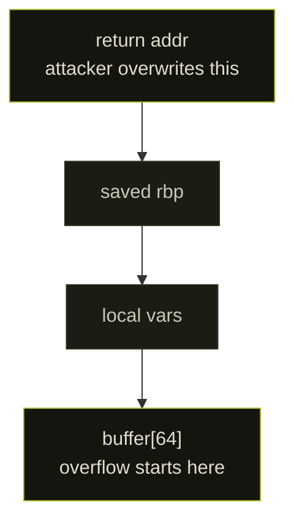
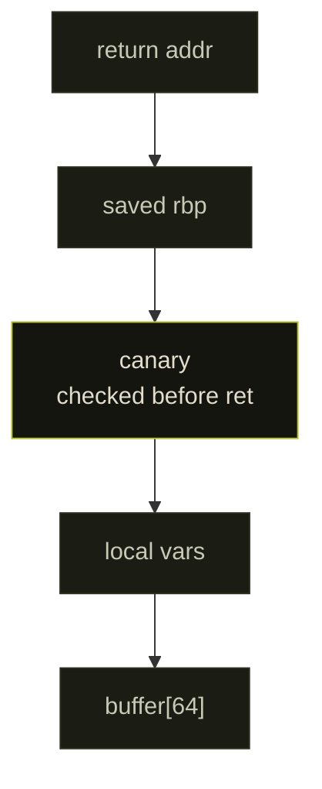
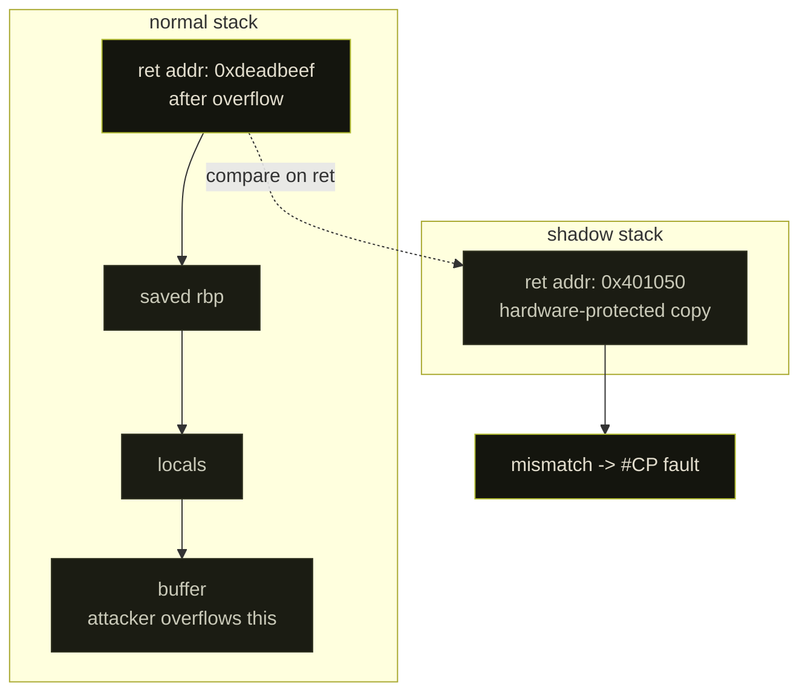

## mice vs cats

Every defensive mechanism in exploit development has been bypassed. Not eventually. Usually within weeks. The history of stack exploitation is not a story of defenders winning. It is attackers adapting faster than anyone expected.

The thread: DEP, ret2libc, ASLR, ROP, stack canaries, format strings, shadow stack.

Understanding why each defense failed is the only way to understand why shadow stack is different.


---

## chapter 1: the history

### the classic overflow

Before any mitigations, a stack buffer overflow was trivially exploitable. Overflow the buffer, overwrite the saved return address, point it at shellcode, function returns, shellcode executes.



The diagram runs high address at the top to low address at the bottom, the way the stack grows down.

The attacker needed the stack to be executable. That assumption lasted until 2004.

### DEP / NX (2004)

**Data Execution Prevention** marks the stack non-executable. The CPU enforces this via the NX bit in page table entries. Attempt to jump into stack shellcode and you get a hardware exception.

It worked briefly. Then ret2libc appeared.

**ret2libc bypass:** instead of jumping to shellcode on the stack, jump to existing executable code in memory, specifically `system()` in libc. Overwrite the return address with the address of `system()`, set up the stack to pass `/bin/sh` as an argument. DEP does not care: you are jumping to legitimate code, not the stack.

DEP was dead within a year.

### ASLR (2005)

**Address Space Layout Randomization** randomizes the base addresses of the stack, heap, and loaded libraries on each run. Even if you want `system()` in libc, you do not know where libc is loaded.

Entropy on 32-bit systems: ~16 bits (65536 possibilities). Average brute-force: 32768 attempts. On a local service that respawns instantly, this is minutes. ASLR on 32-bit is security theater.

On 64-bit, entropy is ~28 bits. Harder but not impossible:

- **Info leaks**: any vulnerability leaking a pointer (use-after-free, format string) gives you a base address. Add the known offset. ASLR defeated.
- **Partial overwrites**: overwrite just the lower bytes of a return address. ASLR does not randomize page offsets, so you can redirect within the same library.
- **Heap spray**: fill memory with your payload at enough locations that guessing where it lands becomes practical.

### stack canaries (2001, widespread ~2010)

A **canary** is a random value placed on the stack between the buffer and the saved return address. Before returning, the function checks it is intact. If not, the program terminates.



Bypasses:

1. **Format string leaks**: `printf(user_input)`. `%08x` walks up the stack and leaks the canary. Overwrite it with the same value.
2. **Heap overflows**: heap has no canaries. Pivot to heap-based ROP.
3. **Non-contiguous overwrites**: some vulns write to arbitrary offsets, skipping the canary.
4. **Fork brute force**: `fork()` servers inherit the parent canary. Brute-force one byte at a time: 256 guesses x 8 bytes = 2048 guesses total.

### ROP (2007+)

**Return-Oriented Programming** does not inject code. It chains tiny snippets already in the binary, "gadgets", each ending in `ret`.

```asm
gadget 1: pop rdi; ret
gadget 2: pop rsi; ret
gadget 3: call system
```

Load `"/bin/sh"` into `rdi`, `NULL` into `rsi`, call `system()`. No injected shellcode. ROP works against DEP and, with an info leak, against ASLR.

This is where the arms race stalled for years.


---

## chapter 2: shadow stack

Shadow stack attacks ROP at its root: the fact that a function's return address can be corrupted.

### the mechanism

When a function is called, the hardware does two things:

1. Pushes the return address onto the normal stack
2. Also pushes the return address onto a separate, hardware-protected **shadow stack**

On return, the hardware compares the return address on the normal stack against the shadow stack. If they differ, control flow violation, the processor faults.




The shadow stack lives in pages with a special encoding in the page tables, read-only to software but marked Dirty, which the MMU treats as the shadow-stack attribute. Ordinary stores cannot write there: a regular `mov [ssp], rax` faults. Only the CALL/RET microcode and the dedicated CET instructions touch it: `INCSSP` (unwind by N slots), `RDSSP` (read `SSP` into a GPR), `RSTORSSP` and `SAVEPREVSSP` (switch shadow stacks through a verified restore token), and the privileged `WRSS`/`WRUSS` (write, gated by the `WR_SHSTK_EN` bit). User code has no unprivileged write primitive into it. That is the whole point: the return-address copy sits in memory the buggy function physically cannot reach.

### Intel CET

Intel shipped CET starting with Tiger Lake (11th gen, 2020). Two features:

- **Shadow Stack (SS)**: protects return addresses
- **Indirect Branch Tracking (IBT)**: `ENDBR64` marks valid call/jmp targets. An indirect branch to any address not starting with `ENDBR64` faults.

Windows 10 20H1+ enables shadow stack for user-mode processes. Linux support landed in 2023 via `ARCH_SHSTK_*` prctl flags.

```bash
# check kernel CET support
grep CET /boot/config-$(uname -r)

# enable shadow stack in your process (linux)
#include <sys/prctl.h>
#include <asm/prctl.h>
arch_prctl(ARCH_SHSTK_ENABLE, ARCH_SHSTK_SHSTK);
```

### the control surface

CET state is MSR-driven, one set per privilege level:

- `IA32_U_CET` (user) and `IA32_S_CET` (supervisor) hold the enable bits: `SH_STK_EN` (shadow stack on), `WR_SHSTK_EN` (allow `WRSS` to write the shadow stack), `ENDBR_EN` (IBT on), plus the legacy-code and no-track bits.
- `SSP` is the shadow stack pointer, a dedicated register, not a GPR. You cannot `mov` into it. Read it with `RDSSP`; it only advances through CALL/RET and the CET instructions.
- The live SSP is backed per ring by `IA32_PL3_SSP` (user) and `IA32_PL0/1/2_SSP` (kernel). `IA32_INTERRUPT_SSP_TABLE_ADDR` selects a shadow stack on interrupt delivery, so a ring transition always lands on a known-good stack.

Switching stacks (signal handlers, `makecontext`, green threads) cannot just write a new `SSP`. The target shadow stack must carry a *restore token* at its top: `RSTORSSP` validates that token before adopting the stack, and `SAVEPREVSSP` leaves one behind on the old one. That token dance is why glibc needed explicit shadow-stack support for `swapcontext`, and why early CET broke `longjmp`-heavy and coroutine code.

### performance

Intel benchmarks: ~1-3% overhead on real workloads. Earlier software implementations (LLVM SafeStack) showed 3-9%. Hardware eliminates most of it. There is no longer a credible performance argument against enabling CET.

---

## demo: seeing shadow stack block an overflow

### the vulnerable program

```c
// vuln.c
#include <stdio.h>
#include <string.h>

void win() {
    printf("[!] code execution redirected\n");
}

void vuln(char *in) {
    char buf[64];
    strcpy(buf, in);  // no bounds check, no canary
}

int main(int argc, char *argv[]) {
    vuln(argv[1]);
    return 0;
}
```

### without protection

```bash
gcc vuln.c -o vuln -fno-stack-protector -no-pie -z execstack -O0
```

Find `win()`:

```bash
objdump -d vuln | grep '<win>'
# 0000000000401136 <win>:
```

Overflow and redirect:

```bash
python3 -c "
import sys
payload = b'A' * 72 + (0x401136).to_bytes(8, 'little')
sys.stdout.buffer.write(payload)
" | xargs -0 ./vuln
# [!] code execution redirected
```

Works. The return address on the stack got replaced with `0x401136`. `vuln()` returned there.

### with shadow stack

```bash
gcc vuln.c -o vuln_cet -fcf-protection=full -fstack-protector-strong -O0
```

Same payload:

```bash
python3 -c "
import sys
payload = b'A' * 72 + (0x401136).to_bytes(8, 'little')
sys.stdout.buffer.write(payload)
" | xargs -0 ./vuln_cet
# Segmentation fault (core dumped)
```

Check in GDB:

```gdb
(gdb) run $(python3 -c "print('A'*72 + '\x36\x11\x40\x00\x00\x00\x00\x00')")
Program received signal SIGSEGV, Segmentation fault.

(gdb) info registers rip
rip  0x401136

(gdb) x/gx $ssp
# holds the original return address into main, untouched
```

The CPU hit `ret` inside `vuln()`. Normal stack said `0x401136`. Shadow stack said `main+X`. Mismatch. `#CP` fault raised. Linux delivered SIGSEGV. The function never completed the return.

### ROP chain vs shadow stack

Without CET, a classic pwntools chain:

```python
from pwn import *

elf = ELF('./vuln')
rop = ROP(elf)
rop.call('puts', [elf.got['puts']])
rop.call(elf.sym['main'])

payload = b'A' * 72 + rop.chain()
p = process(['./vuln', payload])
leak = u64(p.recvline().strip().ljust(8, b'\x00'))
log.info(f'libc leak: {hex(leak)}')
```

Against `vuln_cet`, every `ret` gadget triggers a shadow stack comparison. The chain dies on the first gadget because the return address on the normal stack does not match what was there when that frame was set up. You cannot write to the shadow stack from user code, so there is no way to repair it.

### ENDBR64 and indirect branch tracking

Compile with IBT:

```bash
gcc vuln.c -o vuln_ibt -fcf-protection=branch -O0
```

Check the output:

```bash
objdump -d vuln_ibt | grep -A4 '<win>\|<vuln>\|<main>'
```

```asm
0000000000401136 <win>:
  401136:  f3 0f 1e fa    endbr64       # required marker at every valid target
  40113a:  55             push   rbp

0000000000401146 <vuln>:
  401146:  f3 0f 1e fa    endbr64
  40114a:  55             push   rbp
```

An indirect jump (`jmp rax`) to any address not starting with `ENDBR64` raises `#CP`. Mid-function gadgets are eliminated. JOP chains have no valid landing pads.

The encoding `f3 0f 1e fa` is deliberate: it was a multi-byte NOP (`nop`) before CET existed, so a binary compiled with `-fcf-protection` still runs unchanged on pre-Tiger-Lake CPUs, which just execute the marker as a no-op. Only call/jmp targets get the marker, never `ret` targets, since returns are covered by the shadow stack instead. The loader also keeps a legacy-code bitmap so a CET process can call into a non-CET shared library by exempting those pages from IBT.

Shadow stack (blocks `ret` chains) + IBT (blocks `jmp/call` chains) closes both main attack surfaces simultaneously.

---

## chapter 3: remaining attack surface

Shadow stack breaks classical ROP. It does not eliminate exploitation.

**JOP (Jump-Oriented Programming)**: chains gadgets ending in `jmp` or `call`. Shadow stack only protects return addresses. JOP is only blocked by IBT, and only if the binary was compiled with `-fcf-protection=branch`.

**Heap corruption**: shadow stack does not touch heap. Use-after-free, heap overflows, type confusion bugs are unaffected.

**Logic bugs**: shadow stack is a control-flow integrity mechanism. It says nothing about what a function *does*, only whether it returns to the right place.

**TOCTOU / race conditions**: entirely outside the threat model.

**SSP corruption**: the shadow stack pointer (`SSP`) is readable in user mode via `RDSSPQ`. If a kernel bug lets an attacker corrupt `IA32_PL3_SSP`, they can point the SSP at attacker-controlled memory. Not trivial, but not theoretical.

**Writable shadow stack (`WRSS`)**: some runtimes ask the kernel to set `WR_SHSTK_EN` so `WRSS` can edit the shadow stack from user mode, needed by certain JITs, unwinders, and checkpoint/restore. With it on, an arbitrary-write primitive can forge shadow-stack entries and classical ROP is back. It is off by default; treat any process that opts in as effectively unprotected against return-address corruption.

---

## chapter 4: what's next

CET/shadow stack hardens C/C++ programs by restricting *how* control flow can be corrupted. It does not prevent the underlying memory corruption that makes exploitation possible in the first place.

Rust eliminates the bug class at the source. No buffer overflow means nothing for shadow stack to protect.

The realistic outcome is not one or the other. Critical systems will run Rust. Legacy C/C++ codebases (the kernel, browsers, decades of infrastructure) will be protected by CET. Both are necessary and neither is sufficient alone.

---

## references

- [Intel CET White Paper](https://software.intel.com/content/www/us/en/develop/articles/technical-look-control-flow-enforcement-technology.html)
- [Linux Kernel CET Support](https://www.phoronix.com/news/Linux-6.6-x86-CET-Shadow-Stack)
- [Phoronix CET benchmarks](https://www.phoronix.com/review/intel-cet-testing)
- [ROP is Still Dangerous (2021)](https://arxiv.org/abs/2105.02175)
- [glibc shadow stack support](https://sourceware.org/glibc/wiki/Shadowstack)
