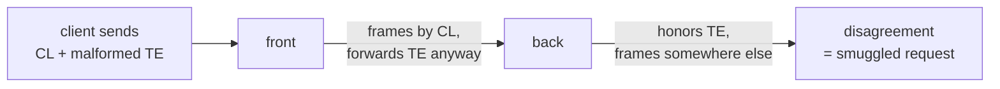

## the shape of the problem

A request smuggling vulnerability does not live in a proxy. It lives between two of them.

That sentence gets repeated a lot and then quietly ignored, because the tooling we build does not act like we believe it. We stand up a front, stand up a back, fire malformed requests, and record whether that pair desyncs. One experiment, one pair, one bit of knowledge. Change the backend and you know nothing until you run it again.

I ignored it too, and it cost me a week. I pointed an evolutionary fuzzer at eight reverse proxies for days and got a clean sheet, because I had held the backend fixed at one strict parser. Eight fronts, one back, eight experiments, and every one of them was structurally incapable of producing a hit. I [wrote that up]({{ site.baseurl }}/sozu-clte-host-tropism) when the bug I had missed turned out to be sitting in my own capture logs.

This post is what I built afterwards, which is the thing I should have built first.

## a disagreement is two independent facts

Take the classic CL.TE desync apart and look at what each side contributes.

The front receives a request carrying both a `Content-Length` and some malformed `Transfer-Encoding`. It has to decide which one frames the message. If it picks `Content-Length` and then **forwards the `Transfer-Encoding` anyway**, it has handed the backend a second opinion it did not itself accept.

The back receives that request and makes its own decision. If it honors the `Transfer-Encoding` the front ignored, the two now disagree about where the message ends, and the bytes past that boundary become a request nobody authorized.



Neither half is a vulnerability. A front that forwards both headers is harmless behind a backend that rejects the value. A backend that honors `chunked<TAB>` is harmless behind a front that strips it. The bug is the conjunction, and the conjunction is exactly what makes pair testing expensive: the property you are measuring is a product of two things you keep measuring together.

So measure them apart.

- **Front question:** for each framing value, does this proxy forward it next to a `Content-Length`?
- **Back question:** for each framing value, does this server honor it?

A pair is predicted to desync when the answer to both is yes for the same value. Seven fronts and eleven backends is seventy-seven pairs, and it costs eighteen experiments.

## measuring the back half

The backend question needs an answer to "did this server frame one request or two", and I wanted it without writing a logging application in every language on the list.

The trick is to let the server tell you by how much it says. Send one request whose declared body contains a complete second request hidden behind a zero-length chunk. Then count HTTP responses on the connection.

```
POST /carrier HTTP/1.1
Host: lab
Content-Length: 43
Transfer-Encoding: chunked<TAB>

0

GET /SMUGGLED HTTP/1.1
Host: lab

```

One response means it read the body as forty-three opaque bytes and framed a single request. Two responses means it de-chunked, hit the zero-length terminator, and framed `GET /SMUGGLED` as a request in its own right. That is language-agnostic, so adding a backend is a container image and a one-line app.

## the part that makes it trustworthy

Here is where I have to be careful, because I have been burned by this exact thing.

Counting responses can only detect a second framed request on a connection the server keeps open. A backend that closes after one response **cannot produce a two**, ever, for any input. If I run that backend and report "no smuggling detected", I have written down a fact about my instrument and labelled it a fact about the server.

So every row is gated on a control: two explicitly pipelined requests that any correct keep-alive server must answer twice. If the control does not come back with two responses, the counter cannot reach two on that backend, and every verdict from it is withheld as `UNTRUSTED` rather than published as safe.

```
  gunicorn (sync)
    CONTROL FAILED (responses=1), verdicts untrusted
  Werkzeug (dev)
    CONTROL FAILED (responses=0), verdicts untrusted
```

Both of those close the connection after one response. I do not know whether they honor a tab-suffixed `Transfer-Encoding`, and the table says so instead of guessing. It is worth noting they are also poor smuggling targets for the same reason: without connection reuse there is no pooled connection to poison. But that is a separate argument, and I did not want the table to make it for me by accident.

The rule I keep coming back to: a negative from an instrument that has never produced a positive is not evidence of absence. It is an untested instrument.

## measuring the front half

The front question is different. I do not care what the proxy answers me. I care what it says to the origin.

So the harness runs a byte-recording origin and reads the exact request head each proxy emits, which sorts every front into four buckets:

| verdict | meaning |
|---|---|
| `FORWARDS-BOTH` | sent `Content-Length` and `Transfer-Encoding` downstream. Dangerous half. |
| `normalized` | acted on the `Transfer-Encoding` and dropped the `Content-Length`. Agrees with a strict back. |
| `stripped` | dropped the `Transfer-Encoding` before forwarding. Safe. |
| `rejected` | refused the request outright. Safe. |

And the same discipline applies, harder. The first time I ran this across HAProxy, nginx, Caddy and Traefik, every single cell came back `normalized` or `rejected`. A clean sheet. I have seen that movie, so I did not believe it.

I added a front I already knew the answer for: sozu 2.1.0, the build carrying a `Transfer-Encoding` bug I had reported and which was fixed in kawa 0.7.0.

```
  sozu 2.1.0 (control, known-vulnerable)
    chunked              normalized
    chunked<TAB>         FORWARDS-BOTH
    chunked<SP>          FORWARDS-BOTH
    chunked;a=b          FORWARDS-BOTH
    chunked, identity    FORWARDS-BOTH
```

That row is not a finding, it is a calibration. It proves the instrument can produce a positive, which is the only thing that makes the four clean rows above it mean anything. The control lives in the repo as a permanent fixture, not as a thing I ran once and deleted.

## the arithmetic showing up in the measurements

The sozu bug was a seven-byte suffix compare. The parser checked whether the last seven bytes of the header value were `chunked`, with no whitespace trim and no check that chunked was the final coding.

I expanded the variant axis to eleven header blocks, including some designed to probe that specific shape, and the front-side numbers reproduce the arithmetic without ever reading the source:

| value | last 7 bytes | sozu 2.1.0 |
|---|---|---|
| `chunked` | `chunked` | normalized |
| `identity, chunked` | `chunked` | normalized |
| `xchunked` | `chunked` | normalized |
| `chunked<TAB>` | `hunked<TAB>` | FORWARDS-BOTH |
| `chunked;a=b` | `ked;a=b` | FORWARDS-BOTH |
| `chunked, identity` | `dentity` | FORWARDS-BOTH |

Every value whose final seven bytes are literally `chunked` gets acted on. Every value that pushes those bytes out of the window gets forwarded next to the `Content-Length`. The bug is visible in black-box measurements, in the shape of the results, which is a nicer way to find a suffix compare than reading Rust.

That is the argument for the variant axis being wide. Five values told me sozu was lenient. Eleven told me *how* it was lenient.

## seventy-seven pairs

Join the halves and you get predictions:

```
7 fronts x 11 backends = 77 pairs, computed from 18 measurements.

| front       | backend            | parser     | variants                    |
| sozu 2.1.0  | Go net/http        | net/http   | chunked<TAB>, chunked<SP>   |
| sozu 2.1.0  | Puma               | puma (C)   | chunked<TAB>, chunked<SP>   |
| sozu 2.1.0  | Hypercorn          | h11        | chunked<TAB>, chunked<SP>   |
| sozu 2.1.0  | uvicorn --http h11 | h11        | chunked<TAB>, chunked<SP>   |
```

Four predicted desyncs. They are exactly the four backends I had confirmed by hand, on exactly the two variants that fire. The system reproduced a week of work from two independent measurement runs, neither of which knew about the other.

I want to be precise about what that does and does not prove. It does not prove the predictor finds new bugs; the only vulnerable front in the population is the one I put there as a control. What it proves is that the prediction is sound: measure the halves, join them, get the pairs that a human found the slow way.

**A prediction is a hypothesis.** The output file says so. Each pair still has to be fired end to end and confirmed against a negative control before it is a vulnerability, because a table cannot tell you whether a backend connection is actually pooled, whether the proxy binds one upstream connection per client, or whether anything downstream trusts what you smuggled. That is where the previous post's honest half lives: I had a working desync and most of the impact I wanted was still walled off.

## what the table says that advisories cannot

Two rows in the backend table:

| backend | parser | `chunked<TAB>` |
|---|---|---|
| uvicorn `--http h11` | h11 | SMUGGLE |
| uvicorn `--http httptools` | httptools | reject 400 |

Same server. Same version. One command-line flag. Opposite verdict.

We track HTTP vulnerabilities by product and version, and that granularity is simply wrong for this class. The security boundary is the parser, and one product ships several. If you run an ASGI app, "am I exposed" does not depend on which server you chose, it depends on which parser you loaded, and there is no column for that in any advisory database I know of.

The same is true one layer out. Apache httpd was the only front in the population to answer a third way: it strips the `Transfer-Encoding` and forwards `Content-Length` alone. Not normalized, not rejected, stripped. That is a fifth behavior class nobody would think to ask about until a table has a hole in it.

## the axis nobody can measure yet

Everything above lives in HTTP/1 header semantics, where both halves are byte-inspectable and every tool in the field can generate the inputs.

That stops being true one layer down. QUIC has an extension in draft, [reliable stream reset](https://datatracker.ietf.org/doc/html/draft-ietf-quic-reliable-stream-reset), whose `RESET_STREAM_AT` frame resets a stream but guarantees delivery up to a reliable-size offset. The load-bearing sentence is that a sender may emit several of them to **reduce** that size. You can send a hundred body bytes and then shrink how many of them count, after they are already on the wire.

No HTTP transport has ever let the sender do that. In H1 and H2 a sent byte is sent. Here the length is a value the attacker can move after committing to it, which is the same transport-length-versus-`Content-Length` axis as the standalone-FIN class, with a control that moves post-commit.

Nobody has measured it, and the reason is boring: no public tool can emit the frame. aioquic does not implement it, and every H3 smuggling tool builds on a QUIC library and lets that library reassemble the stream honestly. So I taught Phage to write the raw frame, and pointed it at a downgrader that honors the extension the naive way: stream the body to a pooled backend, pass the client `Content-Length`, treat the reliable size as request-complete, return the connection to the pool.

```
NEG CONTROL (well-formed CL=4 + body):
  backend saw: ['POST /ctl HTTP/1.1', 'POST /VICTIM HTTP/1.1']   CLEAN
ATTACK (CL=100, 50 bytes sent, RESET_STREAM_AT reliable=5):
  backend saw: ['POST /evil HTTP/1.1', '4']                      POISONED
```

The victim's request line gets eaten as the attacker's missing body. Three standard proxy behaviors plus one naive reading of a draft extension, and the bytes are already committed downstream when the length shrinks underneath them.

Now the honest part, because this is the section where a post like this usually oversells. **That downgrader is one I wrote.** Every shipping stack I tested rejects the frame outright, and Google QUICHE implements it but ships it disabled, closing the connection with `RESET_STREAM_AT not enabled`. Breaking a proxy I built myself is a demonstration of a mechanism, not a vulnerability in anything you run. It is a primitive published before its attack surface deploys, and the only claim I will make is that when someone turns that flag on, the measurement should already exist.

Which is the same argument as the rest of the post. The matrix is not interesting because it found something. It is interesting because it is the shape of instrument that would notice.

## the code

The harness is in [Phage](https://github.com/UncleJ4ck/Phage) under `matrix/`.

```
python matrix/run_matrix.py     # back half: which servers honor which values
python matrix/run_fronts.py     # front half: which proxies forward which values
python matrix/pairs.py          # join them into predicted pairs
```

Adding a backend is one entry in `backends.py`: an image, a port, and a trivial app. Adding a front is one entry in `fronts.py` with a config template. Adding a variant is one line, and it multiplies across the whole population.

Three things I would keep if I threw the rest away. Measure halves, not pairs, because the halves compose and the pairs do not. Gate every row on a control that proves the instrument can produce a positive, and print `UNTRUSTED` when it cannot. And put a known-vulnerable target in the population permanently, so the day the harness quietly breaks, the calibration row goes quiet first.

## references

- [T-Reqs: HTTP Request Smuggling with Differential Fuzzing](https://dl.acm.org/doi/10.1145/3460120.3485384) (CCS 2021)
- [The HTTP Garden](https://arxiv.org/abs/2405.17737) (2024)
- [The host it could not infect]({{ site.baseurl }}/sozu-clte-host-tropism), the week that produced this
- [draft-ietf-quic-reliable-stream-reset](https://datatracker.ietf.org/doc/html/draft-ietf-quic-reliable-stream-reset)
- RFC 9112 section 6.1 and 6.3, RFC 9110 section 5.6.3
