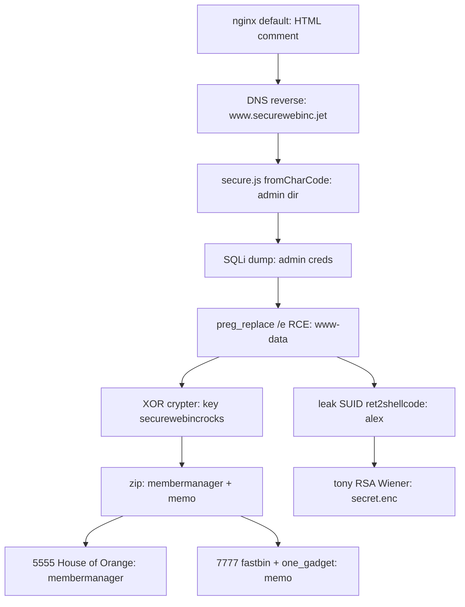

  
// hackthebox fortress

  
<b>Jet</b>

  
11 checkpoints &middot; 10.13.37.10 &middot; web &rarr; www-data &rarr; alex, two 2017 heap binaries, one RSA detour

Jet is billed as an intro fortress, but it fans out wider than that: a web chain (reverse DNS, obfuscated JS, SQL injection, a `preg_replace /e` RCE), a leaky SUID overflow, repeating-key XOR, an RSA Wiener attack, and two hand-written glibc-2.23 heap services that want House of Orange and a fastbin-to-one_gadget chain. Everything below the gate is AES-encrypted in this page. Paste a flag and it unseals every checkpoint up to the one you hold.

## the surface

| port | service | what it gates |
|---|---|---|
| 53 | BIND | reverse DNS names the real vhost |
| 80 | nginx | obfuscated JS, SQLi, `/e` RCE |
| 5555 | membermanager | House of Orange heap pwn |
| 7777 | memo | fastbin + one_gadget heap pwn |
| 9201 | fake ES | data-leak checkpoint |

<b>One infra trap worth the warning.</b> The named vhost took requests and returned nothing over ~1200 bytes. Not a WAF, not a crash: a path-MTU black hole on the VPN tunnel. DF pings pin the real MTU at ~1330, a Range request proves the cliff (401 bytes back, 1201 hangs). Lowering tun0 MTU to 1300 clears it. If large HTTP responses vanish on a fortress, suspect this before the app.

// the chain, end to end

  <h3>unseal</h3>
  
Paste any Jet flag. Braces optional, <code>JET{...}</code> or the inner text both work. Each flag reveals its checkpoint and every one before it, so the further you got, the more you read. Nothing leaves your browser, the flag is the AES key.

  

    <input id="jet-flag" type="text" placeholder="paste a JET{...} flag" autocomplete="off" spellcheck="false">
    <button id="jet-go">unseal</button>
  

  

  

